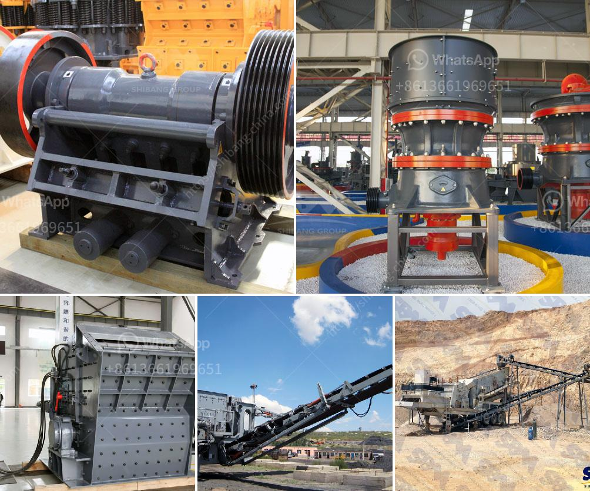

<h3>mini stone crusher for sale</h3>
A mini stone crusher is a small machine designed to reduce large rocks into smaller rocks, gravel, or rock dust. Crushers may be used to reduce the size, or change the form, of waste materials so they can be more easily disposed of or recycled, or to reduce the size of a solid mix of raw materials (as in rock ore), so that pieces of different composition can be differentiated. Crushing is the process of transferring a force amplified by mechanical advantage through a material made of molecules that bond together more strongly, and resist deformation more, than those in the material being crushed do.

Mini crushers have many different types, such as jaw crushers, cone crushers, impact crushers, mobile crushers and vertical shaft impact crushers. In a word, mini crushers are used to process materials with low hardness, such as limestone, calcite, dolomite, coal gangue, cement, construction waste, granite, pebbles, etc. Their final product size can be adjusted according to different requirements.

As a professional manufacturer of small crushing equipment, SBM provides various types of mini stone crusher for sale in China. We have delivered thousands of mini stone crushers worldwide. Our mini stone crushers are highly praised by customers due to their beautiful appearance, compact structure, unique performance and excellent quality.

SBM mini stone crusher for sale is designed based on the conception of fully adapting various crushing condition, eliminating obstacles caused by location, environment, foundation configuration, consequently providing simple, efficient, low-cost crushing equipment. The mini stone crusher is suitable for crushing limestone, granite, bentonite, gypsum, coal, coke and coal gangue, etc.

If you are interested in our mini stone crusher machine, please contact us now for more information. We will provide you with the most considerate service and offer you the best mini stone crusher for sale.
<h3>Contact us</h3><ul><li><strong>Whatsapp:&nbsp;<a href="https://wa.me/8613661969651">+8613661969651</a></strong></li><li><a href="https://swt.shibang-china.com/?git&amp;zhl&amp;mini stone crusher for sale"><strong>Online Service(chat now)</strong></a></li></ul><h3>Related</h3><ul><li><a href='sewa rental stone crusher.md'>sewa rental stone crusher</a></li><li><a href='stone crusher machines manufactures in china.md'>stone crusher machines manufactures in china</a></li><li><a href='vertical vertical roller mill.md'>vertical vertical roller mill</a></li><li><a href='cone crusher machine for sale.md'>cone crusher machine for sale</a></li><li><a href='models of ball mills.md'>models of ball mills</a></li></ul>