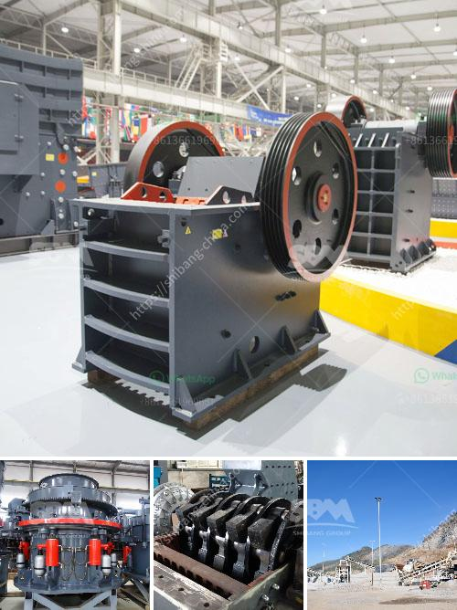

<h3>mining ball mill</h3>
Mining ball mill is a key equipment for grinding crushed materials, and it is widely used in production lines for powders such as cement, silicates, refractory material, fertilizer, glass ceramics, etc., as well as for ore dressing of both ferrous and non-ferrous metals. Ball mills can grind wet or dry and can be continuous or batch type mills.

In the mining industry, ball mills operate either in open or closed circuit. Open circuit operation is best utilized when: 

2. The discharge of the ball mill can be split into three segments, allowing multiple choice regarding grinding media

Typically, a ball mill is filled to approximately 40% with grinding media; however, this percentage can be altered to optimize the efficiency of the mill. The grinding media are usually made of high-chromium steel. The smaller grades are occasionally cylindrical ("pebs") rather than spherical. There exists a speed of rotation (the "critical speed") at which the contents of the mill would simply ride over the roof of the mill due to centrifugal action. The critical speed (rpm) is given by:

For instance, if the internal diameter of the mill is 2 meters, then the critical speed is about 72.6 rpm.

1. Grinding: An abrasion-resistant lining board is installed inside the cylinder, increasing the grinding effect of the grinding media on materials. The dry grinding process ensures a high quality final product even for lighter ores.

2. Crushing and grinding: Grinding medium is lifted to a certain height by the upward force from the impact of grinding media, impacting and grinding the ore particles. Crushing and grinding are completed in the ball mill with the impact of the steel balls. The impact crushing can be further divided into friction crushing and striking crushing. The latter can improve the powder grinding.

3. Transporting: Media balls in the mill rotate with the cylinder, so the grinding medium must be brought to a certain height. This is accomplished by the impact on the grinding medium, causing the grinding medium to fall and repeat the process.

4. Sorting: There are various grinding media sizes, shapes, and ratios inside the mill. Some are irregular shapes and have uneven wear rates. Therefore, sorting the grinding media is crucial for ensuring that all media are used effectively and reducing unnecessary energy consumption.

The performance of the mining ball mill directly affects the production efficiency and product quality of the plant. To optimize the operation of the mill and control the grinding process, a global control strategy is designed, considering the hardness of the ore, fineness target, and production volume. Advanced control strategies can provide a stable and efficient ball mill operation, resulting in energy savings and improved ore processing.

In conclusion, a mining ball mill plays a vital role in the mining industry. Grinding materials to a desired particle size is essential to maximize profits and minimize costs in the mining process. The innovative design of a mining ball mill efficiently enhances the production capacity and energy efficiency of mining operations.
<h3>Contact us</h3><ul><li><strong>Whatsapp:&nbsp;<a href="https://wa.me/8613661969651">+8613661969651</a></strong></li><li><a href="https://swt.shibang-china.com/?git&amp;zhl&amp;mining ball mill"><strong>Online Service(chat now)</strong></a></li></ul><h3>Related</h3><ul><li><a href='how to start a rock quarry business.md'>how to start a rock quarry business</a></li><li><a href='how much do rock crushers cost.md'>how much do rock crushers cost</a></li><li><a href='vertical mill cement.md'>vertical mill cement</a></li><li><a href='cement vertical roller mill.md'>cement vertical roller mill</a></li><li><a href='used quarry equipment for sale in calgary canada.md'>used quarry equipment for sale in calgary canada</a></li></ul>