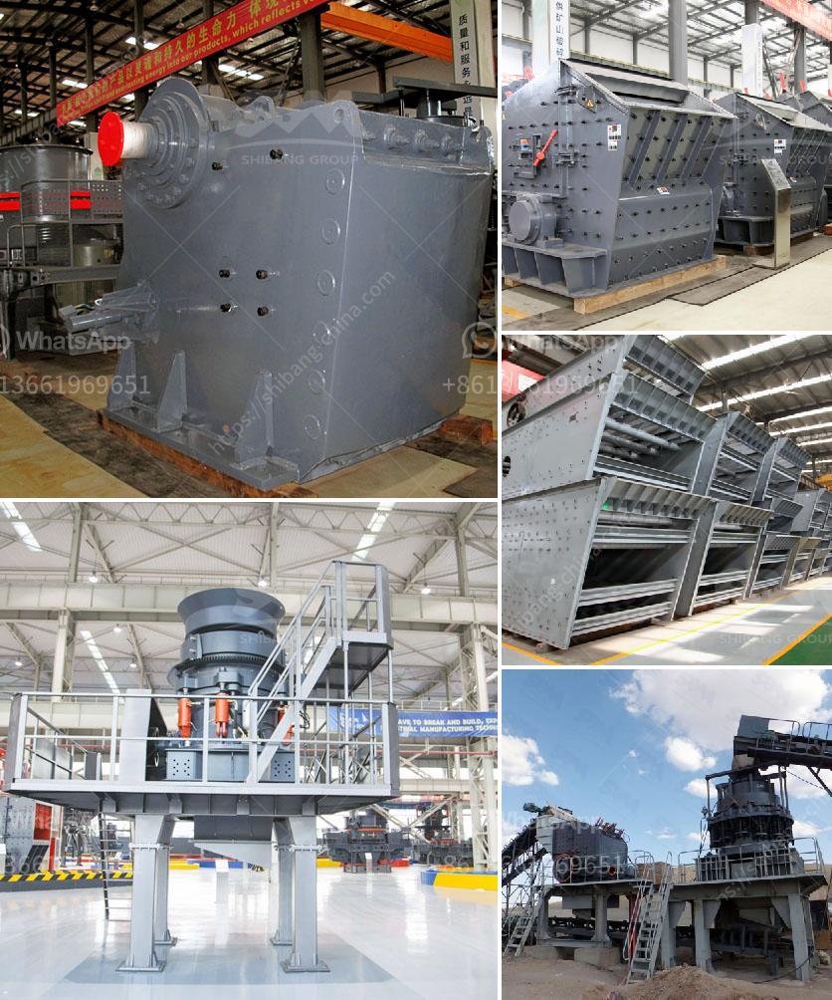

<h3>mining characteristics of crusher</h3>
Mining is an essential industry that plays a vital role in the global economy. One of the key components in this industry is the crusher - a machine that helps break down large rocks into smaller pieces. There are various types of crushers available in the market that caters to different mining needs. In this article, we will explore the key characteristics of a crusher that make it an indispensable tool for miners.

One of the primary characteristics of a crusher is its ability to produce the desired end product size. Crushers are designed to reduce the size of large rocks, making them suitable for further processing or usage. Different crushers have varying capabilities in terms of output size. For instance, gyratory crushers are known for producing coarse materials, while cone crushers are more suitable for producing finer particles. This characteristic allows miners to choose the appropriate crusher depending on their requirements and the end product they aim to achieve.

Another important characteristic of a crusher is its efficiency. Crushers are designed to maximize the production of desired materials while minimizing the energy consumption and overall operating costs. This is achieved through various features and technologies incorporated into modern crushers. For example, advanced hydraulic systems enable greater efficiency, as they allow for easier adjustment of the crusher settings. Additionally, the use of advanced wear-resistant materials ensures longer lifespan and reduced maintenance, leading to increased operational efficiency.

The versatility of a crusher is also a significant characteristic that enhances its mining capabilities. Crushers can be used for a wide range of applications, including primary crushing, secondary crushing, and even tertiary crushing. This versatility allows miners to use a single crusher for multiple tasks, resulting in cost savings and improved productivity. Moreover, crushers can handle various types of materials, including hard and abrasive rocks, making them suitable for diverse mining operations.

Durability is another notable characteristic of a crusher that proves its suitability for mining activities. Mining environments are often harsh and demanding, subjecting equipment to extreme conditions such as high forces, vibrations, and abrasive materials. Crushers must be able to withstand these conditions without compromising their performance. That's why most crushers are built with robust and durable materials, ensuring their longevity and reliability in challenging mining environments.

Safety is an essential consideration in the mining industry, and crushers are no exception. Many modern crushers come equipped with safety features to protect operators and minimize the risk of accidents. For example, automatic tramp release systems prevent damage to the crusher in case a foreign object enters the crushing chamber. Additionally, advanced control systems help monitor and control the crusher's operation, ensuring safe and efficient performance.

In conclusion, crushers are an integral part of mining operations due to their unique characteristics and capabilities. Their ability to produce desired end product sizes, efficiency, versatility, durability, and safety features make them indispensable tools for miners. As the mining industry continues to evolve and demand for various materials increases, crushers will remain crucial in meeting the industry's needs.
<h3>Contact us</h3><ul><li><strong>Whatsapp:&nbsp;<a href="https://wa.me/8613661969651">+8613661969651</a></strong></li><li><a href="https://swt.shibang-china.com/?git&amp;zhl&amp;mining characteristics of crusher"><strong>Online Service(chat now)</strong></a></li></ul><h3>Related</h3><ul><li><a href='stone crushing plant 100tph for sale.md'>stone crushing plant 100tph for sale</a></li><li><a href='fly ash powder making.md'>fly ash powder making</a></li><li><a href='grinding machine palletsgrinding machine palvisor.md'>grinding machine palletsgrinding machine palvisor</a></li><li><a href='ball mill maintenance seminar.md'>ball mill maintenance seminar</a></li><li><a href='cobalt ore processing plant setup cost.md'>cobalt ore processing plant setup cost</a></li></ul>