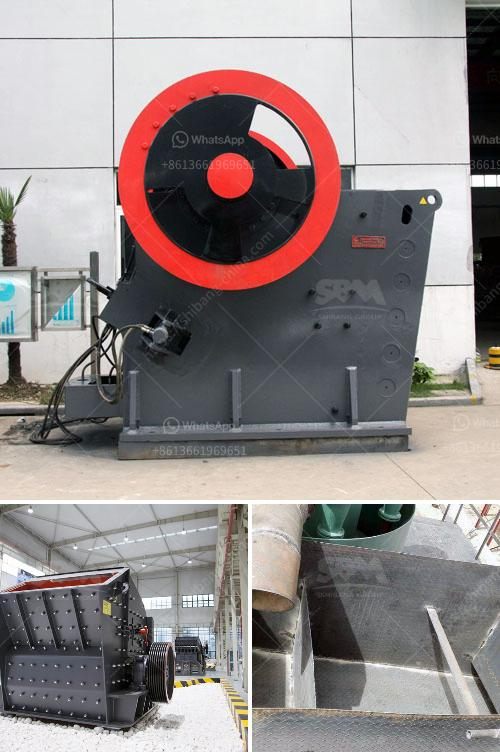

<h3>mining companies that sell heavy equipment</h3>
Mining is an industry that requires robust equipment to extract and process minerals efficiently. With advancements in technology, mining companies are opting for state-of-the-art equipment to enhance productivity and maximize their profits. These industry giants understand the importance of investing in heavy machinery that can withstand demanding conditions.

Mining companies that sell heavy equipment are revolutionizing the mining landscape. They play a crucial role in providing high-quality machinery to their clients, ensuring effective operations and minimizing downtime. These companies understand the unique challenges faced by the mining sector and strive to offer cutting-edge solutions.

One key advantage of purchasing heavy equipment from mining companies is the assurance of quality. These companies specialize in producing machinery designed specifically for the mining industry. They have the expertise to manufacture equipment that suits various mining operations, be it surface or underground mining. This targeted approach ensures that the equipment can withstand extreme conditions, ensuring durability and longevity.

Another advantage is the comprehensive after-sales support provided by mining companies. They offer maintenance services, spare parts, and regular inspections to ensure that the equipment continues to perform optimally. In the event of a breakdown or malfunction, mining companies can swiftly address any issues, minimizing downtime and maximizing productivity.

Furthermore, mining companies that sell heavy equipment often provide customized solutions tailored to their clients' specific needs. By understanding the unique requirements of each mining operation, these companies can offer equipment that maximizes efficiency and reduces costs. This personalized approach fosters long-term relationships, creating a win-win situation for both parties in terms of enhanced productivity and profitability.

Investing in high-quality heavy equipment from reputable mining companies also contributes to a company's environmental sustainability goals. Modern equipment is designed to minimize pollution and reduce carbon emissions. These companies are committed to supporting eco-friendly practices by offering state-of-the-art machinery that adheres to the industry's stringent environmental regulations.

In conclusion, mining companies that sell heavy equipment have revolutionized the mining industry by providing cutting-edge machinery. Their expertise in designing and manufacturing equipment tailored specifically for mining operations ensures durability, efficiency, and longevity. The comprehensive after-sales support and customized solutions offered by these companies further add value to the mining sector. By investing in high-quality equipment, mining companies can enhance productivity, reduce downtime, meet environmental regulations, and ultimately improve their bottom line.
<h3>Contact us</h3><ul><li><strong>Whatsapp:&nbsp;<a href="https://wa.me/8613661969651">+8613661969651</a></strong></li><li><a href="https://swt.shibang-china.com/?git&amp;zhl&amp;mining companies that sell heavy equipment"><strong>Online Service(chat now)</strong></a></li></ul><h3>Related</h3><ul><li><a href='roller crusher price list.md'>roller crusher price list</a></li><li><a href='mining processing machine prices.md'>mining processing machine prices</a></li><li><a href='crushing plant in the philippines.md'>crushing plant in the philippines</a></li><li><a href='sand and gravel mining equipment for sale.md'>sand and gravel mining equipment for sale</a></li><li><a href='static jaw crusher.md'>static jaw crusher</a></li></ul>