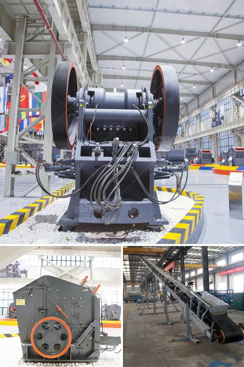

<h3>mining conveyor belt china</h3>
China, known as the world's largest producer and consumer of coal, has been striving to enhance its mining output. With an industry that heavily relies on efficient transport systems, the mining conveyor belt in China plays a vital role in the country's mining industry.

Mining conveyors are the lifeline of any mining operation, moving extracted materials from one location to another. They act as the arteries of the mining process, carrying tonnages of raw material to processing facilities, loading docks, or storage areas. These critical systems require robust and reliable conveyor belts designed to withstand harsh conditions, heavy loads, and high operating speeds.

China has been at the forefront of developing advanced technologies in conveyor belt systems. Their conveyor belt industry has made significant advancements in recent years to cater specifically to the mining sector.

One of the primary challenges mining conveyor belts face is the transport of heavy and abrasive materials such as coal, ores, and minerals. These materials can cause rapid wear and tear on conventional conveyor belts, leading to frequent breakdowns and increased maintenance costs. To combat these challenges, Chinese manufacturers have developed specialized conveyor belts with high tensile strength, resistance to impact, and excellent durability.

Reinforced with multiple layers of synthetic fabric or steel cords, these conveyor belts can withstand heavy loads and provide reliable and long-lasting performance. Moreover, they are designed with a variety of cover types, including heat-resistant, flame-resistant, and oil-resistant covers, to meet the specific needs of different mining applications.

In addition to durability, Chinese mining conveyor belts are designed for high efficiency. The belts are engineered for smooth and precise material transport, minimizing spillage and reducing loss of valuable materials. This improved efficiency not only enhances productivity but also reduces environmental impact by minimizing waste.

Another significant development in China's mining conveyor belt industry is automation and technology integration. Automated conveyor belt systems utilize sensors, scanners, and software to monitor factors such as belt speed, tension, and tracking. This real-time monitoring helps to identify issues before they cause significant breakdowns, reducing downtime and improving overall efficiency.

Furthermore, Chinese manufacturers have incorporated advanced technologies like artificial intelligence and machine learning into conveyor belt systems. These technologies enable predictive maintenance, where algorithms analyze data from various sensors to predict maintenance requirements. By detecting potential failures in advance, preventive measures can be taken, reducing repair costs and optimizing the lifespan of conveyor belts.

Chinese mining conveyor belt manufacturers also prioritize safety. Safety features such as emergency stop switches, guards, and protection devices are standard in their conveyor belt systems. These measures help to prevent accidents and ensure the well-being of workers in the mining industry.

In conclusion, China's mining conveyor belt industry has made significant progress in developing specialized conveyor belts that meet the unique needs of the mining sector. These belts are designed to withstand heavy loads, provide efficient material transport, and incorporate advanced automation and safety features. By continually investing in technological advancements, China is supporting its mining industry with reliable and efficient conveyor belt systems, contributing to increased productivity, reduced downtime, and improved workplace safety.
<h3>Contact us</h3><ul><li><strong>Whatsapp:&nbsp;<a href="https://wa.me/8613661969651">+8613661969651</a></strong></li><li><a href="https://swt.shibang-china.com/?git&amp;zhl&amp;mining conveyor belt china"><strong>Online Service(chat now)</strong></a></li></ul><h3>Related</h3><ul><li><a href='diameter of the ball mill.md'>diameter of the ball mill</a></li><li><a href='basalt crushing line.md'>basalt crushing line</a></li><li><a href='crushing conveyor belts malaysia.md'>crushing conveyor belts malaysia</a></li><li><a href='roller raymond mill with best price.md'>roller raymond mill with best price</a></li><li><a href='rock quarry equipment for sale in europe.md'>rock quarry equipment for sale in europe</a></li></ul>