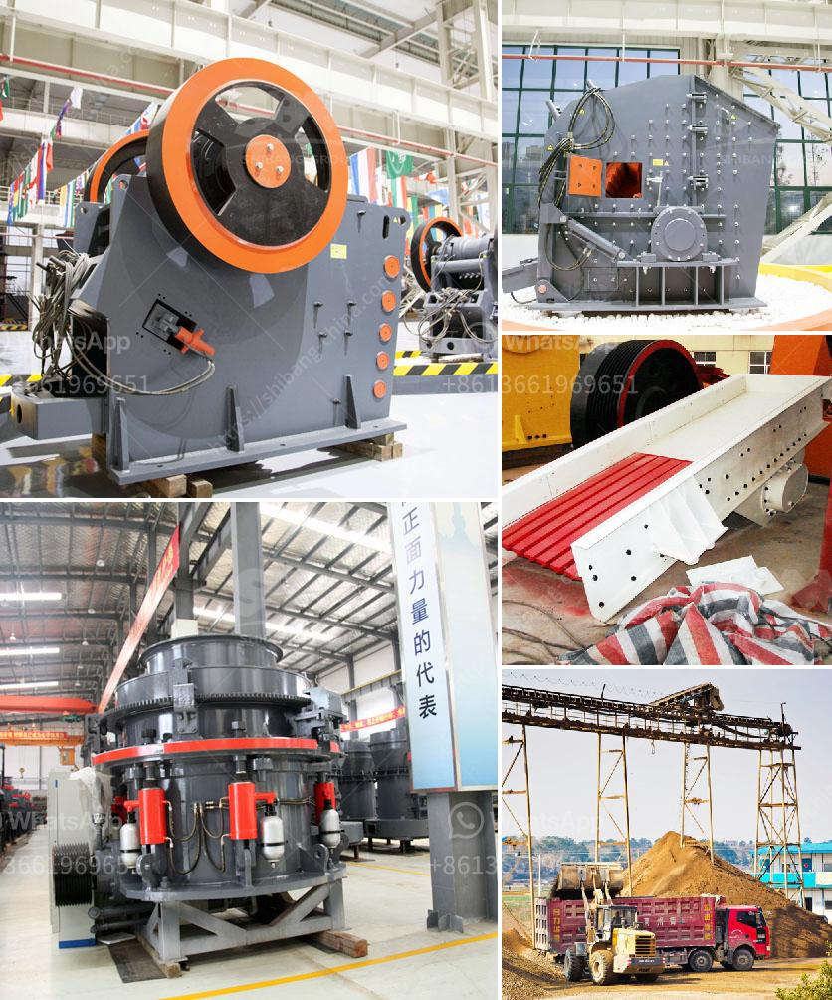

<h3>mining crusher for lateric ores cost</h3>
Mining operations have always been a costly endeavor, especially when it comes to extracting and processing valuable ores like laterites. Lateric ores, also known as laterite, are a type of soil deposit rich in minerals such as nickel, cobalt, and iron. However, mining these ores can be challenging due to their strong physical and chemical characteristics.

To effectively mine lateric ores, an essential piece of equipment is the mining crusher. The mining crusher plays a crucial role in breaking down large chunks of laterite into smaller, more manageable sizes. This not only speeds up the mining process but also enhances the efficiency of subsequent processing steps, such as washing, grinding, and separating the valuable minerals from the waste.

One key consideration when choosing a mining crusher for lateric ores is its cost-effectiveness. Mining companies need to evaluate the initial investment cost, maintenance and operational expenses, and the overall performance and reliability of the crusher. To achieve optimal cost-efficiency, several factors should be taken into account.

Firstly, the type of crusher employed is essential. There are various types available, including jaw crushers, cone crushers, impact crushers, and gyratory crushers. Each type has its own advantages and disadvantages, so mining companies should select the one that best fits their specific needs and budget.

Additionally, the capacity of the crusher must be considered. Depending on the anticipated production requirements, a higher capacity crusher may be necessary. However, it is important to strike a balance between capacity and cost, as investing in an excessively large crusher can unnecessarily inflate expenses. Careful evaluation of production forecasts and long-term mining plans can guide the selection process.

Moreover, the durability and reliability of the crusher must not be overlooked. Considering the harsh operating conditions of a mining site, the crusher must be robust enough to withstand heavy loads, impacts, and frequent material changes. Poor durability and reliability can result in frequent breakdowns and unplanned maintenance, leading to increased downtime and costs.

To further enhance cost-effectiveness, the mining crusher should incorporate energy-efficient technologies. Energy consumption can account for a substantial portion of the operating costs of a mining operation. Opting for crushers with advanced features such as variable speed drives, automatic control systems, and energy recovery mechanisms can significantly reduce energy consumption, thereby cutting costs in the long run.

Moreover, regular maintenance and timely repairs are crucial for achieving cost-effectiveness. Well-maintained crushers tend to have longer lifespans and higher productivity. Implementing a preventive maintenance program and training the workforce in routine inspection and maintenance can help identify and address problems before they escalate, ultimately reducing overall costs.

In conclusion, mining crushers play a pivotal role in optimizing the efficiency of lateric ore extraction and processing. When selecting a crusher for mining operations, cost-effectiveness should be a primary consideration. Evaluating factors such as initial investment, maintenance expenses, reliability, capacity, and energy efficiency can help mining companies make informed decisions, ensuring maximum profitability while minimizing costs.
<h3>Contact us</h3><ul><li><strong>Whatsapp:&nbsp;<a href="https://wa.me/8613661969651">+8613661969651</a></strong></li><li><a href="https://swt.shibang-china.com/?git&amp;zhl&amp;mining crusher for lateric ores cost"><strong>Online Service(chat now)</strong></a></li></ul><h3>Related</h3><ul><li><a href='supplier of granite crusher.md'>supplier of granite crusher</a></li><li><a href='mica grinding mill.md'>mica grinding mill</a></li><li><a href='stone jaw crushers in japan.md'>stone jaw crushers in japan</a></li><li><a href='sand screening mobile washing plants for sale.md'>sand screening mobile washing plants for sale</a></li><li><a href='used stone crusher equipment price uk.md'>used stone crusher equipment price uk</a></li></ul>