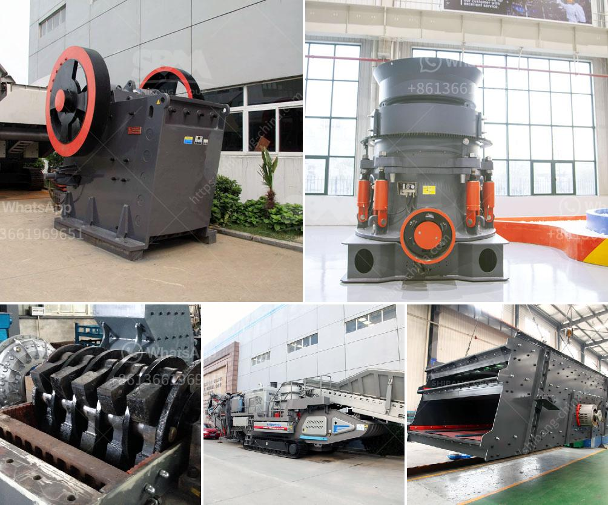

<h3>mining crusher plants in egypt</h3>
Mining crusher plants in Egypt generate high quality materials for various industries in the country. The mining industry in Egypt is considered one of the most thriving sectors as it contributes significantly to the economic growth. Egypt's rich mineral resources, including tantalite, zinc, copper, lead, and phosphates, have attracted various mining companies to the region.

Mining crusher plants in Egypt have a great impact on the industry's development since it allows the processing of ores to be conducted in a more efficient and productive manner. These plants are designed to break down different types of rocks, ores, and minerals into smaller forms or sizes to be used for various purposes such as construction materials, cement production, and road building.

One of the well-known mining crusher plants in Egypt is the International Mining Technology Company (IMT). This company has been a pioneer in the industry for many years and manufactures high-quality crushers. The crushers produced by IMT are efficient, durable, and designed to handle the toughest materials. They use advanced technology and innovative engineering to ensure the highest level of performance.

The advantages of using mining crusher plants in Egypt are numerous. Firstly, they increase the overall productivity of the mining process, allowing more materials to be extracted and processed. This leads to higher profits for mining companies and economic growth for the country. Additionally, these plants help in minimizing the impact on the environment by reducing the need for new mining sites.

Furthermore, mining crusher plants in Egypt help in creating job opportunities for local communities. These plants require skilled workers to operate and maintain, providing employment for the local workforce. The development of the mining industry in Egypt, including the establishment of crusher plants, has contributed to the reduction of unemployment rates and poverty levels in rural areas.

In conclusion, mining crusher plants in Egypt play a crucial role in supporting the mining industry and the country's economy. These plants enable efficient processing of minerals and provide various materials needed for different sectors. They bring numerous benefits, such as higher productivity, job creation, and environmental sustainability. The mining industry in Egypt continues to thrive thanks to the presence of these crusher plants.
<h3>Contact us</h3><ul><li><strong>Whatsapp:&nbsp;<a href="https://wa.me/8613661969651">+8613661969651</a></strong></li><li><a href="https://swt.shibang-china.com/?git&amp;zhl&amp;mining crusher plants in egypt"><strong>Online Service(chat now)</strong></a></li></ul><h3>Related</h3><ul><li><a href='roller mill process machine.md'>roller mill process machine</a></li><li><a href='mobile crushing station philippines.md'>mobile crushing station philippines</a></li><li><a href='iron ore crusher.md'>iron ore crusher</a></li><li><a href='china raymond mill company.md'>china raymond mill company</a></li><li><a href='stone quarry crusher in kasoa.md'>stone quarry crusher in kasoa</a></li></ul>