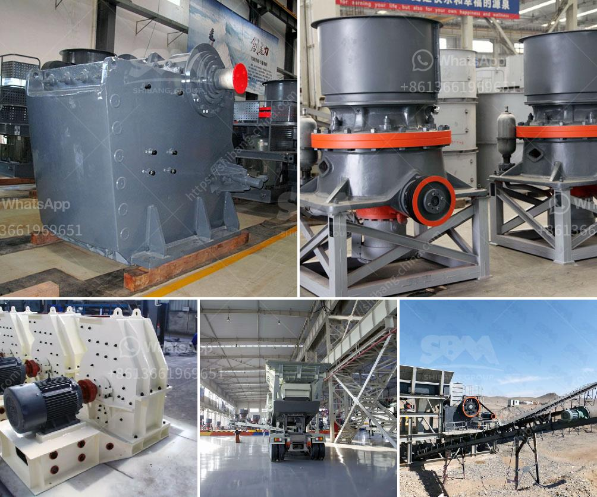

<h3>mining equipment agent in iran</h3>
Iran, known for its vast natural resources, has always been a major player in the mining industry. Rich in minerals such as copper, zinc, coal, lead, and iron ore, the country holds great potential for extracting and utilizing these resources. However, harnessing these resources efficiently and safely requires the use of advanced mining equipment. This is where mining equipment agents step in, playing a critical role in supporting the industry's growth and facilitating technological innovation.

A mining equipment agent acts as a bridge between the mining companies and manufacturers of mining machinery. They are responsible for representing and distributing the products of various renowned international manufacturers in the Iranian market. These agents bring expertise, technical knowledge, and industry know-how, ensuring that the mining companies have access to top-quality equipment and cutting-edge technologies.

One of the key advantages of working with mining equipment agents is their ability to provide customized solutions to meet the unique needs and challenges of the Iranian mining industry. They understand the specific requirements of different mining operations and collaborate closely with manufacturers to develop tailored equipment that maximizes efficiency and productivity.

Moreover, mining equipment agents often play a crucial role in introducing new technologies to the Iranian market. They continuously monitor global advancements in mining machinery and bring these innovations to the attention of the local industry. By facilitating knowledge transfer and promoting technological advancements, these agents contribute significantly to the modernization and automation of mining operations in Iran.

Additionally, mining equipment agents play a vital role in providing after-sales support, maintenance, and spare parts services to their clients. Local presence and expertise allow them to quickly respond to any technical issues, ensuring minimal downtime and maximizing the uptime of mining equipment. This prompt service and support not only enhance operational efficiency but also contribute to building trust and long-term relationships with the mining companies.

In recent years, Iran has witnessed a growing number of mining equipment agents entering the market. The increased presence of international manufacturers through these agents has positively impacted the industry. It has brought healthy competition, improved product quality, and offered a wider range of options to the mining companies to choose from.

Furthermore, the presence of mining equipment agents has also contributed to local job creation and skills development. As these agents establish their offices and service centers in Iran, they create employment opportunities, particularly for technicians, engineers, and support staff. They also invest in training local personnel, enhancing the technical capabilities of the local workforce.

To ensure continued growth and success, mining equipment agents in Iran need to adapt to the changing needs of the industry. They must keep abreast of emerging technologies, renewable energy solutions, and sustainable mining practices. By actively promoting the adoption of environmentally friendly mining technologies and advocating for responsible mining practices, these agents can contribute to the long-term sustainability of the mining sector in Iran.

In conclusion, mining equipment agents in Iran play a vital role in supporting the growth of the mining industry. They provide access to advanced machinery, facilitate technology transfer, and offer customized solutions to meet the specific needs of mining operations. Their presence drives innovation, improves product quality, and enhances operational efficiency. With their continued efforts, mining equipment agents are contributing to the modernization and sustainable development of the mining sector in Iran.
<h3>Contact us</h3><ul><li><strong>Whatsapp:&nbsp;<a href="https://wa.me/8613661969651">+8613661969651</a></strong></li><li><a href="https://swt.shibang-china.com/?git&amp;zhl&amp;mining equipment agent in iran"><strong>Online Service(chat now)</strong></a></li></ul><h3>Related</h3><ul><li><a href='micro powder mill cost.md'>micro powder mill cost</a></li><li><a href='ballast crushing equipment.md'>ballast crushing equipment</a></li><li><a href='limestone grinding machine manufacturers in india.md'>limestone grinding machine manufacturers in india</a></li><li><a href='machinery required to setup cement plant.md'>machinery required to setup cement plant</a></li><li><a href='iron ore beneficiation plants price in china.md'>iron ore beneficiation plants price in china</a></li></ul>