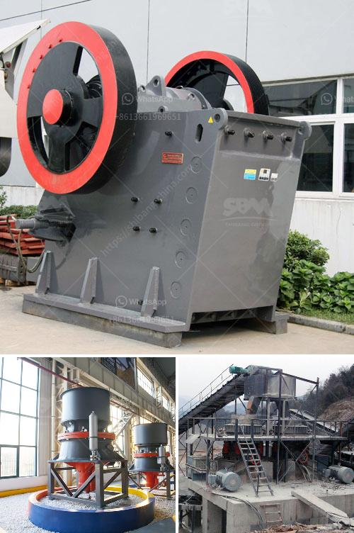

<h3>mining industry in mpumalanga</h3>
The mining industry in Mpumalanga, a province in South Africa, has been a significant contributor to the local economy for many years. Mpumalanga is rich in coal deposits, which are extensively mined in the region. The extraction of coal has played a vital role in the industrial development and infrastructural growth of the province.

The coal mining industry in Mpumalanga is characterized by large-scale operations, with several coal mines scattered across the province. These mines provide employment opportunities for thousands of people and contribute significantly to the provincial Gross Domestic Product (GDP).

One of the major advantages of the mining industry in Mpumalanga is the abundance of coal reserves. The province has estimated coal reserves of around 53 billion tons, making it one of the largest coal-producing regions in the world. This abundance of coal ensures a reliable supply for the domestic market and allows for export to international markets, further boosting the local economy.

The mining industry in Mpumalanga has also led to the development of support sectors, such as transportation and logistics. The transportation of coal from the mines to power stations and export terminals requires an extensive network of roads, rail lines, and ports. This infrastructure development not only facilitates the movement of coal but also provides employment opportunities in the construction and maintenance of these facilities.

However, the mining industry in Mpumalanga is not without its challenges. One of the most significant concerns is the environmental impact of coal mining. Coal mining activities are known to have detrimental effects on the environment, including the destruction of natural habitats, air pollution, and water contamination. Efforts are being made by mining companies and the government to mitigate these impacts through responsible mining practices and the implementation of environmental management plans.

Another challenge faced by the mining industry in Mpumalanga is the health and safety of workers. Mining is a dangerous occupation, and accidents and fatalities are not uncommon. To address this issue, stringent safety regulations are in place, and mining companies are required to comply with these regulations to ensure the well-being of their employees.

Despite these challenges, the mining industry in Mpumalanga continues to play a crucial role in the provincial economy. It provides employment opportunities, income generation, and foreign exchange earnings through coal exports. The industry's contribution to the GDP of Mpumalanga cannot be understated, and it remains a significant pillar of economic growth in the province.

In conclusion, the mining industry in Mpumalanga, particularly in coal extraction, is a major contributor to the provincial economy. The region's abundant coal reserves provide a reliable supply for both domestic consumption and international exports. Although the industry faces challenges related to environmental impact and worker safety, efforts are being made to address these issues. Overall, the mining industry in Mpumalanga continues to drive economic growth and development in the province.
<h3>Contact us</h3><ul><li><strong>Whatsapp:&nbsp;<a href="https://wa.me/8613661969651">+8613661969651</a></strong></li><li><a href="https://swt.shibang-china.com/?git&amp;zhl&amp;mining industry in mpumalanga"><strong>Online Service(chat now)</strong></a></li></ul><h3>Related</h3><ul><li><a href='graphite mining equipment.md'>graphite mining equipment</a></li><li><a href='ball mill vs vertical roller mill pdf.md'>ball mill vs vertical roller mill pdf</a></li><li><a href='used portable crusher plant for sale dubai.md'>used portable crusher plant for sale dubai</a></li><li><a href='overland conveyor belt system cost estimates.md'>overland conveyor belt system cost estimates</a></li><li><a href='cost of crushing plants in india.md'>cost of crushing plants in india</a></li></ul>