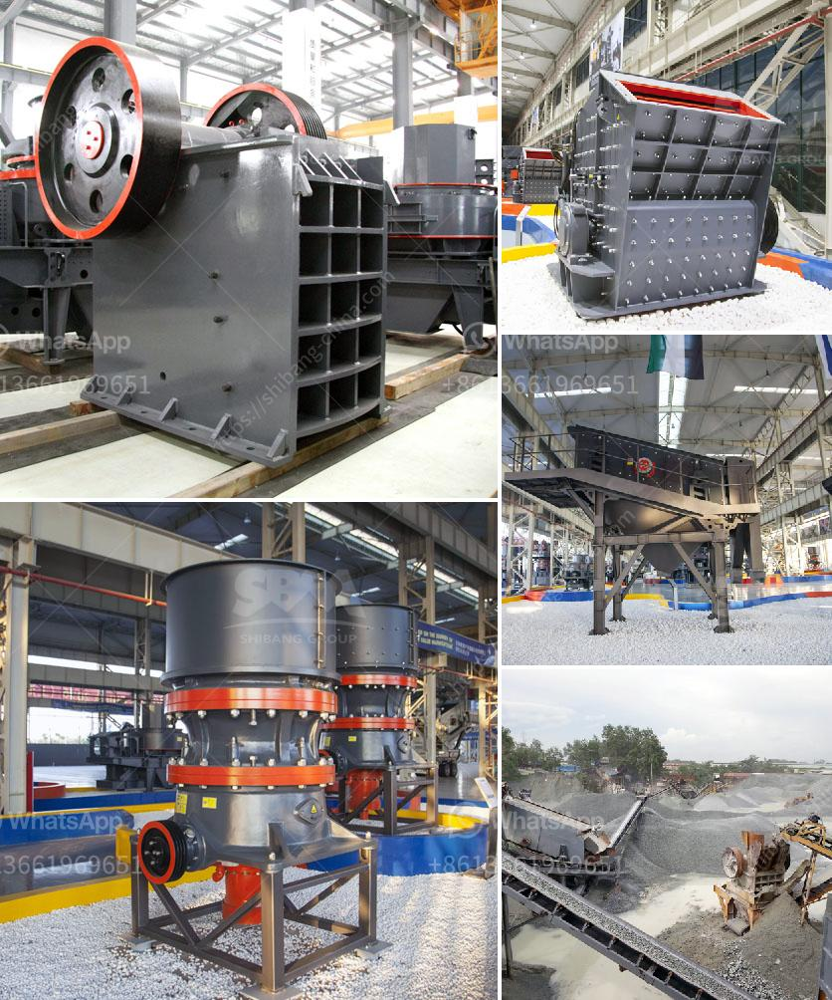

<h3>mining machinery manufacturer in italy</h3>
Italy is renowned for its rich history and diverse culture, but little do people know that it is also a significant player in the mining machinery industry. Italy's mining machinery manufacturers have gained a strong foothold globally, thanks to their cutting-edge technology, innovative design, and commitment to excellence.

One prominent Italian mining machinery manufacturer is Komatsu Italia Manufacturing, an affiliate of the renowned Japanese brand Komatsu. With its state-of-the-art manufacturing facility in Italy, the company produces a wide range of mining equipment, including loaders, bulldozers, and excavators. These machines are known for their robust construction, superior performance, and advanced features that ensure optimal productivity and efficiency in mining operations.

Another leading player in the Italian mining machinery sector is CNH Industrial, a multinational company that designs, produces, and sells agricultural and construction equipment. It offers a comprehensive range of mining machinery under its brand names, such as New Holland Construction, CASE Construction Equipment, and Iveco Astra. The company's mining machinery is known for its reliability, durability, and exceptional performance, making it a preferred choice among mining companies worldwide.

Italy's mining machinery manufacturers have gained recognition for their focus on sustainability and environmental friendliness. For instance, Liebherr-Italia, a subsidiary of the German company Liebherr, has developed advanced mining machinery that incorporates energy-saving technology and reduces emissions. These machines not only improve operational efficiency but also significantly minimize the carbon footprint associated with mining activities.

Moreover, Italy's mining machinery manufacturers prioritize safety in their designs, ensuring that their equipment meets the highest industry standards. They incorporate advanced safety features, such as ergonomic operator cabins, real-time monitoring systems, and automated controls, to minimize accidents and promote the well-being of workers.

In conclusion, Italy's mining machinery manufacturers are a force to be reckoned with in the global market. Their commitment to technological innovation, sustainability, and safety has propelled them to the forefront of the industry. With their superior quality and cutting-edge designs, Italian mining machinery manufacturers are contributing to the growth and success of mining operations worldwide.
<h3>Contact us</h3><ul><li><strong>Whatsapp:&nbsp;<a href="https://wa.me/8613661969651">+8613661969651</a></strong></li><li><a href="https://swt.shibang-china.com/?git&amp;zhl&amp;mining machinery manufacturer in italy"><strong>Online Service(chat now)</strong></a></li></ul><h3>Related</h3><ul><li><a href='rock crushing machine nigeria.md'>rock crushing machine nigeria</a></li><li><a href='machinery required to setup cement plant.md'>machinery required to setup cement plant</a></li><li><a href='ball mill maintenance seminar.md'>ball mill maintenance seminar</a></li><li><a href='mining screens and crushing equipment.md'>mining screens and crushing equipment</a></li><li><a href='jaw crusher for sale in spain.md'>jaw crusher for sale in spain</a></li></ul>