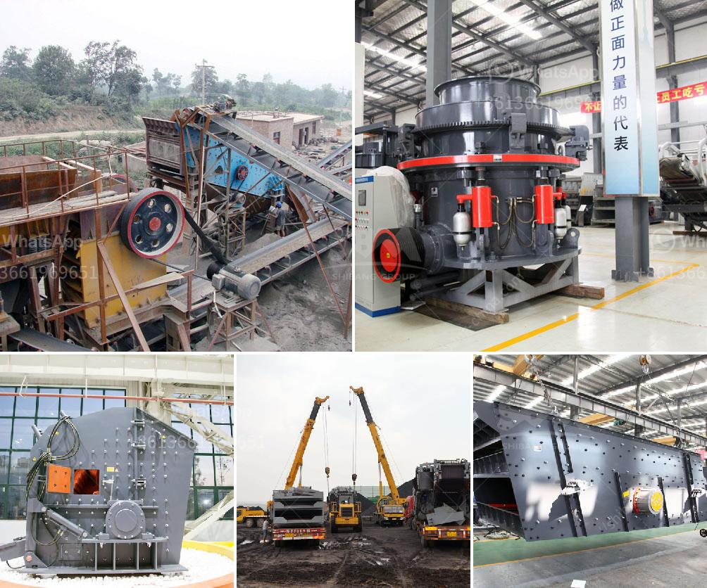

<h3>mining process of marble crusher</h3>
Marble mining is a multi-stage process that involves various stages and different types of machines to extract and process marble materials. As the leading stone crusher manufacturer and exporter, we provide evidence solutions for marble quarrying, plant, and machinery. We offer various sizes of primary and secondary marble crushers, such as PE jaw crusher, PEW jaw crusher, PF impact crusher, PFW impact crusher, cone crusher, hammer crusher, gyratory crusher, VSI crusher, etc.

1. Excavation: The first stage in the marble mining process is the removal of overburden, which includes dirt, trees, shrubs, and other unwanted materials. This process is accomplished using heavy equipment such as bulldozers, excavators, or big trucks.

2. Marble extraction: After the overburden is removed, the marble block in the mountain is exposed. The extraction process involves drilling holes and creating a chain of cuts with a wire saw or diamond-tipped blade. These cuts separate the marble block from the quarry wall. Cranes or pulley systems are then used to lift the blocks onto trucks for transportation to the crushing plant.

3. Crushing: The marble blocks transferred to the crushing plant are crushed by the jaw crusher, impact crusher, cone crusher, gyratory crusher, or hammer crusher. The marble fragments obtained are then sieved through a vibrating screen. Oversized material is returned to the crushers for further processing, while the correctly sized material is sent to the next stage.

4. Grinding and polishing: After the marble fragments are crushed and screened, they are usually subjected to grinding and polishing processes to obtain the desired marble product. This stage involves using machines such as grinders and polishers to remove any rough edges and create a smooth, glossy surface on the marble.

5. Inspection and packaging: Once the marble blocks are transformed into finished products, they undergo a thorough inspection to ensure their quality. Defects, if any, are rectified during this stage. The finished products, such as marble slabs or tiles, are then carefully packaged to prevent any damage during transportation.

The mining process of marble crusher is labor-intensive and requires various machinery and equipment. It starts with the excavation and removal of overburden, followed by the extraction of marble blocks from the quarry wall. The blocks are then crushed, ground, and polished to achieve the desired finished product. Each stage of the process requires specific machines and skilled workers to ensure a high-quality end result.

Marble mining not only provides an essential material for construction and decoration but also contributes to the local economy through employment and export of finished products. However, it is essential to ensure that marble mining is carried out sustainably, minimizing environmental impacts and considering the well-being of the surrounding communities.

In conclusion, the mining process of marble crusher involves various stages and equipment, starting with the excavation and extraction of marble blocks, followed by crushing, grinding, and polishing to obtain the finished product. This process requires skilled workers and specialized machinery to ensure high-quality marble products while minimizing environmental impacts.
<h3>Contact us</h3><ul><li><strong>Whatsapp:&nbsp;<a href="https://wa.me/8613661969651">+8613661969651</a></strong></li><li><a href="https://swt.shibang-china.com/?git&amp;zhl&amp;mining process of marble crusher"><strong>Online Service(chat now)</strong></a></li></ul><h3>Related</h3><ul><li><a href='grinding mill usa.md'>grinding mill usa</a></li><li><a href='stone crushing plant 100tph for sale.md'>stone crushing plant 100tph for sale</a></li><li><a href='nigeria vertical mill machine.md'>nigeria vertical mill machine</a></li><li><a href='laboratory grinding mills jaw crushers.md'>laboratory grinding mills jaw crushers</a></li><li><a href='200tph stationary crushing plant.md'>200tph stationary crushing plant</a></li></ul>