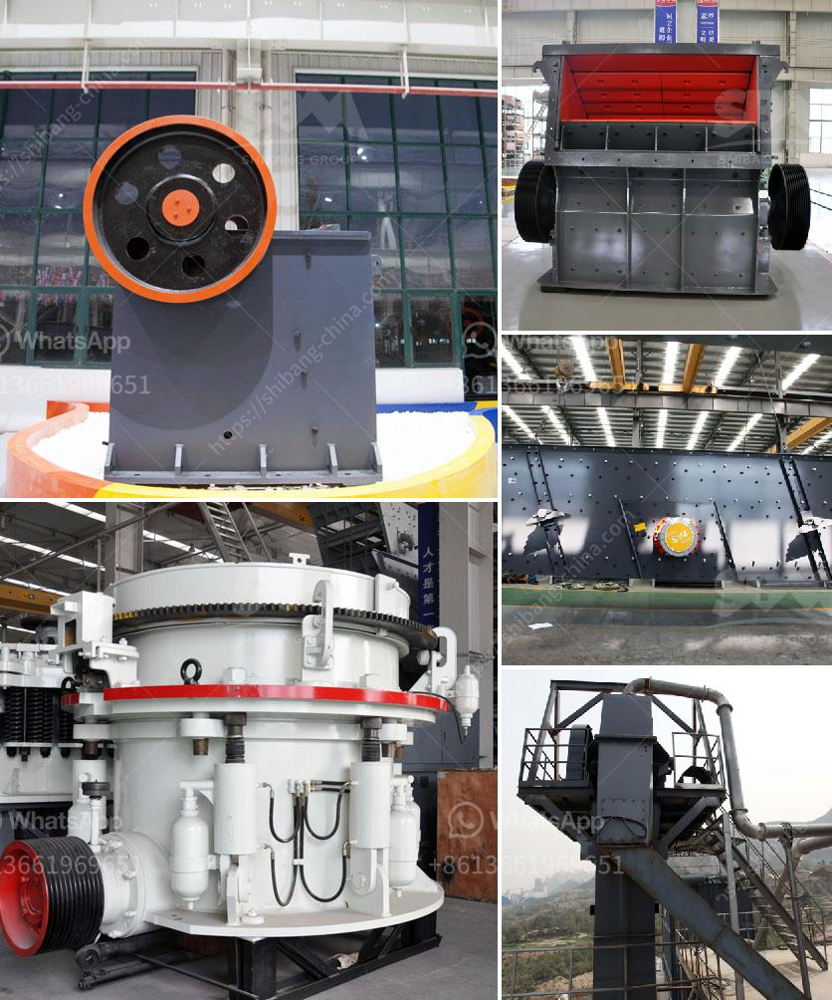

<h3>mining processing machine prices</h3>
Mining processing machines are essential in the mining industry as they are responsible for extracting valuable resources from the earth. These machines are designed to process and refine raw materials, ensuring that they meet the required specifications for various industries. However, the costs of mining processing machines can vary significantly based on various factors.

One of the main factors that influence mining processing machine prices is the size and capacity of the machine. Larger machines with higher processing capacities tend to be more expensive compared to smaller ones. This is because larger machines require more robust components, higher horsepower engines, and advanced technology to handle larger volumes of raw materials.

Additionally, the complexity and level of automation also impact the prices of mining processing machines. Machines with advanced automation features that reduce human intervention and increase efficiency generally come with a higher price tag. These machines often incorporate cutting-edge technology such as artificial intelligence and remote monitoring systems, which contribute to increased productivity but also drive up the overall cost.

Another significant factor that affects the prices of mining processing machines is the type of raw material being processed. Different minerals and ores require specific processing methods and specialized machinery. For example, gold processing machines need to be able to separate and extract gold particles efficiently, whereas iron ore processing machines need to crush and grind the ore to a specific size for further processing. The complexity involved in processing different materials affects the design and manufacturing requirements, thereby influencing the cost of the machines.

Furthermore, economic factors also play a vital role in determining mining processing machine prices. The price of raw materials, availability of labor, and fluctuations in metal prices impact the overall cost of mining operations. Manufacturers often take these factors into account when setting the prices of their machines to ensure profitability and competitiveness in the market.

Besides the initial purchase price, mining processing machine prices also encompass other costs that contribute to the total cost of ownership. These costs include maintenance, repair, and energy consumption. Machines with higher energy efficiency tend to have a higher upfront cost but can result in significant savings in operational expenses over the machine's lifespan.

It is important for mining companies to carefully evaluate their requirements and budget when investing in mining processing machines. Factors such as production volume, type of raw material, and operational efficiency should be considered to ensure that the chosen machines align with the company's goals and can deliver the desired results.

In conclusion, mining processing machine prices are influenced by various factors, including size, capacity, complexity, automation, type of raw material, and economic factors. Understanding these factors and their impact on the cost of mining machines is crucial for mining companies to make informed decisions and optimize their operations. By carefully considering their requirements and evaluating the total cost of ownership, companies can choose the right mining processing machines that offer the best value for their investment.
<h3>Contact us</h3><ul><li><strong>Whatsapp:&nbsp;<a href="https://wa.me/8613661969651">+8613661969651</a></strong></li><li><a href="https://swt.shibang-china.com/?git&amp;zhl&amp;mining processing machine prices"><strong>Online Service(chat now)</strong></a></li></ul><h3>Related</h3><ul><li><a href='mining processing machine prices.md'>mining processing machine prices</a></li><li><a href='mobile crusher discount.md'>mobile crusher discount</a></li><li><a href='stone crusher price list 300 tonnes capacity per hour.md'>stone crusher price list 300 tonnes capacity per hour</a></li><li><a href='rent a conveyor belt.md'>rent a conveyor belt</a></li><li><a href='sample of a business proposal for a block factory.md'>sample of a business proposal for a block factory</a></li></ul>