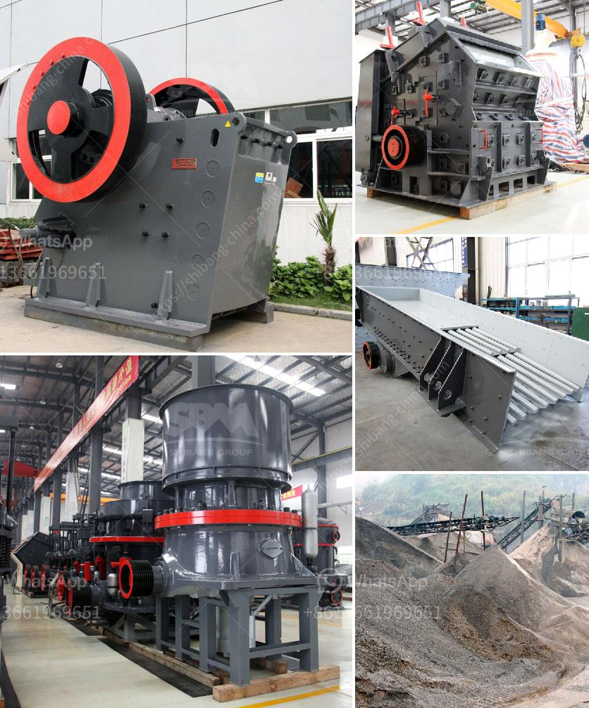

<h3>mining screens and crushing equipment</h3>
Mining screens and crushing equipment are crucial components in the mining industry. They are used to separate valuable minerals and rocks from waste materials and ensure efficient and effective mining operations. These equipment play a significant role in reducing the size of the mined materials for further processing, transportation, and subsequent sale.

Mining screens are designed to filter out different-sized particles based on their specific properties. They are commonly used in the first stages of the mining process to separate valuable minerals from larger rocks and materials. Screens come in various types, such as vibrating screens, grizzly screens, and trommel screens. These screens can be customized to fit specific mining requirements, and they play a crucial role in ensuring that only desired materials proceed to the next stage of processing.

Crushing equipment, on the other hand, reduces the size of mined materials into smaller, more manageable sizes. This process is essential in mineral extraction, as it facilitates the separation of valuable minerals, such as gold, copper, or silver, from the surrounding waste materials. Crushing equipment includes various machines, such as jaw crushers, impact crushers, and cone crushers, designed to break down the mined materials into smaller sizes.

Efficient crushing equipment is vital in achieving maximum productivity and reducing mining costs. It not only enhances the extraction process but also minimizes the amount of energy and resources required. Advanced crushing equipment utilizes innovative technology to handle various types of ores and minerals effectively. They are engineered to withstand heavy-duty operations, ensuring a longer operational life.

In conclusion, mining screens and crushing equipment are integral components in the mining industry. They help separate valuable minerals from waste materials and reduce the size of mined materials for further processing. Investing in high-quality mining screens and crushing equipment is crucial for efficient and cost-effective mining operations. By selecting the right equipment, mining companies can optimize their production, increase profitability, and support sustainable mining practices.
<h3>Contact us</h3><ul><li><strong>Whatsapp:&nbsp;<a href="https://wa.me/8613661969651">+8613661969651</a></strong></li><li><a href="https://swt.shibang-china.com/?git&amp;zhl&amp;mining screens and crushing equipment"><strong>Online Service(chat now)</strong></a></li></ul><h3>Related</h3><ul><li><a href='stone crusher bahan bakar.md'>stone crusher bahan bakar</a></li><li><a href='100tph small capacity granite crusher.md'>100tph small capacity granite crusher</a></li><li><a href='laboratory grinding mills jaw crushers.md'>laboratory grinding mills jaw crushers</a></li><li><a href='stone crusher contact.md'>stone crusher contact</a></li><li><a href='slag powder grinding in india.md'>slag powder grinding in india</a></li></ul>