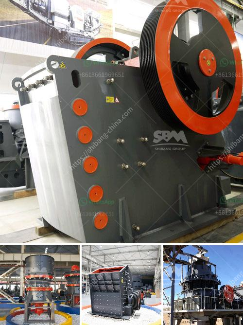

<h3>mining tenders in south africa</h3>
South Africa, widely considered as the treasure trove of mineral resources, has a long and rich history of mining. The country's vast geological reserves are home to a variety of minerals, including gold, platinum, diamonds, coal, and chrome, among others. And with the extensive mineral wealth comes immense potential for economic growth and development.

However, to tap into these reserves and harness their true potential, a robust and transparent mining tender process is essential. Mining tenders serve as a primary mechanism to attract local and international investors and ensure fair competition while fostering sustainable mining practices.

The mining tender process in South Africa is overseen by the Department of Mineral Resources and Energy (DMRE). The DMRE's main objective is to promote and regulate the country's mining sector while ensuring the responsible utilization of mineral resources. Through the tender process, the department aims to attract reputable mining companies with the required expertise and financial capacity to undertake mining projects in South Africa.

Mining tenders in the country typically involve the allocation of mineral rights or mining licenses to interested parties. These tenders are published and open for bidding by any qualified company or consortium, both local and foreign. The transparency of the process ensures fairness and eliminates any bias, creating a level playing field for all participants.

The advantages of mining tenders in South Africa are multifaceted. Firstly, they provide opportunities for job creation and skills development, contributing to the country's socio-economic growth. Mining projects require a diverse workforce, from skilled engineers and geologists to machine operators and laborers, thereby creating employment at various levels.

Secondly, mining tenders are essential for attracting foreign investment into the country. The mineral wealth of South Africa is renowned globally, making it a hotspot for mining companies seeking lucrative opportunities. A transparent tender process opens doors for international mining operators to enter the South African market, promoting competition and injecting capital into the local economy.

Furthermore, the tender process ensures that mining projects adhere to environmental regulations and sustainable practices. The DMRE imposes stringent criteria on applicants, such as demonstrating their commitment to minimizing the environmental impact of mining operations and implementing measures to protect local ecosystems and communities.

One notable example is the requirement for social and labor plans, which outline the mining company's commitment to uplift local communities through job creation, infrastructure development, and support for education and healthcare facilities. These plans ensure that the benefits of mining are shared equitably and contribute to the overall socio-economic upliftment of South African society.

However, challenges remain in the mining tender process. Delays in awarding mining licenses and issues related to bureaucratic procedures have been sources of frustration for both potential investors and the government. Streamlining the tender process and reducing red tape are crucial to improving the efficiency and effectiveness of mining tenders in South Africa.

In conclusion, mining tenders in South Africa play a vital role in unlocking the vast mineral wealth of the nation. By ensuring a transparent and competitive process, the country can attract local and foreign investment, create jobs, promote sustainable mining practices, and contribute to overall economic growth. As South Africa continues to harness its mineral resources, ongoing improvements in the tender process are necessary to fully capitalize on the country's mining potential.
<h3>Contact us</h3><ul><li><strong>Whatsapp:&nbsp;<a href="https://wa.me/8613661969651">+8613661969651</a></strong></li><li><a href="https://swt.shibang-china.com/?git&amp;zhl&amp;mining tenders in south africa"><strong>Online Service(chat now)</strong></a></li></ul><h3>Related</h3><ul><li><a href='how to dismantle brand jaw crusher.md'>how to dismantle brand jaw crusher</a></li><li><a href='how much to set up a granite crushing plant.md'>how much to set up a granite crushing plant</a></li><li><a href='flow chart of three stage agreegate crushing plant.md'>flow chart of three stage agreegate crushing plant</a></li><li><a href='mobile rock crusher for sale.md'>mobile rock crusher for sale</a></li><li><a href='ball mill manufacturers south africa.md'>ball mill manufacturers south africa</a></li></ul>