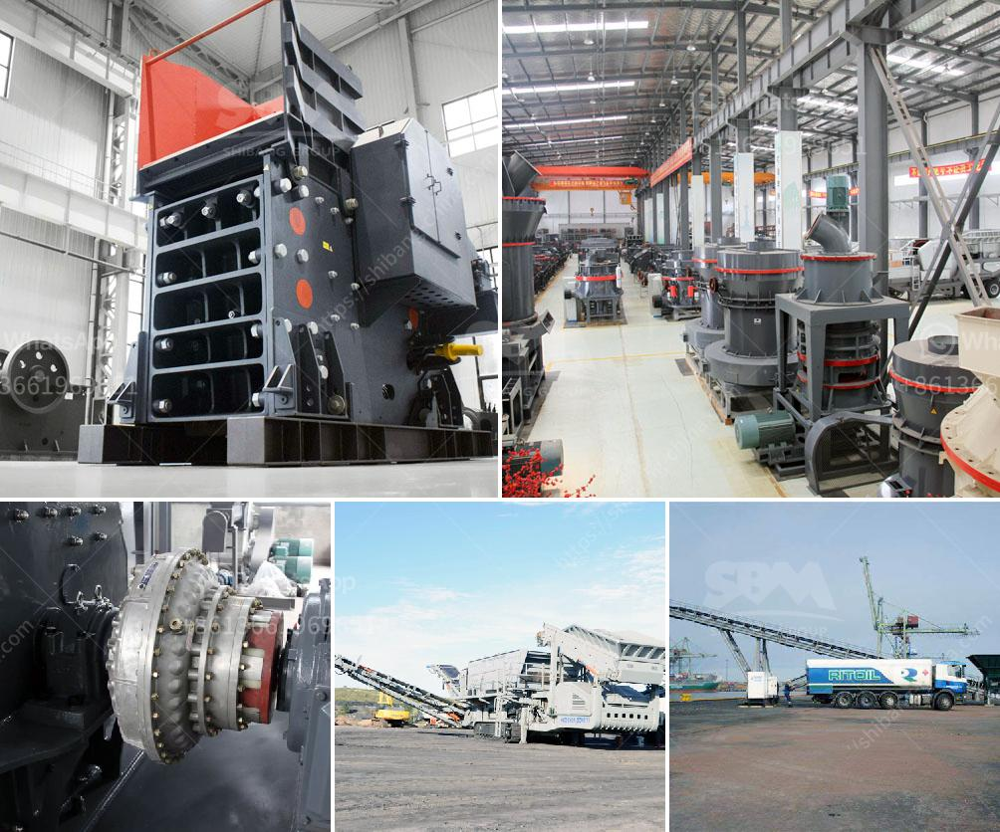

<h3>mining wash plant price</h3>
The mining industry plays a crucial role in the extraction and processing of valuable minerals and resources that are essential for various industrial sectors. One of the most critical equipment utilized in mining operations is the wash plant. It is designed to efficiently separate valuable minerals or metals from the surrounding material, using water or other washing agents. However, the price of a mining wash plant can vary significantly depending on several factors.

The size and capacity of the wash plant are key determinants of its price. A larger wash plant with a higher processing capacity will typically cost more than a smaller one. The processing capacity is usually measured in tons per hour (TPH) or cubic yards per hour (CY/H). The higher the capacity, the more material it can process within a given time frame.

The design and technology employed in a wash plant can heavily influence its price. Advanced wash plants with sophisticated features like automated controls, variable speed drives, and advanced screening systems will command a higher price. These advanced features ensure optimum efficiency and productivity, while also reducing maintenance and operating costs in the long run.

The quality and durability of the wash plant components significantly affect its price. A wash plant constructed with high-quality materials such as stainless steel, heavy-duty pumps, and durable screens will generally come at a higher price. Investing in a quality wash plant can result in improved performance, reduced downtime, and increased lifespan, ultimately offering a better return on investment.

The price of a mining wash plant can also depend on additional equipment and accessories required for specific applications. Depending on the mining operation's needs, a wash plant might require equipment such as slurry pumps, dewatering screens, or water recycling systems. These additional components can contribute to the overall cost of the wash plant.

The choice of the supplier or manufacturer can influence the price of a mining wash plant. Reputable and established manufacturers with a track record of delivering high-quality equipment may charge a premium compared to lesser-known manufacturers. However, opting for a trusted brand ensures the availability of spare parts, reliable customer support, and potential warranty options.

Market demand and competition within the mining equipment industry can also impact the price of a wash plant. If the market is highly competitive with numerous suppliers, it might lead to price variations as suppliers try to offer competitive deals and differentiate themselves with better features or services. Conversely, limited competition might result in higher prices due to a lack of options for buyers.

In conclusion, the price of a mining wash plant is influenced by various factors such as size, capacity, design, materials, additional equipment, and the reputation of the manufacturer. When considering purchasing a wash plant, it is crucial to assess these factors carefully to make an informed decision. It is important to strike a balance between upfront costs and the long-term benefits, such as improved efficiency, increased productivity, and reduced operating costs.
<h3>Contact us</h3><ul><li><strong>Whatsapp:&nbsp;<a href="https://wa.me/8613661969651">+8613661969651</a></strong></li><li><a href="https://swt.shibang-china.com/?git&amp;zhl&amp;mining wash plant price"><strong>Online Service(chat now)</strong></a></li></ul><h3>Related</h3><ul><li><a href='portable aggregate crushing plants.md'>portable aggregate crushing plants</a></li><li><a href='materials vibrating feeder.md'>materials vibrating feeder</a></li><li><a href='stone crushing machinery suppliers.md'>stone crushing machinery suppliers</a></li><li><a href='200tpd gold processing plant.md'>200tpd gold processing plant</a></li><li><a href='how to make unq stone crusher.md'>how to make unq stone crusher</a></li></ul>