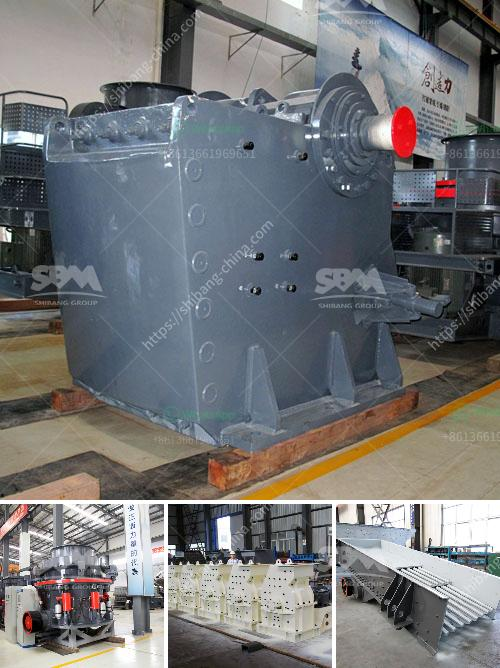

<h3>mobile aggregates washing plant</h3>
In the fast-paced world of construction, time is of the essence. There is a constant demand for high-quality aggregates, such as sand and gravel, to meet the needs of infrastructure projects. To ensure a sustainable supply of these essential materials, mobile aggregates washing plants have become a game-changer in the industry.

A mobile aggregates washing plant is a portable plant that allows the production of high-quality sand and gravel, which can be used for various construction purposes. These plants utilize advanced technology and intelligent systems to wash, scrub, and separate the materials, resulting in clean, well-graded aggregates that are ready for immediate use.

One of the key advantages of mobile aggregates washing plants is their mobility. They can be easily transported to any construction site, eliminating the need for transportation logistics and reducing costs. This allows for on-site production of aggregates, minimizing the time and effort required to source materials from external suppliers.

Moreover, these plants are designed to enhance efficiency. With automated processes and intelligent control systems, they can significantly reduce water and energy consumption. This not only saves costs but also contributes to sustainability by minimizing water usage and reducing the carbon footprint associated with aggregate production.

The quality of the aggregates produced by mobile washing plants is also exceptional. The scrubbing and washing processes ensure that the materials are thoroughly cleaned, removing impurities and contaminants. This results in aggregates that meet the strictest quality standards, improving the durability and longevity of construction projects.

Furthermore, mobile aggregates washing plants offer versatility. They can process a wide range of materials, from natural sands and gravels to crushed stone and recycled aggregates. This allows for greater flexibility in meeting the specific requirements of different construction projects.

In conclusion, mobile aggregates washing plants are revolutionizing the construction industry by enhancing efficiency and sustainability. With their mobility, efficiency, and versatility, they provide a cost-effective solution for producing high-quality aggregates directly on-site. As the demand for sustainable construction practices continues to grow, mobile aggregates washing plants are paving the way towards a more environmentally friendly future.
<h3>Contact us</h3><ul><li><strong>Whatsapp:&nbsp;<a href="https://wa.me/8613661969651">+8613661969651</a></strong></li><li><a href="https://swt.shibang-china.com/?git&amp;zhl&amp;mobile aggregates washing plant"><strong>Online Service(chat now)</strong></a></li></ul><h3>Related</h3><ul><li><a href='used portable crusher plant for sale dubai.md'>used portable crusher plant for sale dubai</a></li><li><a href='iron ore vibrator screen.md'>iron ore vibrator screen</a></li><li><a href='manufacturer of talc powder in uae.md'>manufacturer of talc powder in uae</a></li><li><a href='feldspar powder making.md'>feldspar powder making</a></li><li><a href='europe stone quarry equipment supplier.md'>europe stone quarry equipment supplier</a></li></ul>