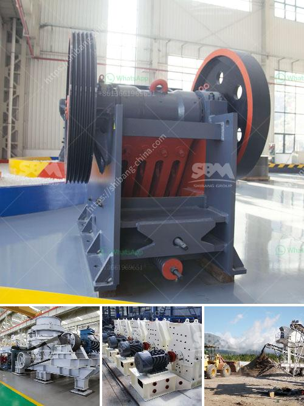

<h3>mobile coal crusher price sa</h3>
Mobile coal crushers are used for crushing coal for different purposes in various industries. The 4G and 5G technologies have revolutionized the mobile communication sector. Today, we are witnessing mobile phones becoming an integral part of our lives. We cannot imagine a day without a mobile phone, as it connects us with the digital world, and provides us with various services and facilities.

Similarly, the coal industry has also witnessed technological advancements in the form of mobile coal crushers. These crushers are designed to crush coal efficiently and effectively, making it suitable for various industries. The mobile coal crusher is a convenient and flexible crushing machine, which not only saves time and energy but also enhances productivity and efficiency.

The mobile coal crusher price varies from supplier to supplier, depending on the type of crusher and the features it offers. The leading suppliers in the market offer different prices for their products, including variable payment options to help customers choose according to their budget. With the rise in demand for mobile coal crushers, suppliers are constantly striving to offer competitive prices to attract more customers.

The mobile coal crushers come in different sizes and capacities. The price of a crusher depends on its size and capacity, as well as the features it offers. However, irrespective of the size and capacity, these crushers are designed to provide efficient crushing solutions for coal. They are compact, lightweight, and easy to transport, making them an ideal choice for various job sites.

The mobile coal crusher price SA also depends on the geographical location of the supplier. Suppliers situated closer to the coal mines can offer better prices due to reduced transportation costs. It is advisable to choose a supplier who is located nearby to save on transportation expenses.

Apart from price, it is important to consider other factors such as quality and after-sales services while purchasing a mobile coal crusher. Investing in a high-quality crusher ensures durability, reliability, and long-term performance. Additionally, suppliers who offer after-sales services like installation, training, and maintenance can add value to the purchase.

Furthermore, customers should also consider the specific requirements of their industry while choosing a mobile coal crusher. Different industries have different coal requirements, and crushers should be selected accordingly. Some crushers are specifically designed for crushing large-sized coal, while others are suitable for smaller particles. Understanding the specific requirements and choosing a crusher accordingly can help in achieving the desired results.

In conclusion, mobile coal crushers have revolutionized the coal industry by providing efficient and cost-effective crushing solutions. With the rise in demand for mobile crushers, suppliers are offering competitive prices, making it affordable for various industries. However, customers should consider factors like quality, after-sales services, and industry requirements while purchasing a mobile coal crusher. By making a wise choice, industries can enhance their productivity, efficiency, and overall performance.
<h3>Contact us</h3><ul><li><strong>Whatsapp:&nbsp;<a href="https://wa.me/8613661969651">+8613661969651</a></strong></li><li><a href="https://swt.shibang-china.com/?git&amp;zhl&amp;mobile coal crusher price sa"><strong>Online Service(chat now)</strong></a></li></ul><h3>Related</h3><ul><li><a href='distributor stone crusher di indonesia.md'>distributor stone crusher di indonesia</a></li><li><a href='copper processing machine.md'>copper processing machine</a></li><li><a href='silica sand grinding machine cost.md'>silica sand grinding machine cost</a></li><li><a href='stamp mill for sale in zimbabwe.md'>stamp mill for sale in zimbabwe</a></li><li><a href='cobalt ore mining processing plant.md'>cobalt ore mining processing plant</a></li></ul>