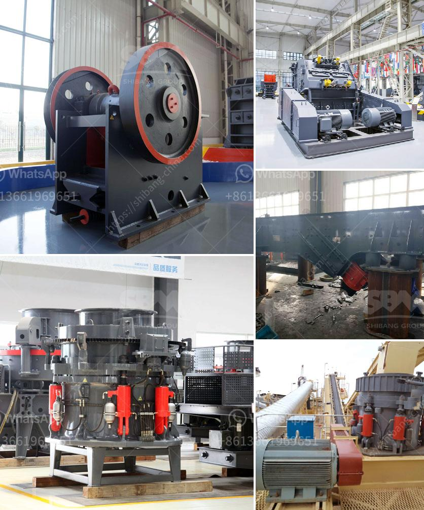

<h3>mobile coal jaw crusher provider in south africa</h3>
Mobile coal jaw crusher provider in South Africa is one of the most useful equipment in the coal mining industry. In 2016, coal mining industry contributed approximately 3.4% of the country’s gross domestic product, compared to the 5.7% expected by 2020. From an economic perspective, it is therefore crucial to harness the full potential of this industry by ensuring efficient and reliable equipment is available to handle the coal extraction process.

The mobile coal jaw crusher provider in South Africa is a machine often used for coal mining sites. As mobile coal jaw crusher provider in South Africa, it can achieve crushing ratio of 4-6 and the shape of final product is even. It’s widely applied to crush high hardness, mid hardness and soft rocks and ores such as slag, construction materials, marble, etc. The pressure resistance strength is under 200Mpa, that is, suitable for primary crush. Jaw crusher can be used in mining, metallurgical industry, construction, road and railway building, conversancy, chemistry, etc.

When it comes to the coal mining industry in South Africa, efficiency and reliability are key. The mobile coal jaw crusher provider in South Africa is designed to ensure reliability, durability, and optimal performance. It is able to deliver the same output as a stationary jaw crusher, but with the added benefit of mobility. This allows miners to easily move the crusher to different locations within the mine, improving productivity and reducing downtime.

In addition to its mobility and reliability, the mobile coal jaw crusher provider in South Africa offers numerous other benefits. For example, it features a hydraulic adjusting system that allows for easy and quick setting changes. This ensures that the desired particle size can be achieved with minimal effort. Furthermore, the machine is equipped with a highly efficient dust suppression system, reducing the risk of dust exposure for workers and preventing environmental pollution.

Another advantage of the mobile coal jaw crusher provider in South Africa is its ease of maintenance. The machine is designed to be easily accessible, with maintenance points conveniently located for quick and efficient service. This reduces downtime, ensuring that the crusher is always operational and maximizing productivity.

Lastly, the mobile coal jaw crusher provider in South Africa is also cost-effective. By eliminating the need for additional crushing equipment such as cone or impact crushers, it reduces capital investment and overall operating costs. This makes it an attractive option for coal mining companies looking to maximize their profitability.

In conclusion, the mobile coal jaw crusher provider in South Africa is an efficient and reliable equipment for the coal mining industry. It offers mobility, reliability, and ease of maintenance, enhancing productivity and reducing downtime. With the growing demand for coal in South Africa, utilizing this equipment is essential to ensure the industry’s long-term success.
<h3>Contact us</h3><ul><li><strong>Whatsapp:&nbsp;<a href="https://wa.me/8613661969651">+8613661969651</a></strong></li><li><a href="https://swt.shibang-china.com/?git&amp;zhl&amp;mobile coal jaw crusher provider in south africa"><strong>Online Service(chat now)</strong></a></li></ul><h3>Related</h3><ul><li><a href='calcium carbonate grinding technology.md'>calcium carbonate grinding technology</a></li><li><a href='grinding machine for marble.md'>grinding machine for marble</a></li><li><a href='jaw crusher grinding.md'>jaw crusher grinding</a></li><li><a href='feed mill manufacturer in davao.md'>feed mill manufacturer in davao</a></li><li><a href='price conveyor belts in malaysia.md'>price conveyor belts in malaysia</a></li></ul>