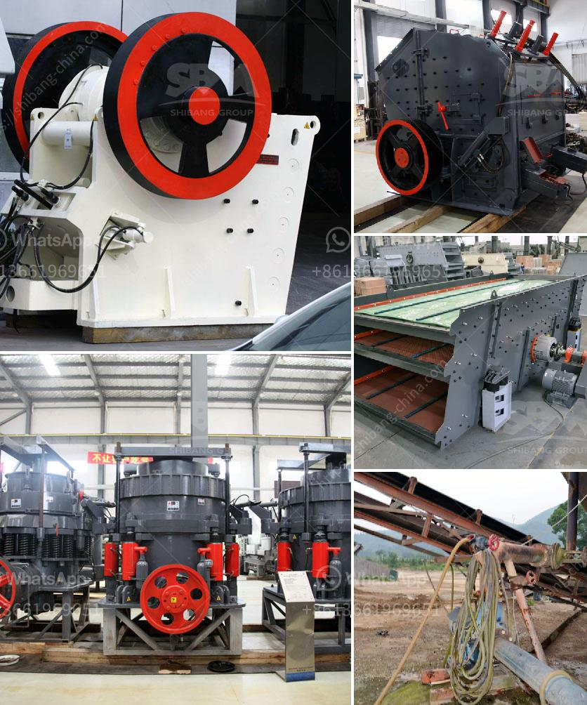

<h3>mobile coal washing plant south africa</h3>
The mobile coal washing plant, also called a coal preparation plant (CPP), is a facility that washes coal of soil and rock, preparing it for transport. The plant facilitates the removal of impurities, ensuring that the coal remains efficient and clean. This type of coal washing plant is mainly used for coal processing and extraction, as it effectively eliminates most of the pollutants present in coal, making it suitable for various industrial applications.

In South Africa, the need for a mobile coal washing plant is highlighted by the fact that over 70% of the country’s coal is consumed by the power sector. South Africa exports the remaining coal to countries in Europe, Asia, and the Americas. To meet the growing demand for electricity, the country needs to utilize its coal resources efficiently and sustainably.

One of the primary advantages of a mobile coal washing plant is its mobility. This plant can be easily transported to different locations, enabling coal processing at various mining sites. It eliminates the need for separate infrastructure for coal processing, reducing costs and increasing efficiency. Additionally, it allows for on-site processing, minimizing the time and resources required to transport coal to a central processing plant.

The mobile coal washing plant in South Africa includes a crusher machine, a cyclone, a dewatering screen, a centrifugal concentrator, and a spiral separator. It effectively removes the impurities, including stones, clay, and fine particles, while retaining the required coal quality. These components work together to achieve a high level of coal beneficiation.

The crusher machine is responsible for reducing the size of coal particles, making it suitable for washing. The cyclone separates the clean coal from the clay and other impurities, while the dewatering screen removes excess water. The centrifugal concentrator further enhances the coal quality by removing mineral matter and reducing ash content. Finally, the spiral separator segregates the coal particles based on their specific gravity, allowing for further coal upgrading.

By using a mobile coal washing plant in South Africa, coal producers can produce an optimized product that meets customer specifications, reduces the impact on the environment, and maximizes profitability. This plant can also help coal producers respond to fluctuating market demands, as it can be easily relocated to new mining sites or regions.

Furthermore, employing a mobile coal washing plant promotes sustainable mining practices. It reduces the need for large-scale infrastructure and transportation, minimizing carbon emissions and the overall environmental impact. It also allows for the recovery and reuse of valuable coal resources trapped in waste rock or previously discarded materials, contributing to a circular economy.

In conclusion, the mobile coal washing plant in South Africa is an adaptable and efficient processing solution for coal mining operations. It offers a flexible and cost-effective alternative for coal producers, ensuring the optimal utilization of coal resources and reducing environmental impact. By investing in a mobile coal washing plant, South Africa advances its goals of reliable energy supply, economic growth, and sustainable mining practices.
<h3>Contact us</h3><ul><li><strong>Whatsapp:&nbsp;<a href="https://wa.me/8613661969651">+8613661969651</a></strong></li><li><a href="https://swt.shibang-china.com/?git&amp;zhl&amp;mobile coal washing plant south africa"><strong>Online Service(chat now)</strong></a></li></ul><h3>Related</h3><ul><li><a href='vibrating screen indonesia.md'>vibrating screen indonesia</a></li><li><a href='recycling of material in construction.md'>recycling of material in construction</a></li><li><a href='uk made stone crushing machine.md'>uk made stone crushing machine</a></li><li><a href='crusher for cobble.md'>crusher for cobble</a></li><li><a href='rent a conveyor belt.md'>rent a conveyor belt</a></li></ul>