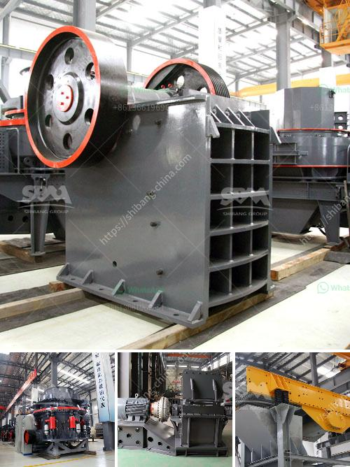

<h3>mobile cone crusher plant</h3>
Mobile cone crusher plant is a kind of mobile crushing plant, which is mainly used for construction waste crushing and recycling in highway, railway and construction projects. With the development of global infrastructure, the demand for construction waste crushing equipment is increasing.

The mobile cone crusher plant is equipped with cone crusher, vibrating screen, belt conveyor and control cabinet. The feeding hopper of cone crusher is made of high-quality steel structure, and equipped with folding feeding belt conveyor, which has good adaptability and flexibility.

The cone crusher is a high-performance mobile cone crusher, which is designed for crushing on-site or in any remote locations, and can be moved easily from one site to another. With its compact structure, the mobile cone crusher plant is very easy to transport and can be conveniently stationed in the working site.

The mobile cone crusher plant has the advantages of large capacity, high efficiency, good adaptability and excellent performance. It can be used for primary crushing, fine crushing and screening. The mobile cone crusher plant is suitable for secondary and tertiary crushing, with high production efficiency and uniform product size.

One of the main advantages of the mobile cone crusher plant is its ability to be operated in both open and closed circuit configurations. In open circuit, the material passes through the cone crusher once and then is discharged from the bottom of the crusher. In closed circuit, the material is screened by the vibrating screen and then fed back into the cone crusher for further crushing.

The mobile cone crusher plant can crush materials on site or in the near future, greatly reducing the transportation costs of materials. In addition, the mobile cone crusher plant is equipped with dust removal system, which can effectively control the dust pollution in the working site and create a clean working environment.

In conclusion, the mobile cone crusher plant is a versatile and efficient piece of equipment that offers a cost-effective solution for crushing and recycling construction waste. With its superior performance, high capacity and flexibility, it has become a popular choice for many construction companies.
<h3>Contact us</h3><ul><li><strong>Whatsapp:&nbsp;<a href="https://wa.me/8613661969651">+8613661969651</a></strong></li><li><a href="https://swt.shibang-china.com/?git&amp;zhl&amp;mobile cone crusher plant"><strong>Online Service(chat now)</strong></a></li></ul><h3>Related</h3><ul><li><a href='crusher cost of crusher of jaw.md'>crusher cost of crusher of jaw</a></li><li><a href='application procedure for ball mill.md'>application procedure for ball mill</a></li><li><a href='hammer for crushing concrete.md'>hammer for crushing concrete</a></li><li><a href='nigeria rock crusher for sale.md'>nigeria rock crusher for sale</a></li><li><a href='rock crushing price.md'>rock crushing price</a></li></ul>