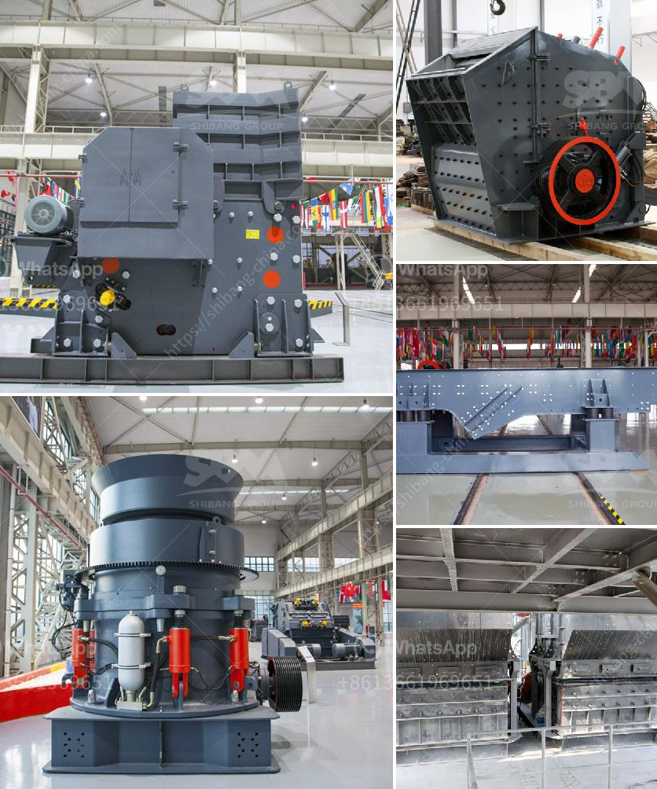

<h3>mobile cone crusher</h3>
Mobile crushers are widely used in the mining industry where they offer an efficient way of crushing rocks and minerals. With developments in technology, it has become possible to move these machines around and provide an excellent level of crushing capability. The mobility of the machines allows it to be positioned close to the material that is being crushed, thus reducing transportation costs.

One type of mobile crusher that has gained popularity is the mobile cone crusher. This machine is ideal for secondary and tertiary crushing applications. The cone crusher takes rocks and ores down to a smaller size using the principle of crushing by compression. It is excellent at providing a high reduction ratio and good cubical shape of the end products.

The mobile cone crusher is versatile and very easy to service. Please note that the machine consists of a fully hydraulic system (pump, hydraulic motor, and all the necessary valves) that control the operation. To ensure optimum performance at all times, the crusher requires regular maintenance. This includes checking oil levels, filters, belts, and other components.

One of the key advantages of the mobile cone crusher is its ability to move around and reach places that are difficult to access with traditional crushers. For example, areas with limited access due to narrow roads or rugged terrain. This mobility feature is especially useful in mining operations where the crusher can be brought closer to the material, minimizing the need for hauling and reducing logistical costs.

In summary, the mobile cone crusher is a true workhorse, providing efficient and reliable performance for all crushing tasks. It is designed to tackle a variety of materials and is ideal for secondary and tertiary applications. The mobility of the machine ensures that it can be positioned close to the material being crushed, reducing transportation costs and improving operational efficiency. Whether in mining or construction applications, the mobile cone crusher is a valuable asset that can enhance productivity and profitability.
<h3>Contact us</h3><ul><li><strong>Whatsapp:&nbsp;<a href="https://wa.me/8613661969651">+8613661969651</a></strong></li><li><a href="https://swt.shibang-china.com/?git&amp;zhl&amp;mobile cone crusher"><strong>Online Service(chat now)</strong></a></li></ul><h3>Related</h3><ul><li><a href='mining tenders in south africa.md'>mining tenders in south africa</a></li><li><a href='stone crusher machine usato in italy.md'>stone crusher machine usato in italy</a></li><li><a href='europe quartz stone machinery factory.md'>europe quartz stone machinery factory</a></li><li><a href='mobile crushers for sale in nigeria.md'>mobile crushers for sale in nigeria</a></li><li><a href='gypsum manufacturing process.md'>gypsum manufacturing process</a></li></ul>