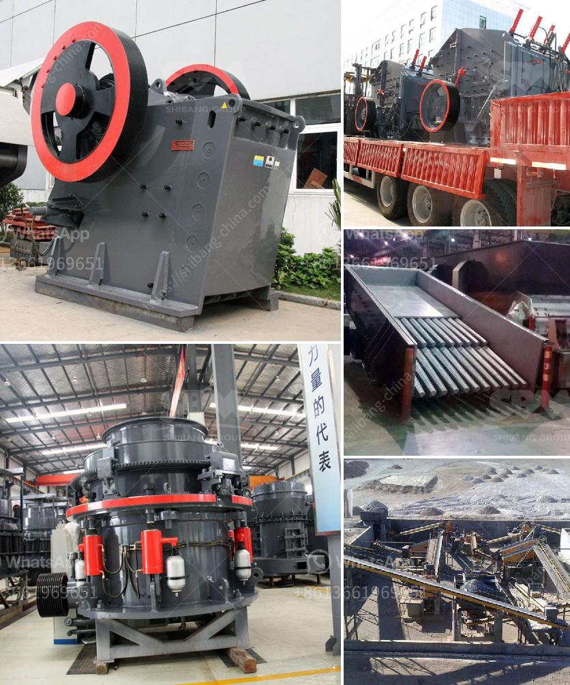

<h3>mobile crusher discount</h3>
Mobile crushers are becoming increasingly popular in the mining and construction industry due to their numerous advantages, such as versatility, flexibility, and efficiency. These powerful machines are capable of crushing a wide range of materials, including concrete, asphalt, and rocks, making them essential equipment for any construction project.

While mobile crushers offer unparalleled convenience and productivity, they can be a significant investment. However, to make these machines more accessible to a broader range of customers, many manufacturers and suppliers offer discounts and promotions on their mobile crushers.

One of the most popular discount options is a reduced price on mobile crushers. This promotion allows customers to purchase their desired machine at a significantly lower cost, making it an ideal opportunity for those working within a budget or looking to save money on their equipment investment.

Mobile crusher discounts can range from a few hundred dollars to several thousand dollars, depending on the model, brand, and specific promotion. These discounts can be available at various times throughout the year, such as during special sales events, end-of-year clearance, or anniversary celebrations. Therefore, it is worthwhile for potential buyers to keep an eye out for these discounts and take advantage of them when available.

In addition to reduced prices, mobile crusher manufacturers and suppliers may also offer other discount options, such as free or discounted accessories, extended warranties, or lower financing rates. These additional incentives can further enhance the value of the deal and provide customers with more flexibility and peace of mind.

It is important to note that mobile crusher discounts do not compromise the quality or performance of the machines. Manufacturers and suppliers offer discounts as part of their marketing strategies to attract more customers and boost sales. The discounted models are still manufactured with the same high-quality materials and components, ensuring reliability and durability.

When considering purchasing a mobile crusher with a discount, it is crucial to conduct thorough research on the brand, model, and specifications to determine if it meets your specific requirements. Reading reviews and comparisons, consulting with industry experts, and visiting trade shows or exhibitions can provide valuable insights into the various options available and help make an informed decision.

Moreover, it is advisable to compare prices and promotions from different manufacturers and suppliers before making a final purchase. This will ensure that you are getting the best deal possible and maximizing your savings.

In conclusion, mobile crusher discounts are an excellent opportunity for customers to acquire these powerful machines at more affordable prices. These promotions enable a broader range of businesses and individuals to benefit from the efficiency and productivity that mobile crushers offer. By staying informed and taking advantage of these discounts, customers can make significant savings and invest in high-quality equipment for their construction and mining projects.
<h3>Contact us</h3><ul><li><strong>Whatsapp:&nbsp;<a href="https://wa.me/8613661969651">+8613661969651</a></strong></li><li><a href="https://swt.shibang-china.com/?git&amp;zhl&amp;mobile crusher discount"><strong>Online Service(chat now)</strong></a></li></ul><h3>Related</h3><ul><li><a href='crusher equipment supplier.md'>crusher equipment supplier</a></li><li><a href='contact list of stone crusher companies in south africa.md'>contact list of stone crusher companies in south africa</a></li><li><a href='ballast quarry equipment supplies.md'>ballast quarry equipment supplies</a></li><li><a href='belt conveyor design procedure.md'>belt conveyor design procedure</a></li><li><a href='coal pulverizer manufacturers.md'>coal pulverizer manufacturers</a></li></ul>