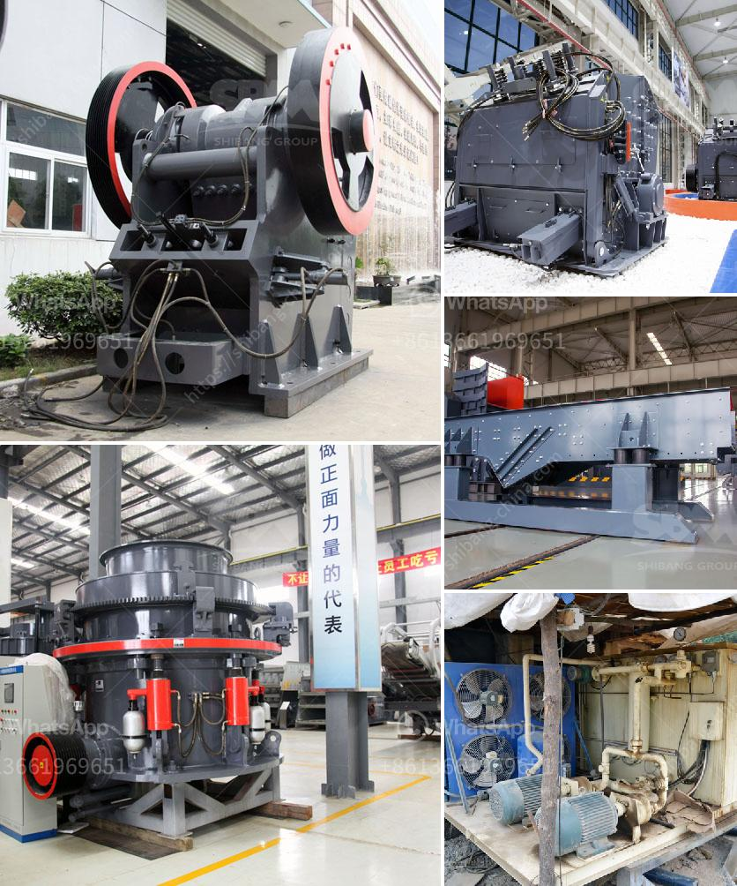

<h3>mobile crusher ghana</h3>
Ghana, a country known for its vast mineral resources, has been attracting foreign investments in its mining sector for decades. The West African nation is rich in gold, bauxite, manganese, and other valuable minerals. However, the traditional mining methods employed in Ghana's mining industry often prove to be time-consuming, expensive, and environmentally harmful. Fortunately, the introduction of mobile crushers in Ghana has revolutionized the mining sector, offering new opportunities and solutions for mining companies in the country.

Mobile crushers are specialized machinery used in the mining industry to break down large rocks into smaller, more manageable pieces. These machines come in various sizes and types, such as jaw crushers, impact crushers, and cone crushers. They are highly efficient, versatile, and can be easily transported and repositioned on-site, improving productivity and reducing operational costs significantly.

One of the major advantages of mobile crushers in Ghana is their ability to be used in both open-pit and underground mining operations. This flexibility allows mining companies to access mineral deposits in previously inaccessible areas, expanding their operations and maximizing their profitability. Moreover, mobile crushers enable miners to process materials on-site, eliminating the need for costly transportation and reducing the environmental impact associated with traditional mining methods.

Mobile crushers also improve the safety of mining operations in Ghana. By reducing the need for manual rock breaking, these machines minimize the risk of accidents and injuries for mine workers. Additionally, their advanced technological features, such as hydraulic systems and automated controls, enhance the overall safety and efficiency of the crushing process.

The introduction of mobile crushers has sparked a positive transformation in Ghana's mining sector. Local and foreign mining companies in the country are now utilizing this game-changing technology to improve their operations, increase productivity, and reduce environmental impact. Consequently, Ghana is emerging as one of the leading mining destinations in Africa, attracting more investments and generating employment opportunities for its citizens.

In conclusion, mobile crushers have revolutionized Ghana's mining industry by offering versatile, efficient, and cost-effective solutions for mineral extraction. With the ability to access previously untapped mineral deposits and process materials on-site, these machines have significantly improved productivity, reduced operational costs, and enhanced workers' safety. As Ghana continues to attract investments in its mining sector, mobile crushers are expected to play a vital role in fostering sustainable and responsible mining practices in the country.
<h3>Contact us</h3><ul><li><strong>Whatsapp:&nbsp;<a href="https://wa.me/8613661969651">+8613661969651</a></strong></li><li><a href="https://swt.shibang-china.com/?git&amp;zhl&amp;mobile crusher ghana"><strong>Online Service(chat now)</strong></a></li></ul><h3>Related</h3><ul><li><a href='gold mining equipment manufacturers.md'>gold mining equipment manufacturers</a></li><li><a href='flowchart of a stone crushing plant.md'>flowchart of a stone crushing plant</a></li><li><a href='chrome crusher machine price list.md'>chrome crusher machine price list</a></li><li><a href='concrete waste crushing and iron.md'>concrete waste crushing and iron</a></li><li><a href='crusher plant suppliers in saudi arabia.md'>crusher plant suppliers in saudi arabia</a></li></ul>