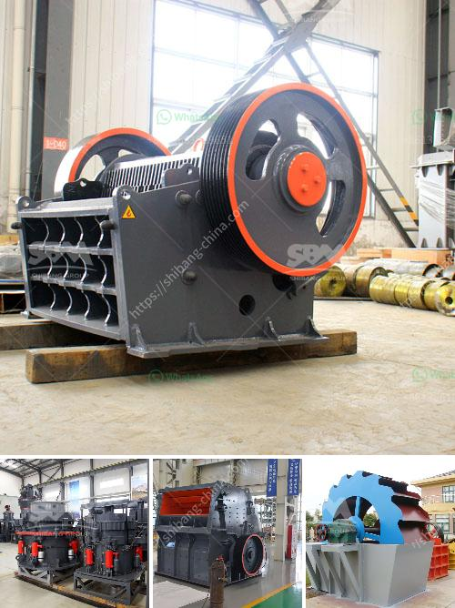

<h3>mobile crusher hire durban</h3>
Mobile Crusher Hire Durban offers excellent crushing service across Durban, KwaZulu-Natal, and surrounding areas. With the portable and powerful crushers at your disposal, you can tackle any crushing project, from construction debris and concrete to asphalt and stones. The mobile crushers are perfect for various recycling applications and on-site crushing projects.

One of the key benefits of mobile crusher hire is the flexibility it provides. Instead of having to transport crushing equipment to the site and haul away the crushed material afterward, you can simply rent a mobile crusher and have it delivered to your location. This saves time, resources, and eliminates the need for additional transportation machinery.

The range of cone crushers and jaw crushers available for hire ensures that you can find the perfect machine for your specific needs. Each crusher is designed to efficiently process a variety of materials, including construction waste, concrete, and hard rocks. With adjustable settings, you can easily achieve the desired product size and shape.

Durban is a bustling city with various ongoing construction projects. Mobile crusher hire in Durban is in high demand, especially during peak construction seasons. Whether you need assistance with crushing rubble or excavating rocks, Mobile Crusher Hire Durban provides reliable and professional services.

Another advantage of hiring a mobile crusher is the cost-effectiveness. Instead of purchasing expensive machinery, you can rent a crusher on a short-term basis, saving both upfront and ongoing costs. This makes mobile crusher hire an attractive option for contractors and construction companies looking to minimize their expenses.

In addition to cost savings, mobile crusher hire Durban also offers environmental benefits. By recycling construction waste on-site, you are reducing the need for landfill space and saving natural resources. Crushing concrete and other materials into reusable aggregates allows for sustainable building practices.

When it comes to safety, Mobile Crusher Hire Durban takes it seriously. The mobile crushers are equipped with advanced safety features, including a remote control system, emergency stop buttons, and safety guards. The operators undergo regular training and adhere to strict safety protocols to ensure the job is done without any accidents or incidents.

Customer satisfaction is a top priority for Mobile Crusher Hire Durban. The experienced and skilled team is dedicated to providing excellent service, understanding your unique needs, and delivering optimal results. The company takes pride in its prompt response times and efficient operations, ensuring that your project is completed on time and within budget.

In conclusion, mobile crusher hire Durban is an excellent solution for various crushing needs. With a range of crushers available, cost-effective pricing, and environmental benefits, it is a convenient and reliable service. By choosing mobile crusher hire Durban, you can save time, money, and resources while contributing to a greener and more sustainable future.
<h3>Contact us</h3><ul><li><strong>Whatsapp:&nbsp;<a href="https://wa.me/8613661969651">+8613661969651</a></strong></li><li><a href="https://swt.shibang-china.com/?git&amp;zhl&amp;mobile crusher hire durban"><strong>Online Service(chat now)</strong></a></li></ul><h3>Related</h3><ul><li><a href='vibrating feeder zsw parts.md'>vibrating feeder zsw parts</a></li><li><a href='big stone quarry business plan pdf.md'>big stone quarry business plan pdf</a></li><li><a href='different types of vibrating screen.md'>different types of vibrating screen</a></li><li><a href='alluvial diamond processing plant container for sale.md'>alluvial diamond processing plant container for sale</a></li><li><a href='grinding machine for gypsum powder.md'>grinding machine for gypsum powder</a></li></ul>