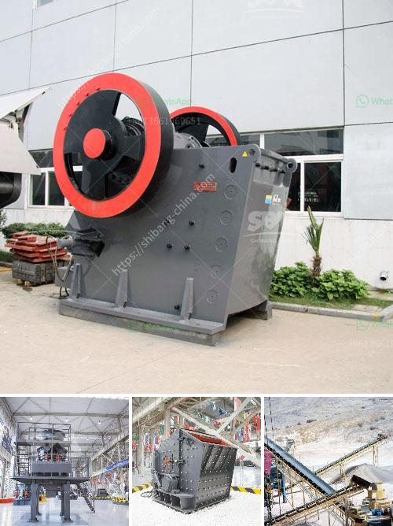

<h3>mobile crusher in saudi arabia</h3>
In the past decades, the mobile crushing plants have been seen as the most convenient choice for construction site work. Rather than hauling oversized material to a stationary crusher, the crushing process occurs directly in the quarry or at a site where the material is stocked. This eliminates the need for truck transportation, which further reduces operational costs and increases overall efficiency in the construction industry.

Mobile crushers are highly effective in transporting and crushing material, saving time and money. Overall, mobility and flexibility have been the key factors in the success of mobile crushers. Mobile crushers are widely used in the mining industry for processing quarried materials and heavy mining substances, with an additional advantage of mobility to relocate the stone crushing site as necessary.

Saudi Arabia, as a prominent name in the construction industry, has emerged as a key market for mobile crushers and screeners. These machines are chosen by Saudi businesses due to their immense flexibility and convenience. With its growing population and infrastructure, the Kingdom of Saudi Arabia will further propel the expansion of the mobile crushers and screeners market.

One of the major advantages of owning a mobile crusher and screeners is the capability to work in different quarries, which helps to reduce transportation costs and also save space in the job site. Thus, it allows for an increased variety of raw materials to be processed and also reduces the production cost.

Additionally, the low operational cost and maintenance of mobile crushers make them an ideal choice for the construction and mining industry. They come equipped with high-performance engines that ensure smooth operations even in the most challenging environments. Moreover, advanced features such as wireless remote control, pre-screening module, and automated crushing processes make the operations more convenient and efficient.

Mobile crushers in Saudi Arabia provide users with multiple benefits, including less moving parts and lower levels of dust, noise, and exhaust emissions. Optimized efficiency levels ensure reliable and effective operations and help to sustain the environment around the quarry sites.

Furthermore, low-cost transportation and the ability to relocate when necessary increase the overall productivity of the mobile crushers in Saudi Arabia. Flexibility in operations helps to adapt to the ever-changing demands and challenges in the market. Mobile crushers are indispensable in the construction and mining industry and are highly in demand in the Kingdom of Saudi Arabia.

With the increasing growth of infrastructure projects in Saudi Arabia, such as the Vision 2030, projects for railway lines, airport expansions, and major road networks, mobile crushers have gained significant traction in the region. Investing in mobile crushers not only brings efficiency to construction sites but also contributes to the economic growth of Saudi Arabia.

In conclusion, the use of mobile crushers in Saudi Arabia has witnessed growth over recent years. The significant benefits of mobile crushing plants help to decrease operation costs and overcome various environmental challenges. They provide immense flexibility in processing different types of raw materials and cater to the growing demand for construction resources. As Saudi Arabia continues to invest in its infrastructure, mobile crushers will play a vital role in supporting the Kingdom's objectives.
<h3>Contact us</h3><ul><li><strong>Whatsapp:&nbsp;<a href="https://wa.me/8613661969651">+8613661969651</a></strong></li><li><a href="https://swt.shibang-china.com/?git&amp;zhl&amp;mobile crusher in saudi arabia"><strong>Online Service(chat now)</strong></a></li></ul><h3>Related</h3><ul><li><a href='copper mining in zambia.md'>copper mining in zambia</a></li><li><a href='roller grinding machines for sale.md'>roller grinding machines for sale</a></li><li><a href='stone crushing plants of japanese technology.md'>stone crushing plants of japanese technology</a></li><li><a href='raymond mill coal pulverizer.md'>raymond mill coal pulverizer</a></li><li><a href='crusher hp300 cone.md'>crusher hp300 cone</a></li></ul>