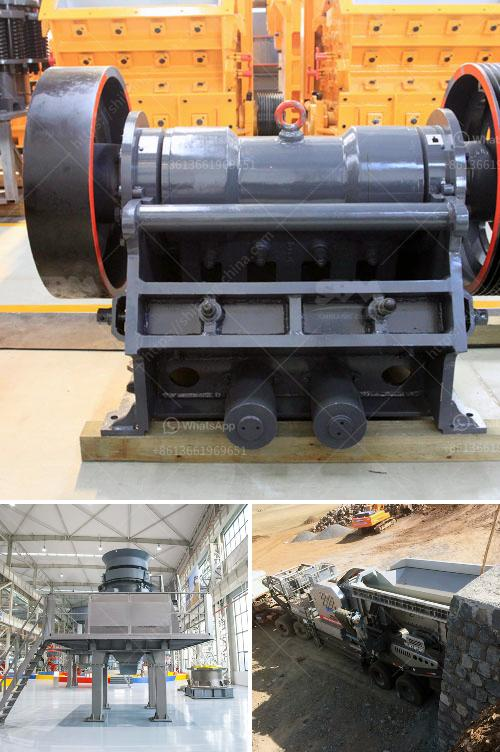

<h3>mobile crusher line</h3>
The world of construction and demolition waste management is gradually moving towards more sustainable practices. As a result, mobile crusher lines are becoming increasingly popular in the construction industry. These highly efficient machines are designed to process construction debris and waste materials into reusable aggregates that can be utilized in various construction projects.

A mobile crusher line is a convenient tool that is utilized in various projects, such as highway construction, building demolitions, and railway track repair. This equipment effectively reduces the size of large rocks or concrete rubble, turning them into reusable materials for further use. Moreover, it offers the flexibility to transport the machine to different locations, making it ideal for on-site crushing operations.

One of the key advantages of a mobile crusher line is its ability to crush materials directly at the construction site, eliminating the need for transportation to a landfill or recycling center. This not only saves time and money but also greatly reduces the environmental impact associated with transportation. Additionally, it reduces the reliance on virgin materials, contributing to the conservation of natural resources.

The mobile crusher line typically consists of several crushers, including jaw crushers, impact crushers, and cone crushers. Each crusher is specifically designed to handle different types of materials, such as rocks, concrete, and asphalt. This diverse range of crushers ensures that the machine can efficiently process a wide variety of construction waste materials.

Furthermore, mobile crusher lines are equipped with advanced technology that enhances their overall efficiency. For instance, some models are equipped with a hydraulic system that enables the machine to adjust the size of the output material, making it more suitable for specific construction applications. Additionally, modern mobile crusher lines often feature a dust suppression system, minimizing the release of dust and harmful particles into the environment.

In terms of productivity, mobile crusher lines are highly efficient. They are capable of producing substantial amounts of aggregate material in a short period, thereby increasing the overall efficiency of construction projects. This makes them a cost-effective solution for contractors and construction companies.

Mobile crusher lines are also designed with safety in mind. They meet stringent safety standards and are equipped with safety features such as emergency stop buttons and protective covers. These features ensure the safety of operators and minimize the risk of accidents during operation.

In conclusion, mobile crusher lines are an essential tool in the construction industry. They offer numerous benefits, including efficient waste management, reduced environmental impact, increased productivity, and enhanced safety. With the growing focus on sustainable construction practices, the demand for mobile crusher lines is expected to rise further. By investing in this equipment, contractors and construction companies can contribute to a greener and more sustainable future.
<h3>Contact us</h3><ul><li><strong>Whatsapp:&nbsp;<a href="https://wa.me/8613661969651">+8613661969651</a></strong></li><li><a href="https://swt.shibang-china.com/?git&amp;zhl&amp;mobile crusher line"><strong>Online Service(chat now)</strong></a></li></ul><h3>Related</h3><ul><li><a href='jaw crushers kyrgyzstan.md'>jaw crushers kyrgyzstan</a></li><li><a href='quarry crusher manufacturer.md'>quarry crusher manufacturer</a></li><li><a href='how to set up a granite quarry.md'>how to set up a granite quarry</a></li><li><a href='stone crushers hydraulic.md'>stone crushers hydraulic</a></li><li><a href='industrial glass crusher worldcrushers.md'>industrial glass crusher worldcrushers</a></li></ul>