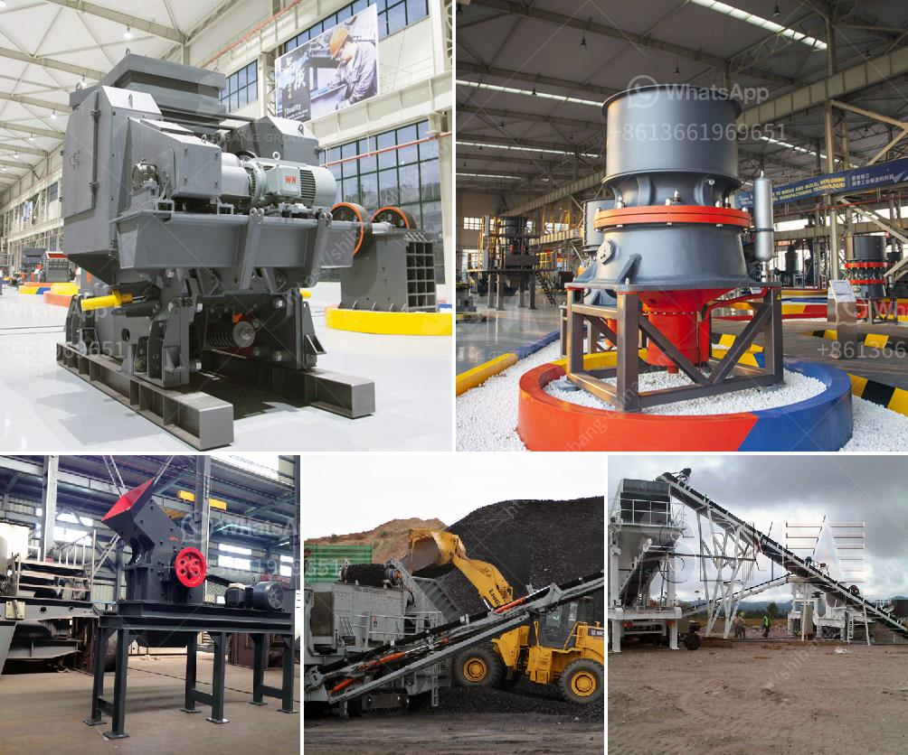

<h3>mobile crusher plant price in india</h3>
The mobile crushing plant is not limited by the crushing place, and reduces high material transportation cost. It allows for flexible configuration and convenient movement. The mobile crusher plant can be called as portable crusher plant machine. SBM has produced different kinds of mobile crusher plant machine, such as mobile jaw crusher plant, mobile cone crusher plant, mobile impact crusher plant and mobile combined crusher plant. 

Depending on the raw material size, hardness, and final products requirements, different mobile crusher plant machines are designed and produced. In India, the mobile crushing plant is mainly used for processing materials which are of relatively low price. As the company mentioned, mobile crushing plant price in India is ranging from 300 to 500 USD per ton, which differs according to the raw material requirements and specific configuration. There are a large number of suppliers who provide mobile crushing plant machine in India. However, many people are not familiar with these suppliers. 

SBM, as a leading manufacturer and supplier of mobile crusher plant machine in India, provides advanced mining machines for sale with five production bases throughout the world. These production bases mainly include crushing plant, grinding plant, sand making plant and quarry plant machine. Besides, SBM also provides the mobile crusher plant machine equipment for customers in India, such as jaw crusher, cone crusher, impact crusher, roller crusher, VSI crusher, and vibrating screen, etc. 

SBM has become India's leading mobile crushing equipment supplier and manufacturer, with five production bases including Gurgaon, Rajasthan, Delhi, Uttar Pradesh, and turnkey plants in Noida. Also, SBM has developed a new mobile crushing plant machine that complements the existing crusher plants. It offers a cost-effective and environmentally friendly way to recycle concrete and asphalt from demolition projects. 

The mobile crusher plant machine is especially suitable for crushing hard rock, such as taconite, granite, dark rock, corundum, silicon carbide and quartzite, etc. The mobile impact crusher plant is built around the proven impact crusher, which features heavy-duty rotor and high wear-resistant blow bar for better crushing efficiency. These features help producers achieve superior product shape, consistent gradation and high production. 

Moreover, the mobile crushing plant machine is equipped with independent pre-screening module which allows the operator to bypass material fines and increase crusher capacity. Furthermore, it also provides excellent reduction ratios and cubicity for the production of high-quality aggregate and sub-base materials. 

With the rapid development of infrastructure construction in India, the demand for mobile crusher plant machine is increasing year by year. SBM provides a wide range of mobile crusher plant machine for sale in India, including portable jaw crusher plant, portable crusher plant machine, portable impact crusher plant, and portable cone crusher plant and so on. These machines can deal with all kinds of medium hard and abrasive rocks, such as limestone, river stone, granite, basalt, quartzite, iron ore, etc. 

In conclusion, the mobile crusher plant price in India should be within a reasonable range according to different raw material requirements and specific production requirements. SBM provides high quality machines with competitive prices for sale. Customers should consider the machines' quality, performance, and after-sales service when choosing supplier and manufacturer for mobile crusher plant machine in India.
<h3>Contact us</h3><ul><li><strong>Whatsapp:&nbsp;<a href="https://wa.me/8613661969651">+8613661969651</a></strong></li><li><a href="https://swt.shibang-china.com/?git&amp;zhl&amp;mobile crusher plant price in india"><strong>Online Service(chat now)</strong></a></li></ul><h3>Related</h3><ul><li><a href='concrete conveyor belts.md'>concrete conveyor belts</a></li><li><a href='grinding mill thrust pad gearbox.md'>grinding mill thrust pad gearbox</a></li><li><a href='how to start a rock quarry business.md'>how to start a rock quarry business</a></li><li><a href='portable aggregate crushing plants.md'>portable aggregate crushing plants</a></li><li><a href='granite rock sand machinery.md'>granite rock sand machinery</a></li></ul>