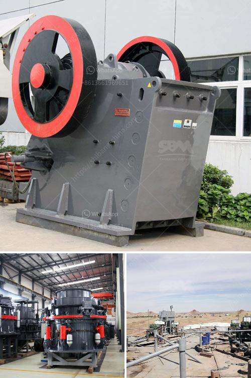

<h3>mobile crusher price algerie</h3>
The mobile crusher industry in Algeria has been growing rapidly due to the increasing demand for crushing materials in various construction projects across the country. The mobile crushing machine market is expected to witness significant growth in the coming years, driven by the increasing investment in infrastructure development projects across Algeria. 

The mobile crusher price in Algeria varies widely depending on the model, size, and capacity. However, there is a common trend that the prices of mobile crushers are gradually decreasing with the advancement of technology and the increase in competition. With the emergence of various crusher manufacturers, the market is becoming more competitive, forcing manufacturers to offer competitive prices to capture market share.

The price of mobile crushers in Algeria also depends on the type and quality of the crusher. For example, jaw crushers are generally more expensive than impact crushers. However, jaw crushers are known for their higher productivity and are therefore preferred in certain applications. On the other hand, impact crushers are suitable for crushing softer rocks and have a lower operating cost. 

In addition to the type and quality of the crusher, other factors such as the brand reputation, after-sales service, and additional features also influence the price of mobile crushers in Algeria. Customers typically consider these factors before making a purchase decision.

Considering the increasing demand for mobile crushers in Algeria and the competitive market, customers can expect a wide range of prices for mobile crushers, ranging from lower-priced models to more expensive and advanced ones. However, it is important for customers to consider their specific requirements and budget before making a purchase decision. Conducting thorough research, comparing prices, and evaluating the reputation and features of different manufacturers will help customers find the ideal mobile crusher at a reasonable price.

Overall, the mobile crusher industry in Algeria is witnessing significant growth, with a wide range of prices available in the market. The advancement of technology, increasing competition, and the growing demand for crushing materials in construction projects are driving manufacturers to offer competitive prices to capture market share. Customers are advised to consider their specific requirements, budget, and research thoroughly before purchasing a mobile crusher in Algeria.
<h3>Contact us</h3><ul><li><strong>Whatsapp:&nbsp;<a href="https://wa.me/8613661969651">+8613661969651</a></strong></li><li><a href="https://swt.shibang-china.com/?git&amp;zhl&amp;mobile crusher price algerie"><strong>Online Service(chat now)</strong></a></li></ul><h3>Related</h3><ul><li><a href='limestone grinding machine manufacturers in india.md'>limestone grinding machine manufacturers in india</a></li><li><a href='germany made grinding mill.md'>germany made grinding mill</a></li><li><a href='turkey stone crushers.md'>turkey stone crushers</a></li><li><a href='cone crusher device.md'>cone crusher device</a></li><li><a href='project cost of mini cement plant in india.md'>project cost of mini cement plant in india</a></li></ul>