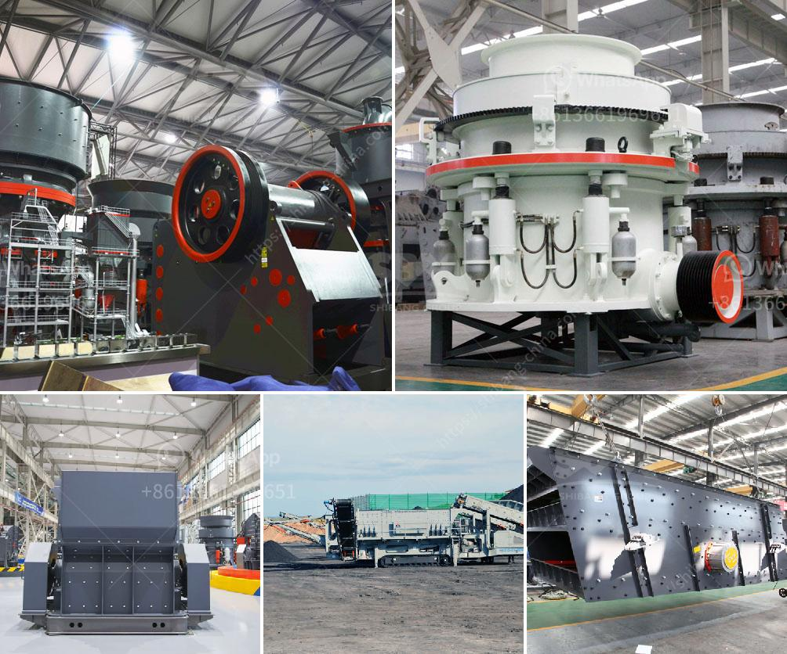

<h3>mobile crusher price malaysia</h3>
With the continuous development of technology, the crushers made by various manufacturers at home and abroad have emerged in an endless stream, presenting different prices to consumers. The price of mobile crusher also varies greatly in Malaysia.

Mobile crusher is a high-end mining machine that can directly crush materials into various sizes. It has been widely used in all kinds of production lines, such as highway, railway, water conservancy and metallurgy, to crush various kinds of materials. However, the price of mobile crusher in Malaysia is not only affected by market demand, but also impacted by a series of factors, such as configuration, equipment materials, manufacturing technology, and brand awareness.

Firstly, the configuration of mobile crusher directly affects its price. Different configurations have different requirements for the input size of materials, output size of finished products, and processing capacity. Generally speaking, the larger the input size, the higher the processing capacity, and the higher the price. The size and quantity of vibrating screens, conveyor belts, and feeders required by different configurations are also different, and these devices will constitute a large proportion of the total price.

Secondly, the quality and material selection of mobile crusher directly affect its price. The materials used in the production of mobile crushers are mostly steel, which requires high hardness and toughness. Therefore, the quality of steel directly affects the service life of the crusher. The manufacturing technology and craftsmanship of crushers also affect their performance and durability. High-quality materials and advanced manufacturing technology can improve the overall performance of mobile crushers, but this will also greatly increase their price.

Thirdly, the brand awareness of mobile crusher manufacturers also affects their prices. Brand manufacturers have higher research and development capabilities, stricter quality control, and better after-sales service. Therefore, their prices are generally higher than those of ordinary manufacturers. However, consumers can not only judge the quality of mobile crushers by brand, but also need to comprehensively consider the configuration and material selection to make the most cost-effective choice.

In summary, the price of mobile crusher in Malaysia is affected by multiple factors, including configuration, equipment materials, manufacturing technology, and brand awareness. Consumers need to choose according to their own production needs and budget. They can compare the prices and quality of different crushers on the market and make a comprehensive evaluation to make the best choice.

It is worth mentioning that mobile crushers in Malaysia not only have a wide range of applications, but also have a huge market potential. With the continuous development of infrastructure construction in Malaysia, the demand for mobile crushers will continue to increase. In addition, in recent years, with the improvement of people's living standards and the rise of e-commerce, the demand for sand and aggregates has also increased significantly, which has driven the rapid development of the mobile crusher market.

In conclusion, the price of mobile crusher in Malaysia is affected by various factors, including configuration, equipment materials, manufacturing technology, and brand awareness. Consumers need to conduct comprehensive evaluations and comparisons to make the best choice. With the continuous development of Malaysian economy and infrastructure, the demand for mobile crushers will rise, providing great opportunities for manufacturers in this field.
<h3>Contact us</h3><ul><li><strong>Whatsapp:&nbsp;<a href="https://wa.me/8613661969651">+8613661969651</a></strong></li><li><a href="https://swt.shibang-china.com/?git&amp;zhl&amp;mobile crusher price malaysia"><strong>Online Service(chat now)</strong></a></li></ul><h3>Related</h3><ul><li><a href='calcium carbonate manufacturing plant.md'>calcium carbonate manufacturing plant</a></li><li><a href='milling processing for small scale mining.md'>milling processing for small scale mining</a></li><li><a href='stone crusher plant cost in saudi.md'>stone crusher plant cost in saudi</a></li><li><a href='price of raymond used for crushing the powder stones.md'>price of raymond used for crushing the powder stones</a></li><li><a href='purchase a small rock stone crusher in philippines.md'>purchase a small rock stone crusher in philippines</a></li></ul>