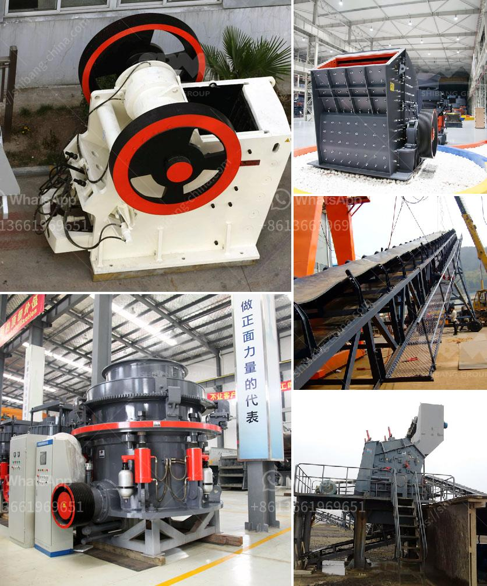

<h3>mobile crusher sale germany</h3>
Germany has a long history of construction and the industry continues to thrive in the modern era. With the increasing demands for infrastructure projects, it is crucial to have equipment that can tackle the toughest jobs efficiently. Mobile crushers have emerged as a game-changer for the construction industry, allowing contractors to save time and money while making their operations more sustainable.

A mobile crusher is a machine designed to reduce large rocks into smaller rocks, gravel, or rock dust. Crushers may be used to reduce the size, or change the form, of waste materials so they can be more easily disposed of or recycled, or to reduce the size of a solid mix of raw materials, so that pieces of different composition can be differentiated. These machines are commonly used for various crushing tasks, such as breaking large rocks into smaller pieces to transport them easily and efficiently.

One advantage of mobile crushers is their portability. These machines can be easily transported from one location to another, making them ideal for construction sites. In Germany, where construction projects can span vast areas, it is important to have equipment that can be easily moved to different sites. Mobile crushers can be wheeled or tracked, allowing contractors to quickly set up and start crushing materials wherever they are needed.

Efficiency is another key advantage of mobile crushers. Traditional crushers require a significant amount of manpower to operate, which can be costly and time-consuming. Mobile crushers, on the other hand, can be operated remotely, reducing the need for physical presence on site. This not only saves time but also reduces the risk of accidents, as operators can control the machine from a safe distance. Additionally, mobile crushers can process a large amount of material in a short time, increasing productivity and allowing construction projects to be completed more efficiently.

Furthermore, mobile crushers contribute to environmental sustainability. Construction waste has become a major concern worldwide, with the need to reduce landfill space and conserve natural resources. Mobile crushers enable the recycling and reuse of construction waste, reducing the need for new raw materials and minimizing waste disposal. By crushing and recycling construction waste, contractors can save on costs and contribute to a greener environment.

Germany, known for its commitment to sustainability, has embraced mobile crushers as a key tool in the construction industry. Numerous mobile crusher manufacturers have established their presence in the country, offering a wide range of models to suit different construction needs. These crushers are equipped with advanced features and technologies, such as high-capacity jaw crushers, hydraulic systems, and remote control operation, to ensure maximum efficiency and safety.

In conclusion, mobile crushers have revolutionized the construction industry in Germany. Their portability, efficiency, and environmental benefits have made them an indispensable tool for contractors. With the ability to process large amounts of material quickly and easily, mobile crushers are helping construction projects in Germany get completed faster and more sustainably. As the demand for infrastructure projects continues to rise, mobile crushers will undoubtedly play a vital role in shaping the future of the construction industry in Germany.
<h3>Contact us</h3><ul><li><strong>Whatsapp:&nbsp;<a href="https://wa.me/8613661969651">+8613661969651</a></strong></li><li><a href="https://swt.shibang-china.com/?git&amp;zhl&amp;mobile crusher sale germany"><strong>Online Service(chat now)</strong></a></li></ul><h3>Related</h3><ul><li><a href='dicalcium phosphate process hydrochloric acid flow chart.md'>dicalcium phosphate process hydrochloric acid flow chart</a></li><li><a href='mineral pulverising ball mill manufacturer in india.md'>mineral pulverising ball mill manufacturer in india</a></li><li><a href='mtm raymond mill.md'>mtm raymond mill</a></li><li><a href='mining industry in mpumalanga.md'>mining industry in mpumalanga</a></li><li><a href='malaysia conveyor belts.md'>malaysia conveyor belts</a></li></ul>