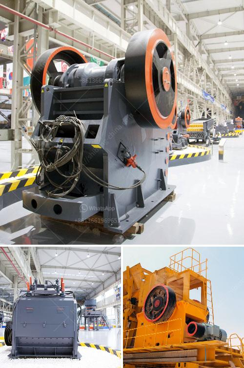

<h3>mobile crushers concrete aggregate</h3>
Mobile crushers are designed to ease the process of crushing aggregates like concrete, asphalt, and limestone on the construction site. The robust machines are built to handle large-scale materials, such as reinforced concrete, to make them usable for other construction purposes. Mobile crushers for concrete aggregate are compact, efficient, and environmentally friendly.

One of the advantages of mobile crushers is their ability to crush material directly on-site. This eliminates the need for transportation and reduces costs associated with hauling aggregates from the construction site to the processing plant. Moreover, mobile crushers can be easily transported to different locations within the construction site, ensuring a continuous supply of crushed concrete aggregate.

The versatility of mobile crushers allows them to handle a wide range of construction materials. Concrete aggregates produced by mobile crushers can be used for various applications, such as road base, fill material, and foundations. The high-quality aggregate produced by mobile crushers can also be used in concrete production, reducing the need for natural resources and promoting sustainability.

In addition to their efficiency and versatility, mobile crushers for concrete aggregate are also designed to be environmentally friendly. These machines are equipped with advanced dust suppression systems to reduce dust emissions, ensuring a safe and healthy working environment for operators. Moreover, mobile crushers are powered by efficient engines that minimize fuel consumption and reduce CO2 emissions.

The use of mobile crushers for crushing concrete aggregate is becoming increasingly popular in the construction industry. The ability to crush materials on-site not only reduces transportation costs but also speeds up the construction process. Furthermore, it allows contractors to recycle and reuse materials, contributing to a more sustainable approach to construction.

In conclusion, mobile crushers for concrete aggregate play a crucial role in modern construction. They increase efficiency, reduce costs, and promote sustainability by allowing contractors to crush materials directly on-site. The versatility and environmentally friendly features of these machines make them an essential tool for any construction project.
<h3>Contact us</h3><ul><li><strong>Whatsapp:&nbsp;<a href="https://wa.me/8613661969651">+8613661969651</a></strong></li><li><a href="https://swt.shibang-china.com/?git&amp;zhl&amp;mobile crushers concrete aggregate"><strong>Online Service(chat now)</strong></a></li></ul><h3>Related</h3><ul><li><a href='stone for stone mill.md'>stone for stone mill</a></li><li><a href='conveyor belts for sand for sale.md'>conveyor belts for sand for sale</a></li><li><a href='speed of vibrating screen.md'>speed of vibrating screen</a></li><li><a href='china gold water grinding mills.md'>china gold water grinding mills</a></li><li><a href='mtm raymond mill.md'>mtm raymond mill</a></li></ul>