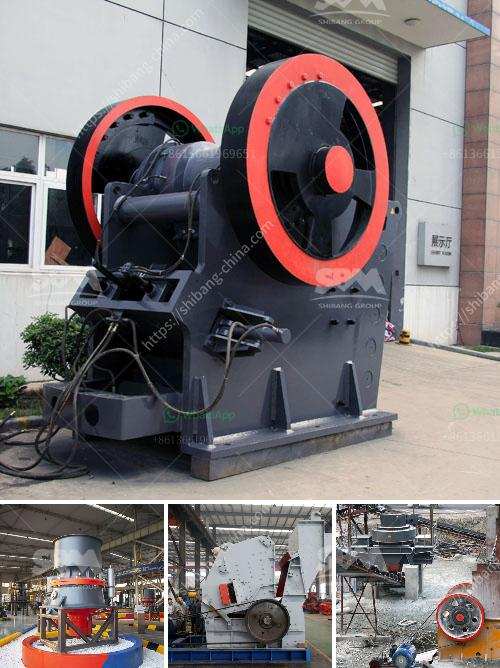

<h3>mobile crushers for sale in nigeria</h3>
Mobile crushers are essential for the crushing of concrete and asphalt of various types. Available in different types, they are used as primary, secondary, as well as tertiary equipment for particle-on-particle crushing or for improving the quality of end material in terms of shape, size and texture as well as for decreasing the wear and tear of the machine and several other important results.

Mobile crushers are designed for crushing mineral ores, stones, recycling construction waste and producing aggregate. These equipment reduce large solid masses of raw material into smaller sizes and change the form of waste material so it can be easily disposed or recycled.

Mobile crushers are often referred to as ‘mobile crushing plants’. They are track-mounted crushing machines which, thanks to their mobility, can maximise productivity and reduce operating costs – while increasing safety and reducing environmental impact. The concept of mobile and semi-mobile crushers has been around for a long time, but for years, many machines were very heavy and moving them required thoughtful planning. However, advancements in technology have paved the way for the emergence of mobile crushers that are compact, easy to transport, and can be assembled and disassembled in a quick and efficient manner.

In Nigeria, a major asphalt producer is increasing production capacity to cope with growing demand for its materials. Nigeria is developing rapidly and its infrastructural projects are directly contributing to the country's growth. Asphalt Unity Construction, based in Nigeria, began operations in 2009, and is now a leading construction company offering road construction services from site preparation, asphalt production, paving and construction.

Crusher is one of the brands that have been distinguished as a leader in the field of mobile concrete crushing equipment. They produce a wide range of crushers for different extraction goals that have different characteristics, depending on the type and size of materials to be crushed.

The Mobile Crusher is specially designed for secondary and tertiary crushing in hard-stone applications. They are extraordinarily efficient, diverse in application and very economical to use. To meet the diverse requirements in processing technology, the Mobile Crusher is available in different sizes and configurations.

The key players in the mobile crushers market are McLanahan Corporation, Sandvik AB, Terex Corporation, Metso Corporation, Astec Companies, McCloskey International, Blue Group, Powerscreen, Shanghai Shibang Machinery (SBM), Rubble Master among others.

Mobile crushers can be classified as stationary crushers and mobile crushing plants based on their mobility. The crusher can be equipped with a conveyor belt that scrubs the material before it is fed into the crusher. Depending on the configuration, they can be portable and have self-propelled capabilities. Mobile crushers can also be equipped with screens to ensure the end product meets the required specifications.

With the rapid advancements in technology, mobile crushers have become an increasingly attractive option in Nigeria for construction companies looking to maintain efficient production schedules while reducing costs. Whether it's processing large amounts of material or tackling smaller, specialized projects, there are mobile crushers for sale in Nigeria that can help get the job done effectively and efficiently.
<h3>Contact us</h3><ul><li><strong>Whatsapp:&nbsp;<a href="https://wa.me/8613661969651">+8613661969651</a></strong></li><li><a href="https://swt.shibang-china.com/?git&amp;zhl&amp;mobile crushers for sale in nigeria"><strong>Online Service(chat now)</strong></a></li></ul><h3>Related</h3><ul><li><a href='ball mill for solutions.md'>ball mill for solutions</a></li><li><a href='mining processing machine prices.md'>mining processing machine prices</a></li><li><a href='stone crusher to diessel.md'>stone crusher to diessel</a></li><li><a href='india stone crusher machine.md'>india stone crusher machine</a></li><li><a href='impact crusher for sale in saudi arabia.md'>impact crusher for sale in saudi arabia</a></li></ul>