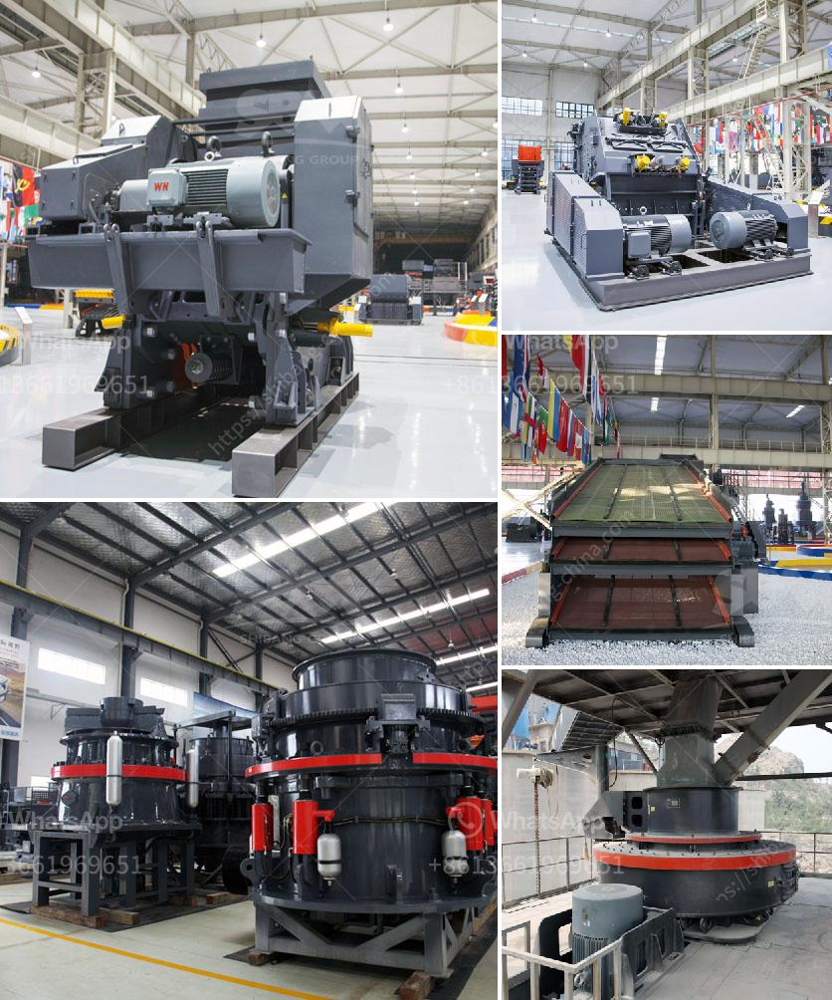

<h3>mobile crushers for sale in south africa</h3>
Mobile crushers are widely used in the mining industry, especially for the recycling of construction waste. They enable efficient disposal of materials, reducing transport costs and pollution while also increasing the productivity of construction projects. The demand for mobile crushers in South Africa is growing due to their benefits such as high flexibility and efficiency.

Mobile crushers create value in the recycling process as they break down the concrete and asphalt that is already on site, and reuse the materials for new construction projects. This eliminates the need for transportation and disposal of waste materials, resulting in significant cost savings. Additionally, mobile crushers can produce various sizes of aggregate, making them suitable for a wide range of applications.

In South Africa, there are many companies that provide mobile crushers for sale. These companies offer a variety of models, each designed to meet the unique needs of different industries. Some popular models offered by these companies include the Powerscreen Metrotrak, Sandvik QJ341, and Keestrack B4. These crushers are highly efficient and powerful, capable of processing large volumes of materials quickly.

One of the major advantages of mobile crushers is their high flexibility. They can be easily transported to different locations, allowing operators to move the crushing operation closer to the source of materials. This reduces the distance that materials need to be transported, saving time and money. Mobile crushers also have the ability to crush materials directly on site, eliminating the need for additional equipment and reducing the overall project timeline.

Mobile crushers in South Africa are also equipped with special safety features to protect the operator and prevent accidents. For instance, the Powerscreen Metrotrak has an automatic tramp iron release system that prevents damage to the crusher in case of an overload. Similarly, the Sandvik QJ341 has a self-locking hopper that prevents the operator from being exposed to the rotating parts of the crusher. These safety features ensure the peace of mind for operators and make mobile crushers a safe option for crushing operations.

In conclusion, mobile crushers are an essential tool in the mining, construction, and recycling industries in South Africa. They offer several advantages such as increased efficiency, reduced transport costs, and environmental benefits. There are many companies in South Africa that offer mobile crushers for sale, providing a wide range of options for customers. With their high flexibility, safety features, and efficient operation, mobile crushers are becoming increasingly popular for various applications in South Africa.
<h3>Contact us</h3><ul><li><strong>Whatsapp:&nbsp;<a href="https://wa.me/8613661969651">+8613661969651</a></strong></li><li><a href="https://swt.shibang-china.com/?git&amp;zhl&amp;mobile crushers for sale in south africa"><strong>Online Service(chat now)</strong></a></li></ul><h3>Related</h3><ul><li><a href='crusher manufacturers in malaysia.md'>crusher manufacturers in malaysia</a></li><li><a href='iron crusher supplier.md'>iron crusher supplier</a></li><li><a href='hammer mill machine price.md'>hammer mill machine price</a></li><li><a href='ball mill di philippines.md'>ball mill di philippines</a></li><li><a href='mobile crusher ghana.md'>mobile crusher ghana</a></li></ul>