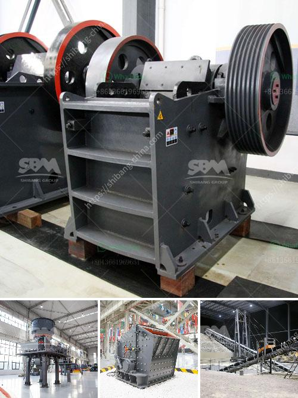

<h3>mobile crushers for sale south africa</h3>
Mobile crushers are commonly used in the mining, construction, and infrastructure industries to break down large stones and rocks into smaller, more manageable pieces. These machines are highly efficient and efficient, making them an essential piece of equipment for any construction project.

In South Africa, the demand for mobile crushers has increased significantly over the years due to the rapid expansion of the country's construction industry. Whether it's for road construction, building renovations, or the development of new infrastructure projects, mobile crushers play a crucial role in streamlining the process and ensuring that projects are completed on time.

One of the main advantages of mobile crushers is their versatility, as they can be used in a variety of applications and locations. They can easily navigate through different terrains and access hard-to-reach areas, allowing for efficient crushing operations even in remote locations. This mobility also means that the crushers can be transported easily from site to site, reducing downtime and increasing productivity.

Another key benefit of mobile crushers is their ability to produce aggregates of different sizes and specifications. By adjusting the settings of the crusher, operators can easily produce materials with specific gradation requirements, ensuring that they meet the demands of each project.

Furthermore, mobile crushers in South Africa are highly cost-effective and offer a lower cost per ton compared to traditional fixed crushers. This cost savings is attributed to the reduced transportation and operating expenses, as well as the ability to process materials on-site, eliminating the need for additional equipment or vehicles.

In conclusion, mobile crushers are indispensable in the South African construction industry. Their versatility, mobility, and cost-effectiveness make them a valuable asset for any construction project. As the demand for mobile crushers continues to rise, it's important for industry professionals to consider investing in these machines to stay competitive and efficient in the ever-evolving construction landscape.
<h3>Contact us</h3><ul><li><strong>Whatsapp:&nbsp;<a href="https://wa.me/8613661969651">+8613661969651</a></strong></li><li><a href="https://swt.shibang-china.com/?git&amp;zhl&amp;mobile crushers for sale south africa"><strong>Online Service(chat now)</strong></a></li></ul><h3>Related</h3><ul><li><a href='stone crushing plant sale.md'>stone crushing plant sale</a></li><li><a href='manufacturers crushing stone.md'>manufacturers crushing stone</a></li><li><a href='concrete stone crusher uk for sale.md'>concrete stone crusher uk for sale</a></li><li><a href='cone crushing plant elevation.md'>cone crushing plant elevation</a></li><li><a href='mobile stone crushers.md'>mobile stone crushers</a></li></ul>