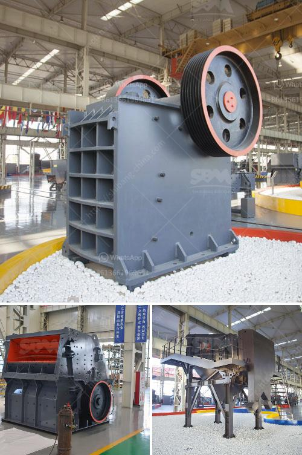

<h3>mobile crushers for sale</h3>
Mobile crushers have gained a lot of popularity in the past few years. These machines enable users to crush rocks, rubble, and even concrete into desired sizes. With the increasing demand for efficient and cost-effective construction and mining equipment, mobile crushers have become an essential tool for contractors and builders.

One of the major advantages of mobile crushers is their versatility. These machines can be easily transported to different job sites, allowing users to crush materials on-site. This eliminates the need to transport heavy materials to a distant location for crushing, resulting in significant time and cost savings.

Another key benefit of mobile crushers is their efficiency. These machines are designed to quickly and effectively crush different types of materials. Their powerful engines and robust construction enable them to process large quantities of materials in a short period. This not only increases productivity but also reduces the need for manual labor, leading to higher operational efficiency.

Mobile crushers also offer great flexibility when it comes to different applications. They can be used to crush various materials, including rocks, concrete, asphalt, and even brick. Whether it's for road construction, building demolition, or recycling purposes, these machines can adapt to different job requirements.

In addition to their versatility and efficiency, mobile crushers also offer significant cost savings. Traditional crushers require a static foundation and a dedicated power supply, which can be costly and time-consuming to set up. On the other hand, mobile crushers are self-contained units that only require a fuel source and a small amount of maintenance. This makes them highly cost-effective in both the short and long term.

Finding mobile crushers for sale is not a difficult task. Many reputable manufacturers and suppliers offer a wide range of models to choose from. These machines come with different specifications, such as crushing capacity, fuel consumption, and size. By considering the specific requirements of your job site, you can easily find a mobile crusher that meets your needs.

When purchasing a mobile crusher, it's important to consider factors such as maintenance and after-sales service. Look for suppliers who offer comprehensive support and spare parts availability. This ensures that your machine stays in optimal condition and minimizes downtime.

In conclusion, mobile crushers are a valuable asset for construction and mining operations. Their versatility, efficiency, and cost-effectiveness make them an essential tool in any job site. By investing in a reliable and high-quality mobile crusher, contractors and builders can improve productivity and achieve optimal results.
<h3>Contact us</h3><ul><li><strong>Whatsapp:&nbsp;<a href="https://wa.me/8613661969651">+8613661969651</a></strong></li><li><a href="https://swt.shibang-china.com/?git&amp;zhl&amp;mobile crushers for sale"><strong>Online Service(chat now)</strong></a></li></ul><h3>Related</h3><ul><li><a href='ball mills for clay.md'>ball mills for clay</a></li><li><a href='full quarry machines for sale in china.md'>full quarry machines for sale in china</a></li><li><a href='quarry stone supplier in dubai.md'>quarry stone supplier in dubai</a></li><li><a href='grinding machine in greece.md'>grinding machine in greece</a></li><li><a href='roller mill compontes.md'>roller mill compontes</a></li></ul>