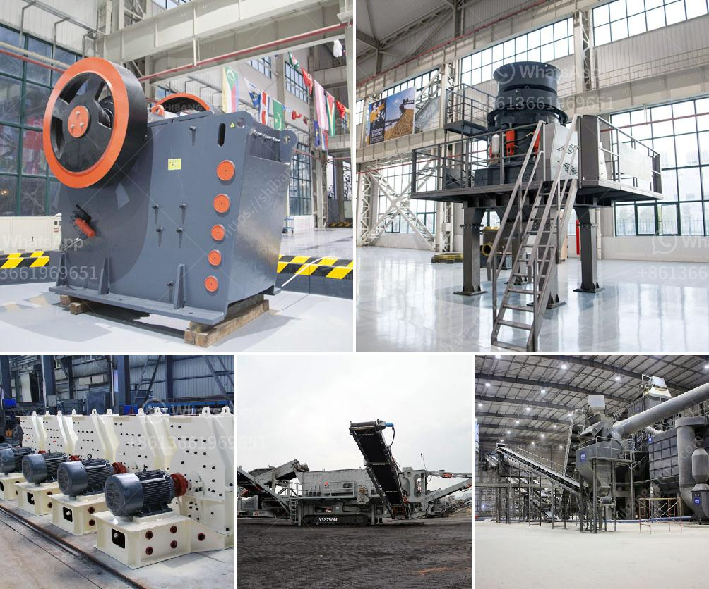

<h3>mobile crushers hire in south africa</h3>
Mobile crushers are designed for crushing rocks and stones efficiently and economically. They are used to reduce the size of large rocks and stones, making them easier to transport and deliver. Mobile crushers can process various materials, such as rocks, ores, and minerals, into desired sizes with high reduction ratios. With the advancements in technology, mobile crushers have become an essential tool in the construction, mining, and quarrying industries in South Africa.

Mobile crushers are track-mounted or wheeled rock crushing machines that are easily movable on and between production sites. They are widely used in aggregates production, recycling applications, and in mining operations. Mobile crushers can replace stationary crushing systems, reducing the need for hauling and thus cutting operational costs.

One of the major advantages of a mobile crusher is its flexibility, allowing users to save time and money. Mobile crushers enable operators to move freely on the job site and perform different tasks without the need for additional machinery. In South Africa, where mobility is a crucial factor, young and developing businesses benefit greatly from mobile crushers, as they are flexible and efficient.

Mobile crushers for hire in South Africa provide a great way to recycle construction waste and save on transportation costs, making it possible for businesses to reuse materials. These machines can also help dispose of or recycle waste materials from other sources, as well as create aggregates and other recycled products.

Camelway Machinery is the manufacturer and supplier of mobile crushing and screening plants, which can be combined with crushing machines and screening machine to complete the mobile crushing plant solution. Camelway mobile crushers are widely used in the mining, metallurgy, construction, highway, railway, water conservancy and other industries.

Camelway mobile crushers are exported to Uzbekistan, Russia, Kazakhstan, Mongolia, Azerbaijan, North Korea, Vietnam, Malaysia, Turkey, Iran, Canada and other countries and regions over the world, and won great reputation and praise from the users.

But South Africa is not only abundant with minerals but also with many other resources. Therefore, it can be seen that this is a multi-demand market, and the mobile crusher industry is undoubtedly a huge opportunity for development. It is estimated that there are about 10 billion tons of reserves in South Africa, which has virtually unlimited potential for mining development.

Many people are generally optimistic about the future market outlook for South African mobile crushers. However, there are also some factors that may affect the price of mobile crusher, as jaw crusher will inevitably lead to some failures in the process of breaking materials. If the machine is not properly maintained, it will lead to some failures. Therefore, in daily operation, users are required to master some maintenance methods and carry out relevant maintenance and inspection on the machine to ensure the normal operation and prolong its service life.

Therefore, the development prospects of the mobile crusher industry in South Africa are also very good, and the future will be full of market requests. Now, let's talk about how to purchase a satisfactory mobile crusher. During the purchase cycle, the quality and price of the equipment are the most concerned issues. However, there are still many other factors that need to be considered by customers, such as product maintenance, after-sales service, equipment quality, etc. These factors need to be carefully analyzed and compared, so as to avoid detours and ensure the purchase of high-quality mobile crusher.

In conclusion, mobile crushers are an ideal choice for companies in South Africa who want to repurpose or reuse their materials. Mobile crushers are versatile, highly efficient machines that can process various materials, including minerals and construction waste, to create aggregates and other recycled products. They are widely used in the construction, mining, and quarrying industries, and offer flexibility and efficiency. With the vast amount of reserves in South Africa, the mobile crusher industry is a huge opportunity for investment and growth.
<h3>Contact us</h3><ul><li><strong>Whatsapp:&nbsp;<a href="https://wa.me/8613661969651">+8613661969651</a></strong></li><li><a href="https://swt.shibang-china.com/?git&amp;zhl&amp;mobile crushers hire in south africa"><strong>Online Service(chat now)</strong></a></li></ul><h3>Related</h3><ul><li><a href='different types of roller milling.md'>different types of roller milling</a></li><li><a href='magnetic separator equipment for sale.md'>magnetic separator equipment for sale</a></li><li><a href='hammer mill dealer in cebu.md'>hammer mill dealer in cebu</a></li><li><a href='portable gold wash plant for sale.md'>portable gold wash plant for sale</a></li><li><a href='crusher hp300 cone.md'>crusher hp300 cone</a></li></ul>