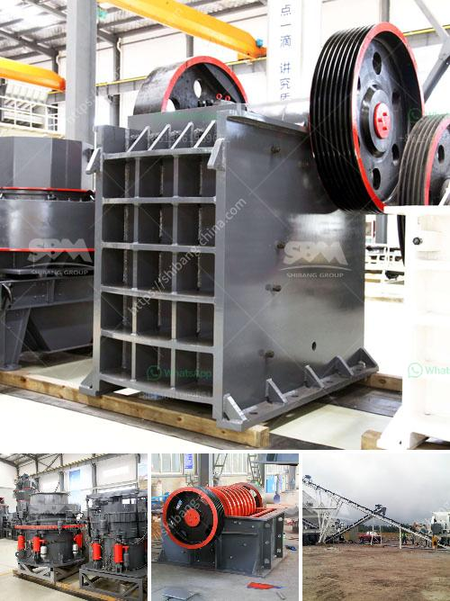

<h3>mobile crushers stone in south africa</h3>
Mobile crushing for contractors in South Africa has long been a focus of many companies operating in the country. Due to the advantages of mobile crushing, most notable being the elimination of transport costs, this option has gained much traction in recent years. In fact, according to industry experts, mobile crushers are now the go-to solution for many crushing tasks in South Africa.

The versatility of mobile crushers makes them ideal for processing materials such as stones, basalt, granite, and limestone. They can be utilized in various stages of crushing, from primary crushing to tertiary crushing, and can even be used as independent units to produce different aggregate sizes for specific applications. These crushers are available in a wide range of sizes and configurations to suit the requirements of different projects.

One of the key advantages of mobile crushers is their ability to be transported to different locations. This is particularly beneficial for contractors working on multiple sites or projects. The crushers can be easily moved and set up, allowing for quick and efficient crushing at any location. This eliminates the need for separate transport of materials to a central crushing site, reducing costs and boosting productivity.

Another advantage of mobile crushers in South Africa is that they can be operated remotely. This means that operators can control the crushers from a distance, enhancing safety and reducing the risk of accidents. Additionally, remote operation allows for better control over the crushing process, ensuring that the desired final product is achieved.

In terms of maintenance, mobile crushers are designed to be easy to maintain and service. They are equipped with features such as hydraulic crusher setting adjustment, which makes it quick and easy to change the crusher's closed side setting. The crushers also have onboard monitoring systems that provide real-time information about the machine's performance, allowing for proactive maintenance and troubleshooting.

One of the main challenges associated with mobile crushers in South Africa is the availability of infrastructure. While the country has a well-developed road network, there may be limitations in accessing remote or rural areas. However, advances in technology have made it possible to use mobile crushers in even the most challenging environments, including construction and mining sites.

In conclusion, mobile crushers stone in South Africa offer numerous benefits to contractors in terms of cost savings, flexibility, and efficiency. They offer the ability to crush a wide range of materials and can be easily transported to different locations. With advancements in technology, these crushers are becoming increasingly popular and are expected to continue playing a vital role in the construction and mining industries in South Africa.
<h3>Contact us</h3><ul><li><strong>Whatsapp:&nbsp;<a href="https://wa.me/8613661969651">+8613661969651</a></strong></li><li><a href="https://swt.shibang-china.com/?git&amp;zhl&amp;mobile crushers stone in south africa"><strong>Online Service(chat now)</strong></a></li></ul><h3>Related</h3><ul><li><a href='stone crusher machine usato in italy.md'>stone crusher machine usato in italy</a></li><li><a href='grinding machine in greece.md'>grinding machine in greece</a></li><li><a href='vibrating screen suppliers in philippines.md'>vibrating screen suppliers in philippines</a></li><li><a href='mobile stone crushers for sale south africa.md'>mobile stone crushers for sale south africa</a></li><li><a href='used quarry equipment from usa.md'>used quarry equipment from usa</a></li></ul>