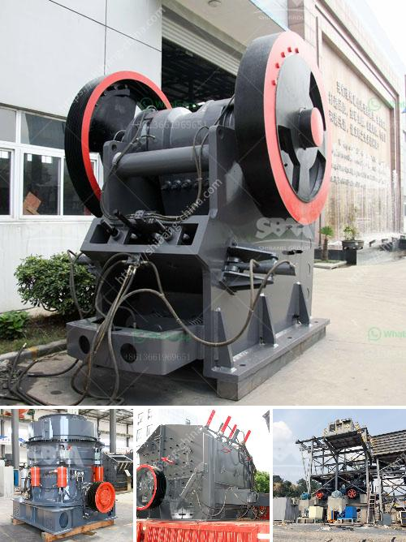

<h3>mobile crushing and screening manufacturer in india</h3>
With the rapid growth of the Indian economy, there is a huge demand for construction and mining equipment. Mobile crushing and screening equipment is an essential part where stone is processed and used for various purposes.

With the advent of mobile crushing and screening equipment, the need for stationary equipment has decreased considerably. Quarrying, mining, construction, demolition, and recycling have become easier and more efficient with the use of mobile crushers and screeners.

The mobile crushing and screening industry in India is witnessing massive growth. With an increasing number of infrastructure projects, the demand for aggregates and crushed stones is also rising. This has led to a surge in the demand for mobile crushing and screening equipment.

Several manufacturers in India are offering a wide variety of mobile crushers and screeners. These machines are designed to suit varied customer requirements. The key focus is to offer reliable and efficient machines that can enhance productivity and profitability for the end-users.

One such prominent manufacturer in India is [Company Name]. They have been in the crushing and screening industry for several years and have established themselves as a reliable and customer-centric brand. Their wide range of mobile crushers and screeners cater to various applications such as quarrying, mining, construction, and recycling.

[Company Name] offers a range of mobile jaw crushers, impact crushers, and cone crushers that are capable of crushing various types of stones and materials. These machines are equipped with advanced features and technologies that ensure high productivity and low operational costs.

Their mobile screeners are designed to separate granular materials into different sizes and textures. These screeners are highly efficient and can handle a wide range of materials, including aggregates, topsoil, and wood chips. The screens can be easily changed, allowing for versatility in screening applications.

One of the significant advantages of using mobile crushing and screening equipment is its mobility. These machines can be easily transported to different locations, enabling operators to access remote sites with ease. This flexibility not only saves time but also reduces transportation costs.

In addition to mobility, these machines are also equipped with state-of-the-art technologies that make them more user-friendly. Advanced control systems, remote monitoring, and diagnostics ensure that the machines are running at optimum performance. This helps in minimizing downtime and maximizing productivity.

Furthermore, mobile crushing and screening machines are environmentally friendly and efficient. They are designed to reduce emissions and noise pollution, making them compliant with environmental regulations.

In conclusion, the demand for mobile crushing and screening equipment in India is witnessing significant growth. With various manufacturers offering a wide range of machines, customers can choose from an array of options that suit their requirements. Companies like [Company Name] are leading the way by providing reliable, efficient, and eco-friendly machines that enhance productivity and profitability for the end-users.
<h3>Contact us</h3><ul><li><strong>Whatsapp:&nbsp;<a href="https://wa.me/8613661969651">+8613661969651</a></strong></li><li><a href="https://swt.shibang-china.com/?git&amp;zhl&amp;mobile crushing and screening manufacturer in india"><strong>Online Service(chat now)</strong></a></li></ul><h3>Related</h3><ul><li><a href='ball mills for sale.md'>ball mills for sale</a></li><li><a href='stone crusher from china.md'>stone crusher from china</a></li><li><a href='quarry stone crushing machine manufacturers.md'>quarry stone crushing machine manufacturers</a></li><li><a href='full quarry machines for sale in china.md'>full quarry machines for sale in china</a></li><li><a href='raymond mill india.md'>raymond mill india</a></li></ul>