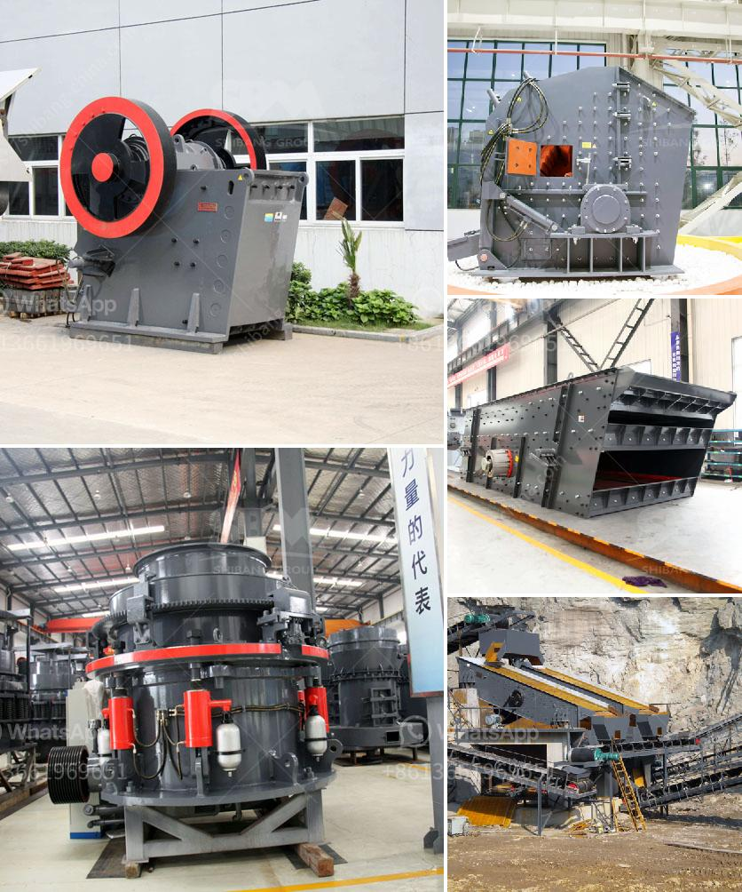

<h3>mobile crushing machines</h3>
Mobile crushing machines are revolutionizing the way construction and mining professionals process material on the job site. Mobile crushers are compact, easy to transport, and convenient to use. These machines are improving efficiency and lowering costs for contractors in various industries.

One of the key advantages of mobile crushing machines is their flexibility. They can be transported to different sites easily, allowing contractors to process material directly at the location where it is being extracted. This eliminates the need for costly transportation of material to a central processing facility. Whether it is rock, concrete, or asphalt, these machines can handle a wide range of materials, making them suitable for various applications.

Furthermore, mobile crushing machines offer significant time and cost savings. Traditional crushing methods involve large, stationary equipment that requires a dedicated space and infrastructure. Mobile crushers, on the other hand, can be set up and taken down in a matter of hours, lowering the time and cost involved in project setup and shutdown. This makes them ideal for short-term projects or when processing material in multiple locations.

Another advantage of mobile crushing machines is their ability to crush material on-site, allowing for immediate reuse. This is particularly beneficial for construction projects that generate large amounts of waste material. Instead of disposing of material at a landfill, contractors can process it into reusable aggregate, reducing the need for new raw materials and minimizing environmental impact.

In addition to their mobility and cost savings, mobile crushing machines are also highly efficient. These machines are designed to maximize productivity and reduce downtime. They are equipped with powerful crushers that can break down material into smaller sizes efficiently. This ensures that the final product meets the required specifications, whether it is for road construction, building foundations, or other applications.

Furthermore, mobile crushers are equipped with innovative features that improve safety and ease of use. For example, advanced control systems allow operators to adjust crusher settings easily and monitor performance in real-time. This ensures optimal output and minimizes the risk of overloading the machine.

Mobile crushing machines are also equipped with dust suppression systems, reducing the risk of respiratory issues for workers and improving air quality on the job site. Additionally, noise reduction features make these machines more environmentally friendly and compliant with local regulations.

Overall, mobile crushing machines are transforming the way material is processed in industries such as construction and mining. Their flexibility, efficiency, and cost savings make them a valuable asset for contractors. With the ability to process material directly at the job site, these machines are streamlining operations and improving productivity. Contractors can now complete projects faster, with less downtime and lower transportation costs. As technology continues to advance, mobile crushing machines are likely to become even more efficient and versatile, contributing to further advancements in the construction and mining sectors.
<h3>Contact us</h3><ul><li><strong>Whatsapp:&nbsp;<a href="https://wa.me/8613661969651">+8613661969651</a></strong></li><li><a href="https://swt.shibang-china.com/?git&amp;zhl&amp;mobile crushing machines"><strong>Online Service(chat now)</strong></a></li></ul><h3>Related</h3><ul><li><a href='price of zenith crusher.md'>price of zenith crusher</a></li><li><a href='chinese aggregate crusher suppliers.md'>chinese aggregate crusher suppliers</a></li><li><a href='mobile coal washing plant south africa.md'>mobile coal washing plant south africa</a></li><li><a href='free technical drawings ore hammer mill.md'>free technical drawings ore hammer mill</a></li><li><a href='gold crushers sale.md'>gold crushers sale</a></li></ul>