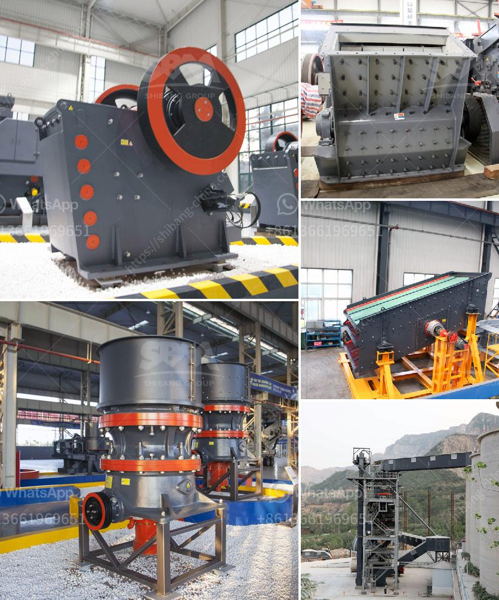

<h3>mobile crushing plants</h3>
Mobile crushing plants are increasingly becoming popular and widely used in various industries, such as mining, construction materials, highway, railway, water conservancy and chemical industries. The use of mobile crushing plants has proven to be a viable option for efficient and effective crushing operations.

One of the main advantages of mobile crushing plants is their flexibility. These plants can be easily moved from one site to another, making them ideal for on-site crushing. This flexibility allows companies to save time and money on transportation costs, as well as reducing the need for multiple crushers and screens at different locations.

Mobile crushing plants are equipped with efficient and powerful crushing capabilities. They are designed to process a wide range of materials, including hard rocks, demolition materials, and even recycled concrete. This versatility ensures that the plants can handle different types of applications, making them suitable for various projects.

Another benefit of mobile crushing plants is their high productivity. These plants are equipped with advanced technology and efficient equipment, allowing for faster and more efficient crushing operations. This increased productivity translates to cost savings for companies, as they can process more materials in a shorter amount of time.

In addition to their productivity, mobile crushing plants also provide a safer working environment. Many mobile crushing plants are designed with features that ensure worker safety, such as guards and safety switches. This reduces the risk of accidents and injuries, making the plants a preferable choice for companies looking to prioritize employee well-being.

In conclusion, mobile crushing plants offer numerous advantages for companies in various industries. Their flexibility, high productivity, and safety features make them a valuable asset for any crushing operation. As technology continues to advance, we can expect to see even more innovative and efficient mobile crushing plant designs in the future.
<h3>Contact us</h3><ul><li><strong>Whatsapp:&nbsp;<a href="https://wa.me/8613661969651">+8613661969651</a></strong></li><li><a href="https://swt.shibang-china.com/?git&amp;zhl&amp;mobile crushing plants"><strong>Online Service(chat now)</strong></a></li></ul><h3>Related</h3><ul><li><a href='micro powder mill cost.md'>micro powder mill cost</a></li><li><a href='equipment for crushing gravel.md'>equipment for crushing gravel</a></li><li><a href='used sand screening plant for sale in uae.md'>used sand screening plant for sale in uae</a></li><li><a href='sand and gravel mining equipment for sale.md'>sand and gravel mining equipment for sale</a></li><li><a href='jual stone crusher mobile cap 30 tph in indonesia.md'>jual stone crusher mobile cap 30 tph in indonesia</a></li></ul>