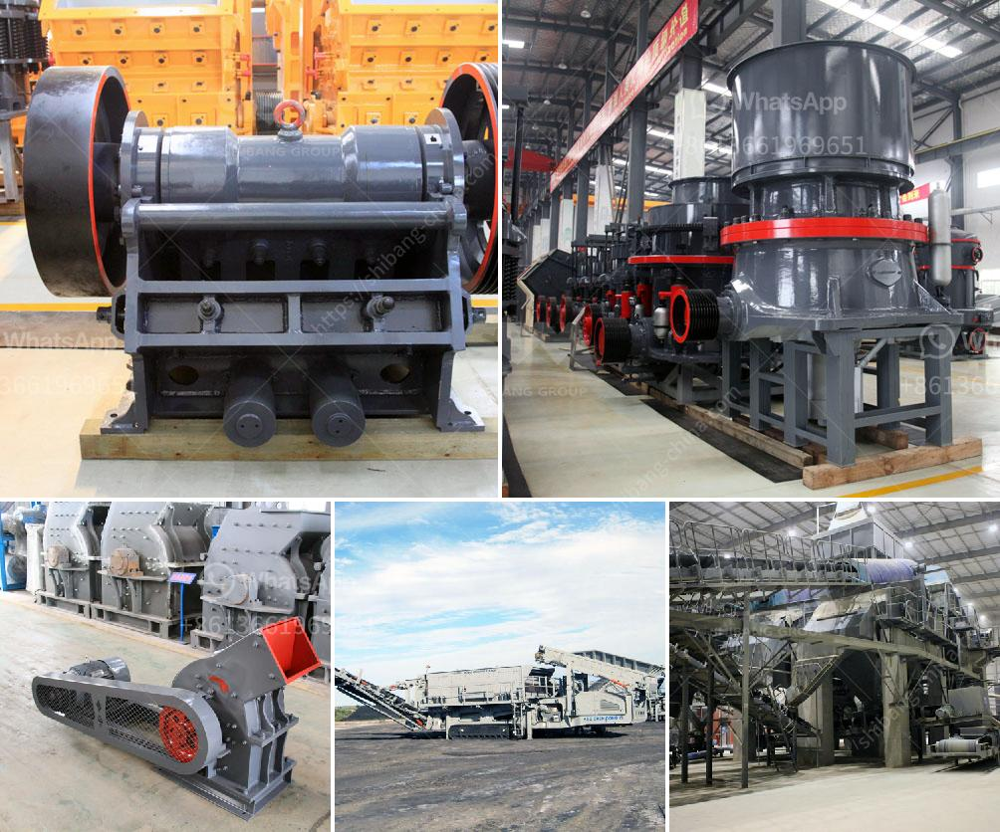

<h3>mobile crushing station philippines</h3>
Mobile crushing station is becoming the latest trend in the Philippines. With the increase in construction and mining activities in the country, the demand for mobile crushing station is also growing rapidly. Many companies are now purchasing mobile crushing stations to meet their crushing needs.

A mobile crushing station is a machine that is designed to crush large rocks into smaller rocks, gravel, sand, or dust. Mobile crushing stations are widely used in mining, metallurgy, building materials, transportation, water conservancy, and other industries.

One of the primary benefits of mobile crushing stations is their flexibility. They can be easily moved from one site to another, allowing companies to use them in multiple locations. This flexibility is especially beneficial for construction and mining companies that operate in remote areas where traditional crushing equipment is not available.

Another advantage of mobile crushing stations is their efficiency. They are equipped with a variety of advanced technologies that ensure efficient and precise crushing operations. The machines are designed to deliver high productivity while consuming less energy. This not only reduces operational costs for the companies but also contributes to a sustainable environment.

Additionally, mobile crushing stations are equipped with remote control systems, which enable operators to control the machine from a distance. This feature enhances safety and improves operational efficiency. Operators can monitor and adjust the machine's settings, such as speed and feed rate, without being near it. This reduces the risk of accidents and ensures smooth operation.

Furthermore, mobile crushing stations are compact and easy to maintain. They are designed to be user-friendly, with simple controls and easy access to maintenance points. Companies can save time and money on maintenance, as they do not need to hire specialized technicians or invest in heavy machinery.

The Philippines is witnessing a surge in construction and mining activities due to the government's infrastructure development programs and the increasing demand for raw materials. Mobile crushing stations have become a game-changer in this industry, as they provide companies with a cost-effective and efficient solution for their crushing needs.

Several companies in the Philippines have already invested in mobile crushing stations to improve their productivity and expand their operations. These machines have proven to be highly reliable and effective in crushing various materials, such as granite, limestone, and sandstone.

In conclusion, mobile crushing stations are revolutionizing the crushing industry in the Philippines. Their flexibility, efficiency, safety features, and easy maintenance make them an ideal choice for construction and mining companies. As the demand for mobile crushing stations continues to grow in the country, more companies are expected to invest in this technology to stay ahead in the competitive market.
<h3>Contact us</h3><ul><li><strong>Whatsapp:&nbsp;<a href="https://wa.me/8613661969651">+8613661969651</a></strong></li><li><a href="https://swt.shibang-china.com/?git&amp;zhl&amp;mobile crushing station philippines"><strong>Online Service(chat now)</strong></a></li></ul><h3>Related</h3><ul><li><a href='rock crusher supplier.md'>rock crusher supplier</a></li><li><a href='grinding machine palletsgrinding machine palvisor.md'>grinding machine palletsgrinding machine palvisor</a></li><li><a href='ball mill mexico.md'>ball mill mexico</a></li><li><a href='grinding machine in greece.md'>grinding machine in greece</a></li><li><a href='price of stone crushing machine in nigeria.md'>price of stone crushing machine in nigeria</a></li></ul>