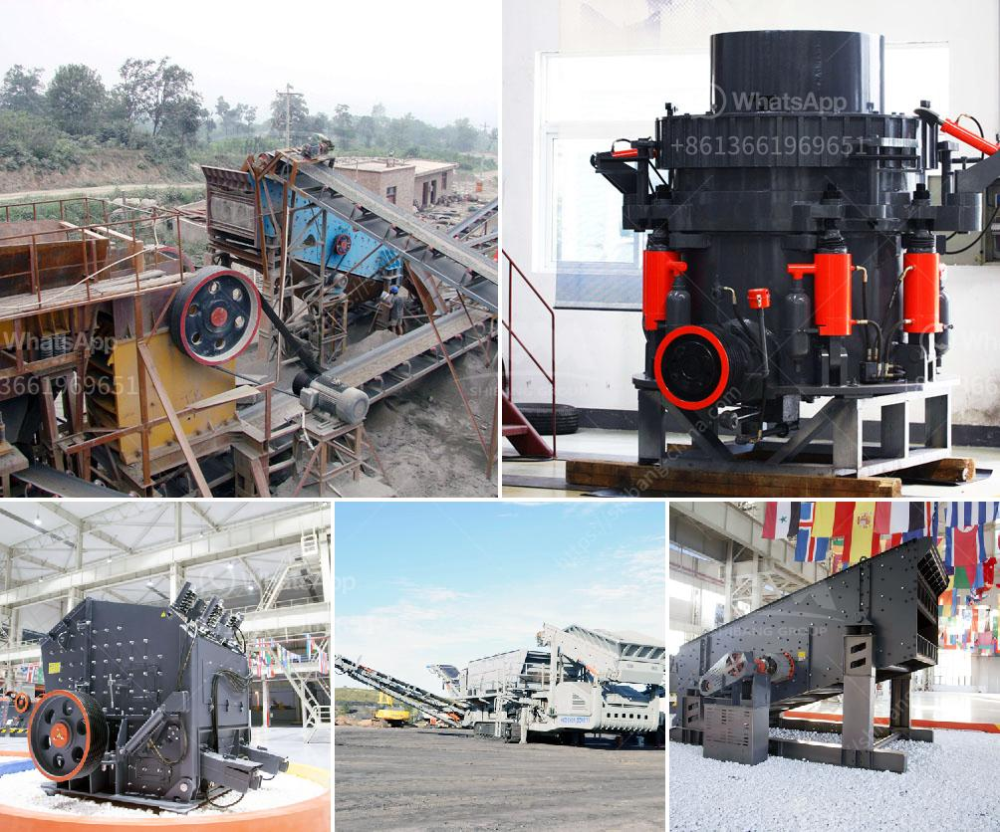

<h3>mobile gold crusher plant</h3>
Gold mining industry is booming around the world. Gold is an important resource to extract and process. More and more gold mining companies are looking for innovative ways to prospect and mine through their mobile gold crusher plant. The key advantage of mobile crushers is that they are moveable and can be dropped off at the mining area, allowing for greater flexibility and convenience for the miners.

A mobile gold crusher plant provides a new field of business opportunities for contractors, quarry operators, recycling and mining applications. It offers high efficient and low cost project plan without environment limit. For the gold mining companies, they are looking for crushing equipment that is reliable, flexible, and efficient. The mobile gold crusher plant has been optimized and equipped with multifunctional attachments, allowing for increased versatility and ease of operation.

The mobile gold crusher plant has the advantage of reasonable matching, unobstructed discharge all line, reliable working, convenient operation, high efficiency and saving energy. Especially, in the large scale gold mining, it saves the labor cost and investment cost. The mobile gold crusher plant can work without the limitation of ore site.

In addition, the mobile gold crusher plant is also popular among gold mining contractors. SBM's mobile gold crusher plant can be divided into two main types, the gold impact crusher and the gold cone crusher. These two series mobile crushers are designed with different capacity ranges to meet customers' different demands. With high crushing ratio, unbeatable performance, and compact structure, the gold cone crusher ensures the end products with a cubical shape.

Overall, the mobile gold crusher plant is the ideal choice for gold mining applications and is also appropriate for processing non-metallic minerals and construction wastes. If you are interested in our mobile gold crusher plant, please contact us for more information. We are committed to providing customers with comprehensive services, including pre-sale, sale, and after-sales support. Let us join hands to create a better future in the gold mining industry with our mobile gold crusher plant!
<h3>Contact us</h3><ul><li><strong>Whatsapp:&nbsp;<a href="https://wa.me/8613661969651">+8613661969651</a></strong></li><li><a href="https://swt.shibang-china.com/?git&amp;zhl&amp;mobile gold crusher plant"><strong>Online Service(chat now)</strong></a></li></ul><h3>Related</h3><ul><li><a href='hammer crusher price one ton per hour.md'>hammer crusher price one ton per hour</a></li><li><a href='jaw crusher and cone crusher manufacturers in dubai.md'>jaw crusher and cone crusher manufacturers in dubai</a></li><li><a href='ball mill manufacturer india.md'>ball mill manufacturer india</a></li><li><a href='sand screening machine in malaysia.md'>sand screening machine in malaysia</a></li><li><a href='gypsum powder production process.md'>gypsum powder production process</a></li></ul>