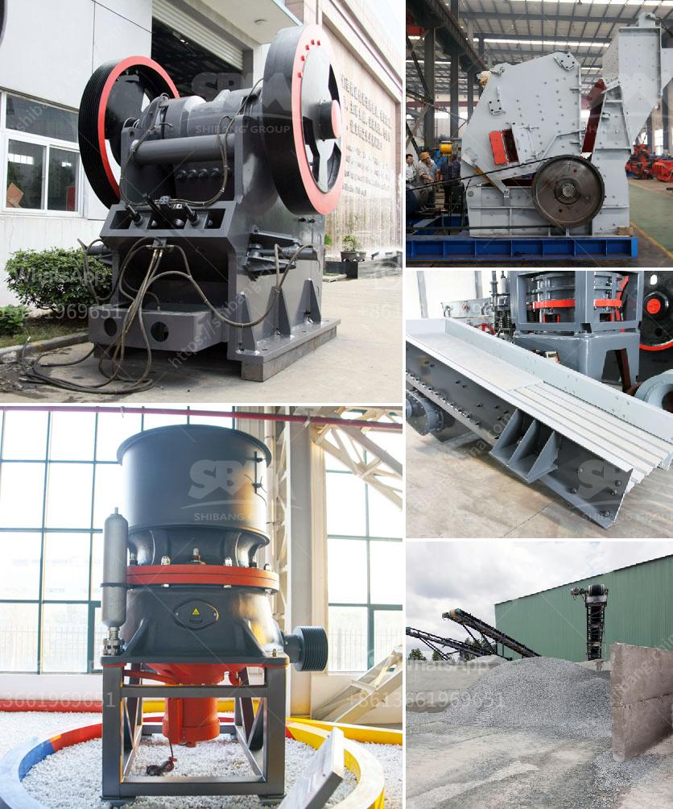

<h3>mobile gold processing plant in russia</h3>
Russia is known for its vast mineral reserves and extensive mining operations. With the ever-increasing emphasis on sustainable and responsible mining practices, mobile gold processing plants are reshaping the industry by providing an environmentally friendly alternative to traditional methods.

One such innovative solution is the mobile gold processing plant, specifically designed for remote locations. These plants are equipped with state-of-the-art technology, allowing miners to extract gold efficiently and effectively without the need for extensive infrastructure.

The mobile gold processing plant offers flexibility and convenience, enabling miners to process gold-bearing ore at the site itself. This eliminates the need for transporting ore back and forth to a centralized processing facility, significantly reducing transportation costs and carbon emissions.

Additionally, the mobile gold processing plant is equipped with advanced equipment and machinery that streamlines the entire process. From crushing and grinding the ore to extracting gold particles, these plants are designed to maximize gold recovery while minimizing environmental impact.

This mobile approach to gold processing is particularly beneficial in Russia's remote regions where transporting ore over long distances can be challenging and costly. With the mobile gold processing plant, mining companies can bring the processing closer to the source, reducing both logistical and financial burdens.

The Russian mining industry has embraced mobile gold processing plants, recognizing their potential to improve operational efficiency and reduce the environmental footprint. By adopting these plants, miners can optimize their gold recovery rates while adhering to stricter sustainability commitments.

Finally, mobile gold processing plants are not limited to gold extraction alone. They can process various types of ore, making them versatile and adaptable to different mining operations. This versatility ensures long-term viability and cost-effectiveness for miners in Russia and beyond.

In conclusion, mobile gold processing plants in Russia are revolutionizing the mining industry by providing an efficient, sustainable, and convenient alternative to traditional processing methods. These plants empower mining companies to extract gold economically, while reducing their carbon footprint and enhancing operational efficiency. With their advanced technology and adaptability, mobile gold processing plants hold tremendous potential, making them a game-changer for the Russian mining landscape.
<h3>Contact us</h3><ul><li><strong>Whatsapp:&nbsp;<a href="https://wa.me/8613661969651">+8613661969651</a></strong></li><li><a href="https://swt.shibang-china.com/?git&amp;zhl&amp;mobile gold processing plant in russia"><strong>Online Service(chat now)</strong></a></li></ul><h3>Related</h3><ul><li><a href='rock crushing plants in tanzania.md'>rock crushing plants in tanzania</a></li><li><a href='formula for belt conveyor tonne per hour.md'>formula for belt conveyor tonne per hour</a></li><li><a href='latest three roll mills.md'>latest three roll mills</a></li><li><a href='bentonite clay powder process equipment.md'>bentonite clay powder process equipment</a></li><li><a href='hammer mill price philippines.md'>hammer mill price philippines</a></li></ul>