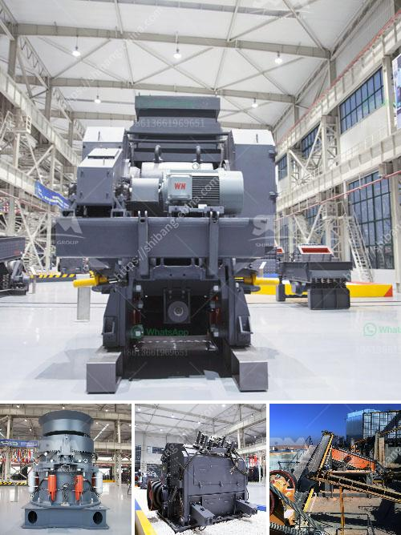

<h3>mobile jaw crusher for sale india used price</h3>
Mobile jaw crusher is the primary tool in the process of crushingmaterials, and then the huge rocks are broken into pieces by the immovablejaw crusher. Mobile jaw crusher refers to the mobile crushing plant with jaw crusher equipped in . The main parts include jaw crusher, fixed rack, feeder, vibrating screen, conveying belt, motor and control box, etc. Mobile jaw crusher acts as a primary crusher for mining and construction material, which means there is always a need to crush materials.

Mobile jaw crusher is a purpose-built tool that allows crushing of materials in the construction industry. It is a modern mobile solution capable of crushing rock materials, stones, ore minerals, and construction waste. It is especially used in quarrying and mining operations.

India is a country where the use of mobile jaw crushers is heavily prevalent. However, it does not come without its own set of challenges. For instance, frequent power outages in remote areas can hamper the productivity of mobile jaw crushers. Maintenance and replacement of spare parts could also pose a challenge in certain regions.

Despite the challenges, mobile jaw crushers are in high demand for their extensive range of applications and superior performance. Moreover, they have a wide range of usage as they can crush materials of various hardness levels.

One of the main advantages of mobile jaw crushers is their flexibility. They can be easily transported to different locations and can be set up quickly. This gives them an edge over stationary crushers, especially for projects where the crushing location needs to be changed frequently. The efficiency and productivity of mobile jaw crushers are further enhanced by their ability to handle different types of materials.

Additionally, mobile jaw crushers ensure a cost-effective solution for various operations. The ability to crush and process materials on-site reduces the need to transport materials to a centralized location. This translates into reduced transportation costs and increased overall efficiency. It also helps in reducing the environmental impact associated with transportation.

When looking for a mobile jaw crusher for sale in India, it is important to consider various factors. The most important factor is the quality and durability of the equipment. It is advisable to purchase from a reputable manufacturer or dealer who offers a warranty on the equipment. This will ensure that any potential issues are addressed promptly and efficiently.

Another factor to consider is the price of the mobile jaw crusher. Prices may vary depending on factors such as the specifications, features, and additional equipment included. It is recommended to compare prices from different sellers and manufacturers to get the best deal.

It is also crucial to ensure that the mobile jaw crusher meets the specific requirements of the project. This includes factors such as the maximum feed size, capacity, and output size. Consulting with a professional in the field can help in determining the most suitable mobile jaw crusher for the particular needs.

In conclusion, mobile jaw crushers are a valuable tool for the construction and mining industry in India. The flexibility, efficiency, and cost-effectiveness of these crushers make them an attractive option for various applications. However, careful consideration should be given to the quality, price, and specific requirements before making a purchase.
<h3>Contact us</h3><ul><li><strong>Whatsapp:&nbsp;<a href="https://wa.me/8613661969651">+8613661969651</a></strong></li><li><a href="https://swt.shibang-china.com/?git&amp;zhl&amp;mobile jaw crusher for sale india used price"><strong>Online Service(chat now)</strong></a></li></ul><h3>Related</h3><ul><li><a href='flowchart of a stone crushing plant.md'>flowchart of a stone crushing plant</a></li><li><a href='used portable roller crushers and screens.md'>used portable roller crushers and screens</a></li><li><a href='material of mantles ball mills.md'>material of mantles ball mills</a></li><li><a href='stone crush machine pakistan price.md'>stone crush machine pakistan price</a></li><li><a href='mobile vibrating screens for hire in south africa.md'>mobile vibrating screens for hire in south africa</a></li></ul>