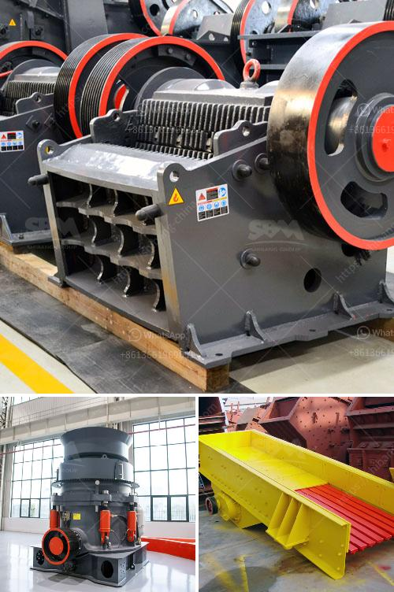

<h3>mobile quarry crusher euipment</h3>
The quarrying industry is experiencing a renewed growth thanks to advancements in technology. Today, quarrying activities rely heavily on mobile crushers, a product that has gained widespread popularity and for good reason. A mobile crusher, in essence, is a more efficient alternative to traditional stationary crushers because it allows greater flexibility, speed, and convenience while maintaining the same levels of productivity.

One of the primary advantages of mobile quarry crusher equipment is the mobility factor. By being able to move the crusher easily when it is no longer needed at the current site, operators can easily relocate their equipment to another area of the quarry or even to a different quarry altogether. This flexibility ensures that crushing operations can be carried out wherever required, allowing for optimal material extraction. 

Another key benefit of mobile crushers is their ability to process a wide range of materials. These machines are designed to handle various types of rocks, stones, ores, and minerals, ensuring that quarry operators can efficiently crush different materials without the need for additional machinery. As a result, this saves time and money, as well as reducing the environmental impact associated with transportation.

Furthermore, mobile quarry crushers offer a significant reduction in downtime. Traditional crushers rely on a fixed base and require time-consuming set-up and dismantling processes when being moved. In contrast, mobile crushers can be ready to operate within minutes, helping to minimize production stoppages and ensuring a continuous flow of crushed materials.

Thanks to technological advancements, modern mobile crushers are equipped with features that enhance safety and productivity. For instance, advanced control systems allow operators to monitor and adjust the crusher settings remotely, reducing the need for manual intervention. Additionally, many mobile crushers are designed to incorporate the latest telematics technology, which provides real-time information on performance, maintenance, and fuel consumption, further optimizing operations.

In conclusion, mobile quarry crusher equipment is a valuable addition to any quarrying operation. By utilizing these machines, quarry operators can significantly improve efficiency, reduce costs, and enhance productivity. With their versatility and convenience, mobile crushers are transforming the way quarrying activities are carried out, creating a positive impact on both operational and environmental factors.
<h3>Contact us</h3><ul><li><strong>Whatsapp:&nbsp;<a href="https://wa.me/8613661969651">+8613661969651</a></strong></li><li><a href="https://swt.shibang-china.com/?git&amp;zhl&amp;mobile quarry crusher euipment"><strong>Online Service(chat now)</strong></a></li></ul><h3>Related</h3><ul><li><a href='gold refinery equipment china.md'>gold refinery equipment china</a></li><li><a href='mining industry in mpumalanga.md'>mining industry in mpumalanga</a></li><li><a href='grinding machine for marble.md'>grinding machine for marble</a></li><li><a href='ball mill of small size.md'>ball mill of small size</a></li><li><a href='mica powder manufacturing process.md'>mica powder manufacturing process</a></li></ul>