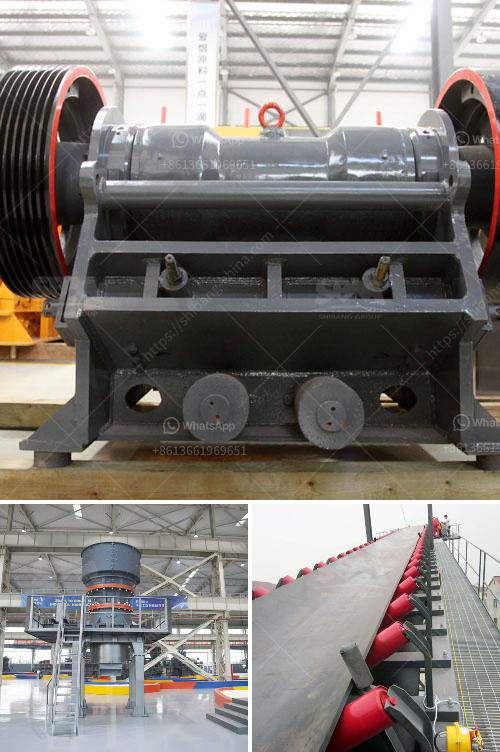

<h3>mobile rock crusher bend oregon</h3>
The emergence of mobile rock crushers in the mining industry has brought a revolutionary transformation to traditional crushing concepts. With the development of technology and increased flexibility, the mobile rock crusher has become a preferred choice among contractors for rock crushing in Bend, Oregon.

One of the key advantages of a mobile rock crusher is its flexibility. This equipment eliminates the need for costly transportation and infrastructure, making it an ideal tool for on-site crushing. Contractors in Bend, Oregon no longer have to worry about transporting large rocks to a fixed crusher site, as the mobile rock crusher can be easily moved from one place to another.

The mobility of these machines enables contractors to crush rocks directly at the construction site, significantly reducing transportation costs and time. This is especially beneficial in remote areas and sites with limited accessibility. By using a mobile rock crusher, contractors in Bend, Oregon, can bring the crushing process closer to the location of rock extraction, ensuring a more efficient and cost-effective operation.

Another advantage of mobile rock crushers is their ability to handle various types of materials. Whether it's hard rock, concrete, or asphalt, these machines can effortlessly crush and recycle them on the spot. This not only saves costs but also contributes to environmental sustainability by reducing waste and the need for new materials.

With the growing demand for sustainable construction practices in Bend, Oregon, mobile rock crushers have become an invaluable tool. The ability to recycle construction materials on-site reduces the reliance on traditional quarries and promotes the use of reclaimed materials, ultimately reducing carbon emissions and the environmental impact of construction projects.

Furthermore, mobile rock crushers offer contractors the ability to customize the crushing process according to specific needs. These machines can be adjusted to produce different sizes of crushed rocks, allowing contractors to meet a wide range of project requirements. Whether it's creating a base material or producing aggregates for asphalt and concrete production, mobile rock crushers provide contractors in Bend, Oregon, with flexibility and versatility in their crushing operations.

In conclusion, mobile rock crushers have revolutionized the construction industry in Bend, Oregon. Their flexibility, cost-effectiveness, and sustainability make them an essential tool for contractors in the region. As the demand for on-site crushing solutions continues to grow, these machines will continue to play a crucial role in improving efficiency, reducing costs, and promoting sustainable practices in the crushing industry.
<h3>Contact us</h3><ul><li><strong>Whatsapp:&nbsp;<a href="https://wa.me/8613661969651">+8613661969651</a></strong></li><li><a href="https://swt.shibang-china.com/?git&amp;zhl&amp;mobile rock crusher bend oregon"><strong>Online Service(chat now)</strong></a></li></ul><h3>Related</h3><ul><li><a href='basalt powder machine supplier uk.md'>basalt powder machine supplier uk</a></li><li><a href='sand and gravel crusher.md'>sand and gravel crusher</a></li><li><a href='purchase a small rock stone crusher in philippines.md'>purchase a small rock stone crusher in philippines</a></li><li><a href='stone equipment hammer mill philippines.md'>stone equipment hammer mill philippines</a></li><li><a href='conveyor belts for dies.md'>conveyor belts for dies</a></li></ul>