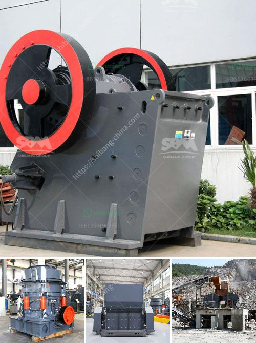

<h3>mobile rock crusher for sale</h3>
Mobile rock crusher for sale is a type of stone crusher that is suitable for primary and secondary crushing in the mining, construction, and road construction industries. It is a highly efficient and flexible machine that is widely used in the field of mining and construction.

Mobile rock crusher is equipped with a 50-ton jaw crusher that can crush rocks up to 650mm in diameter. This jaw crusher, known as the "giant", is capable of crushing almost any type of material used in the construction industry, such as limestone, granite, asphalt, and concrete.

One of the key benefits of mobile rock crushers is their ability to move from one site to another, allowing for flexibility in the application. This means that it can be easily transported to different locations, saving time and money on transportation costs. Additionally, mobile rock crushers have a high performance and low maintenance cost, making them an ideal choice for any job site.

Another advantage of mobile rock crushers is their ease of operation and durability. They are designed to withstand harsh working conditions and can be operated by a single operator. This makes them suitable for small-scale mining operations or for contractors who need to crush materials on various job sites.

In summary, mobile rock crushers offer a cost-effective solution for crushing large rocks on construction sites. They are versatile, durable, and easy to operate, making them an excellent choice for anyone in need of a rock crushing machine. Whether you are a mining company or a contractor, mobile rock crushers are a reliable and efficient solution for your crushing needs.
<h3>Contact us</h3><ul><li><strong>Whatsapp:&nbsp;<a href="https://wa.me/8613661969651">+8613661969651</a></strong></li><li><a href="https://swt.shibang-china.com/?git&amp;zhl&amp;mobile rock crusher for sale"><strong>Online Service(chat now)</strong></a></li></ul><h3>Related</h3><ul><li><a href='used concrete crusher price in uk.md'>used concrete crusher price in uk</a></li><li><a href='gold ore processing equipment in south africa.md'>gold ore processing equipment in south africa</a></li><li><a href='price stone crusher suppliers.md'>price stone crusher suppliers</a></li><li><a href='portable crushing.md'>portable crushing</a></li><li><a href='high reversible mill with 750 mm diameter rolls.md'>high reversible mill with 750 mm diameter rolls</a></li></ul>