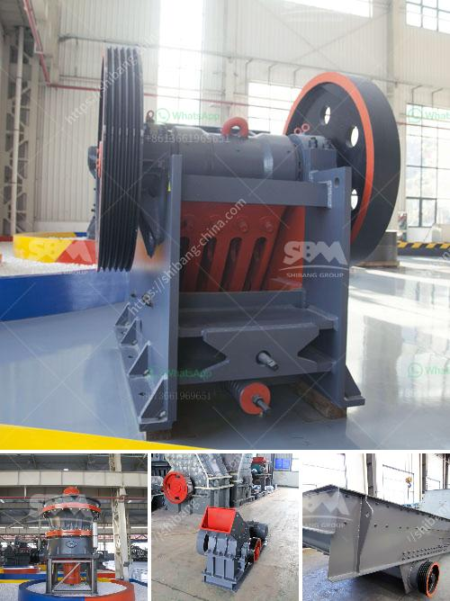

<h3>mobile rock crushing plant nigeria</h3>
Mobile crushers have been used for long time mostly in limestone quarries. They provided advantage of belt conveyor transport and eliminated road construction and truck haulage, and thus resulted in cost savings [1]. With mobile crushing plant, it can crush rocks at the site without transportation process. This brings productivity and efficiency to a new level in rock crushing operations [2]. 

Rock crushing plants in Nigeria are commonly used and cost-effective equipment for many rock processing operations. The rock crushing plant in Nigeria is used to crush large sized rocks into medium sized rocks. Rocks that are classified as less than 8 inches in diameter are processed by secondary crushers to achieve the desired size. This article focuses on the benefits that mobile rock crushing plants bring to commercial and industrial operators in Nigeria.

Cost savings is a major benefit of mobile crushing plant. For many years, transporting and disposing rocks from construction projects were costly and time-consuming processes. With the advent of mobile crushing equipment, operators can take advantage of the ability to move the plant to different locations, saving on transportation costs. This also eliminates the need for trucks to transport material to and from site, reducing fuel consumption and environmental impact. Additionally, mobile rock crushing plants require minimal installation and can be operational in a short period of time, reducing downtime and increasing productivity.

Another benefit of mobile rock crushing plants is their versatility in processing different types of rocks. Whether it is limestone, granite, or basalt, mobile crushers can be used to break down these rocks into a variety of sizes. This allows operators to produce materials of different specifications, serving different construction and industrial needs. Mobile crushers can also be equipped with different screens to produce multiple products simultaneously, further enhancing their versatility and cost-effectiveness.

In addition to cost savings and versatility, mobile rock crushing plants provide operators with increased control over their operations. These plants are equipped with advanced automation systems that allow operators to monitor and adjust the crushing process in real-time. This ensures optimal performance and efficiency, as well as the production of high-quality aggregates. Operators can also remotely control and track the plant's performance, making it easier to identify and resolve any issues that may arise.

Mobile rock crushing plants in Nigeria offer a range of benefits to industrial and commercial operators. They provide cost savings, increased productivity, versatility, and control over operations. These plants are an investment worth considering for any construction or industrial project that requires rock crushing. With their ability to move from site to site and process different types of rocks, mobile rock crushing plants are a practical and efficient solution for various applications in Nigeria’s quarrying and mining industries.

1. Nenad Ristic, et al. “Compressive Crushing of Granite with Wear-resistant Materials.” Materials Research Innovations, vol. 16, no. sup4, 2012, pp. 225-229.

2. Tianxiang Wang, et al. “A Comparative Study of Regression Model and the Adaptive Neuro-Fuzzy Conjecture System for Predicting Energy Consumption of a Stirred Ball Mill.” Minerals, vol. 7, no. 3, 2017, pp. 50.
<h3>Contact us</h3><ul><li><strong>Whatsapp:&nbsp;<a href="https://wa.me/8613661969651">+8613661969651</a></strong></li><li><a href="https://swt.shibang-china.com/?git&amp;zhl&amp;mobile rock crushing plant nigeria"><strong>Online Service(chat now)</strong></a></li></ul><h3>Related</h3><ul><li><a href='vertical ball grinding mills.md'>vertical ball grinding mills</a></li><li><a href='used ball milling machine for sale canada.md'>used ball milling machine for sale canada</a></li><li><a href='stamp mill machine south africa.md'>stamp mill machine south africa</a></li><li><a href='small ball mill price.md'>small ball mill price</a></li><li><a href='equipment equipment for mineral crushing.md'>equipment equipment for mineral crushing</a></li></ul>