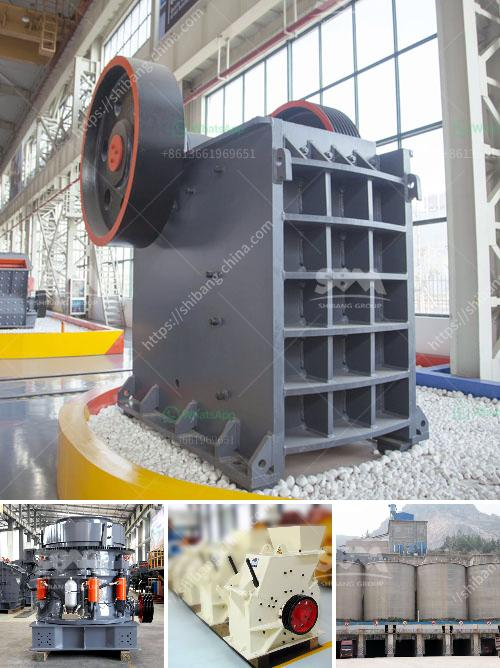

<h3>mobile stone crusher for sale philippines</h3>
The Philippines is a land of rich mineral resources. It is estimated that the Philippines has about 9.2 trillion cubic meters of potential natural gas reserves, totaling about 57 billion barrels of oil equivalent, ranking third in Southeast Asia. As for economic mineral deposits, the country has rich reserves of copper, gold, silver, iron ore, lead, zinc, chromite, and nickel. However, the exploitation and utilization of these resources are still relatively backward, and the processing technology and equipment are relatively lagging behind, which seriously restricts the development of the mining industry.

The emergence of mobile stone crushers for sale has brought the mining industry in the Philippines to a new level. Philippines mobile crushing and screening plant sales price is a professional mining crushing equipment manufacturer, with long-term technical cooperation with Dingqi Construction Machinery Group. Main products are jaw crusher, cone crusher, impact crusher, VSI sand making machine, vibrating screen, vibrating feeder, sand washing machine, belt conveyor, etc., including more than 10 series and 30 types of crushing and screening equipment.

Philippines mobile stone crusher for sale is suitable for the coarse crushing of hard materials in mining, water conservancy, transportation, railway, cement, building materials, metallurgy, chemical, electric power, construction and other industries. The crushing process can be divided into three stages, coarse crushing, medium crushing, and fine crushing. Different stages need different crushers.

Mobile stone crusher machines have the advantages of flexible and convenient mobility. It can save a lot of infrastructure and relocation costs. With the improvement of technology, its performance has reached a high level. The mobile crushing plant can not only directly crush the stone, but also it can produce various grades of gravel and sand materials according to different process requirements to meet different application needs. It can be used for primary crushing to fine crushing and screening. The mobile stone crusher plant is widely used in metallurgy, chemical, building materials, hydropower, and other industries.

Compared with fixed crushing equipment, mobile stone crusher has the advantages of easy movement, low investment, and saving transportation costs. It can be selected and matched flexibly according to the site requirements and processed materials. The output is just a single piece of equipment with high output, which can completely replace the traditional fixed crushing equipment.

In conclusion, mobile stone crusher plant and other crushing equipment for sale in the Philippines have a wide range of applications. They perform well in soft to medium-hard rock or ore crushing, recycling of construction waste, in-situ and mining processes. Mobile stone crusher plants bring a lot of economic benefits to the Philippines, and they will be more commonly used in the future.
<h3>Contact us</h3><ul><li><strong>Whatsapp:&nbsp;<a href="https://wa.me/8613661969651">+8613661969651</a></strong></li><li><a href="https://swt.shibang-china.com/?git&amp;zhl&amp;mobile stone crusher for sale philippines"><strong>Online Service(chat now)</strong></a></li></ul><h3>Related</h3><ul><li><a href='type of stone crushers.md'>type of stone crushers</a></li><li><a href='gold wash plant for sale uk.md'>gold wash plant for sale uk</a></li><li><a href='micro powder mill cost.md'>micro powder mill cost</a></li><li><a href='kaolin mining india.md'>kaolin mining india</a></li><li><a href='marble grinding machine bosch make.md'>marble grinding machine bosch make</a></li></ul>