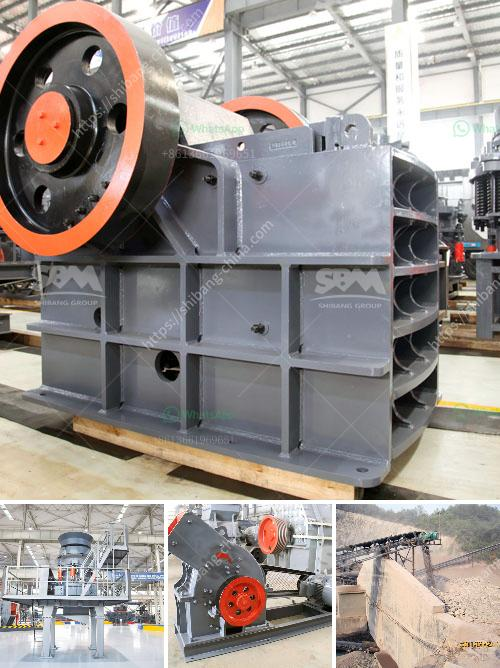

<h3>mobile stone crusher machine price</h3>
Mobile stone crusher machine is the prerequisite products in the mining industry. The common stone crushing plant is consisted of two types: fixed jaw crusher machine and mobile stone crusher machine. Mobile stone crusher machine can be used to process over 120 kinds of stones, such as granite, basalt, limestone, river pebble, limestone, quartz, construction waste, concrete, gold ore, iron ore, coal gangue, etc.

Due to its unique advantages, mobile stone crusher machine is more and more popular in mining industry. Firstly, mobile stone crusher machine can be easily moved from one site to another, which greatly saves transportation costs. Secondly, mobile stone crusher machine has the feature of flexible combination, it can be combined single machine or multiple machines to achieve different crushing effects. Thirdly, mobile stone crusher machine has excellent crushing performance, it is easy to produce high-quality gravel aggregates.

The price of mobile stone crusher machine depends on the specific rock type, different models, different capacities, and different manufacturers. On the basis of the above factors, we should choose the right model, production capacity and manufacturer to buy mobile stone crusher machine, so that we can choose the ideal mobile stone crusher machine and obtain satisfactory stone material.

In general, the price of mobile stone crusher machine should be within 10% of the total cost of crushing projects. According to the stone type, the hardness and required production capacity, we will design the production line layout to tailor-made mobile stone crushing plant. The auxiliary equipment are vibrating feeder, vibrating screen and belt conveyor etc. All these equipment are realized automatic control in the mobile stone crusher machine, which reduces the labor intensity of workers and improves work efficiency.

The mobile stone crusher machine equipped with crushing and screening devices is the complete stone crushing solution. Its widely applied in mining, coal, construction waste recycling, earthwork, city infrastructure, road paving, building construction and so on. The mobile stone crusher machine is the first choice of the crushing process and it is widely used in many sectors such as mining, metallurgy, building materials, transportation, water conservancy, chemical and so on.

In conclusion, the mobile stone crusher machine price is affected by various factors. The specific factors include production cost, market demand, regional differences, raw materials, labor and transportation costs, etc. In order to ensure perfect finished products and ensure stable return on investment, it is recommended to consider these factors comprehensively and choose the suitable mobile stone crusher machine according to specific needs.
<h3>Contact us</h3><ul><li><strong>Whatsapp:&nbsp;<a href="https://wa.me/8613661969651">+8613661969651</a></strong></li><li><a href="https://swt.shibang-china.com/?git&amp;zhl&amp;mobile stone crusher machine price"><strong>Online Service(chat now)</strong></a></li></ul><h3>Related</h3><ul><li><a href='mobile crushing machines.md'>mobile crushing machines</a></li><li><a href='mobile rock crushing plant nigeria.md'>mobile rock crushing plant nigeria</a></li><li><a href='complete crusher plant for sale.md'>complete crusher plant for sale</a></li><li><a href='agen jaw crusher kenya.md'>agen jaw crusher kenya</a></li><li><a href='gold stone crusher images.md'>gold stone crusher images</a></li></ul>